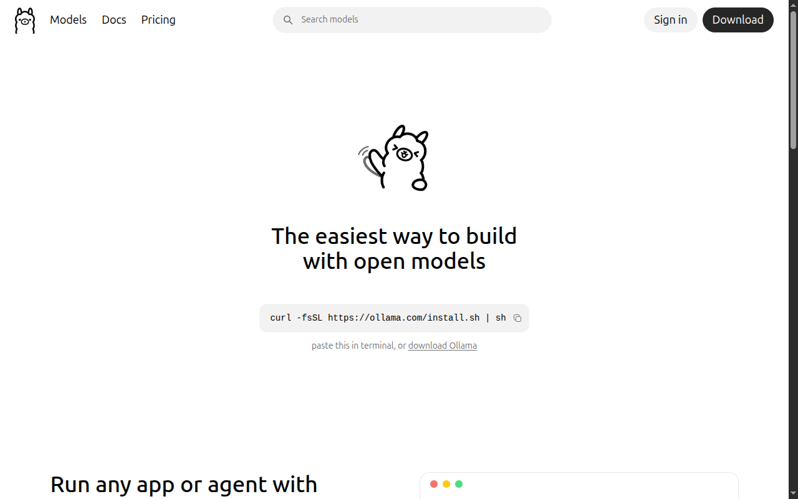
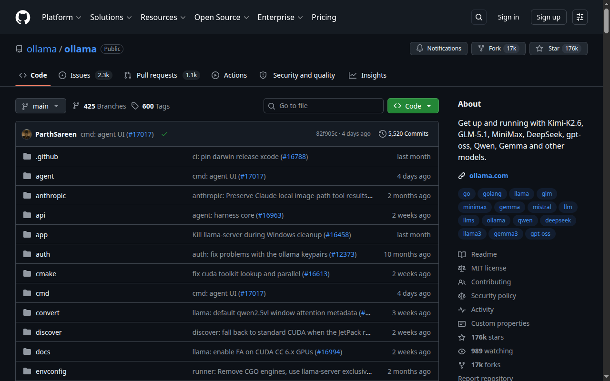

# Ollama — modele locale și `:cloud`: ce există și ce nu

> Material de sprijin pentru secțiunea „Ce este Ollama?” din `prezentare.ro.md`.

## Surse oficiale

**Site:** [ollama.com](https://ollama.com)



**Repo:** [github.com/ollama/ollama](https://github.com/ollama/ollama) — 176k stars, 17k forks



## Modele populare disponibile local (verificate pe ollama.com/library)

| Model | Dimensiune | VRAM necesar | Calitate |
|---|---|---|---|
| `llama3.2:3b` | ~2 GB | 4 GB | Bun pentru sarcini simple |
| `llama3.1:8b` | ~5 GB | 8 GB | Echilibru bun |
| `llama3.3:70b` | ~40 GB | 48+ GB | Aproape de GPT-4o |
| `mistral:7b` | ~4 GB | 8 GB | Bun pentru cod |
| `deepseek-coder:33b` | ~19 GB | 24+ GB | Specializat cod |
| `qwen2.5-coder:32b` | ~18 GB | 24+ GB | Cod, multilingual |

Plus modele `:cloud` (proxy, nu local — verificate pe ollama.com/search?c=cloud): `glm-5.2`, `kimi-k2.7-code`, `minimax-m3`, `deepseek-v4-pro`, `gemini-3-flash-preview`, `gpt-oss:120b-cloud` etc. (local rămâne `gpt-oss:120b`, fără sufix)

```bash
# Modele proprietare/mari — NU se descarcă; rulează prin proxy :cloud (cont ollama.com)
ollama signin
ollama run gemini-3-flash-preview:cloud   # Gemini proprietar, proxy oficial
ollama run glm-5.2:cloud                  # prea mare pentru local (756B)
```

## ⚠️ Unde sunt Claude, Gemini și GPT? (verificat pe ollama.com, iul 2026)

- **Local (`ollama pull`) rulează doar modele open-weight.** Claude, Gemini și GPT-frontier sunt proprietare — nu pot fi rulate local, oricât hardware ai avea.
- **Gemini:** există totuși `gemini-3-flash-preview:cloud` — modelul Google Gemini 3 Flash Preview servit prin Ollama Cloud (pentru hosting și tratamentul datelor se aplică politica Ollama Cloud). Prima fisură în regula „doar open-weight".
- **GPT:** doar `gpt-oss` (20B/120B) — modelele *open-weight* ale OpenAI; GPT-5.x proprietar nu există în Ollama.
- **Claude:** nu există oficial, nici local, nici `:cloud` — doar imitații comunitare (fine-tune-uri „claude-style" pe Qwen/Gemma, de evitat). Pentru Claude real: API-ul Anthropic sau `ollama launch claude` cu alt model în spate.

## Confuzia frecventă: Gemini ≠ Gemma

Ambele sunt de la Google, dar:

- **Gemini** = model închis, doar API (Google AI Studio / Vertex AI) → ❌ nu intră în Ollama
- **Gemma** = fratele open-weight al Gemini (Gemma 2, **Gemma 3** cu multimodal) → ✅ rulează în Ollama: `ollama run gemma3`, `ollama run gemma3:27b`

Așadar singura familie Google pe care o poți rula **local** prin Ollama este **Gemma** (open-weight); Gemini de frontieră există doar ca proxy `gemini-3-flash-preview:cloud`. Vrei experiența completă Gemini? Folosești API-ul Google sau **Antigravity IDE** — platforma agentică Google (IDE + CLI + SDK): descarcă de la [antigravity.google](https://antigravity.google/) (Linux/macOS/Windows).


