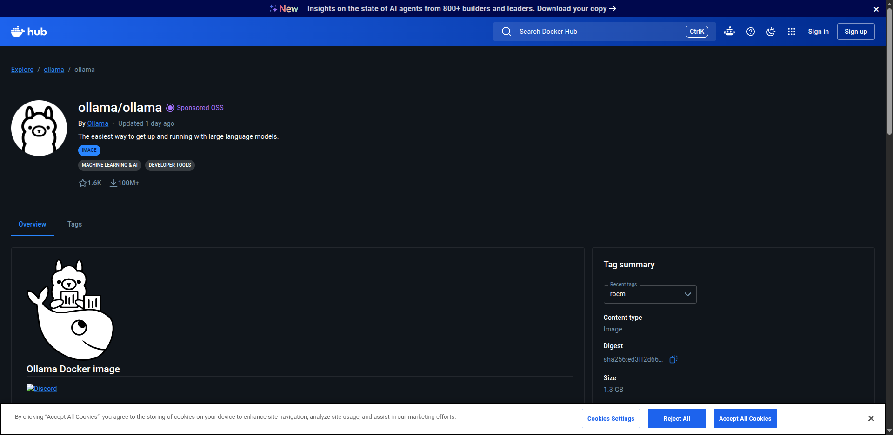
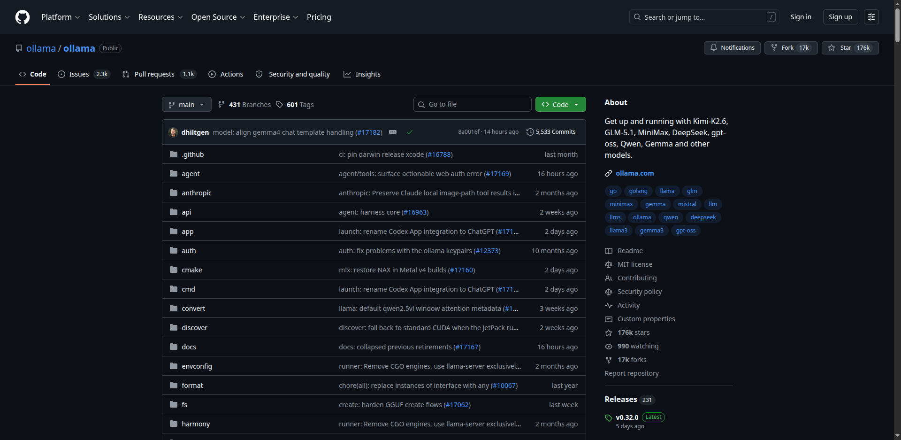
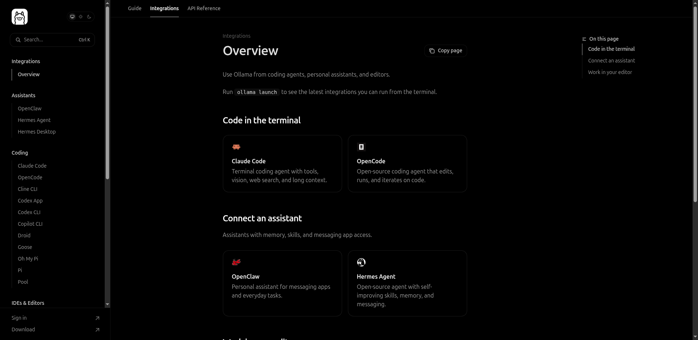
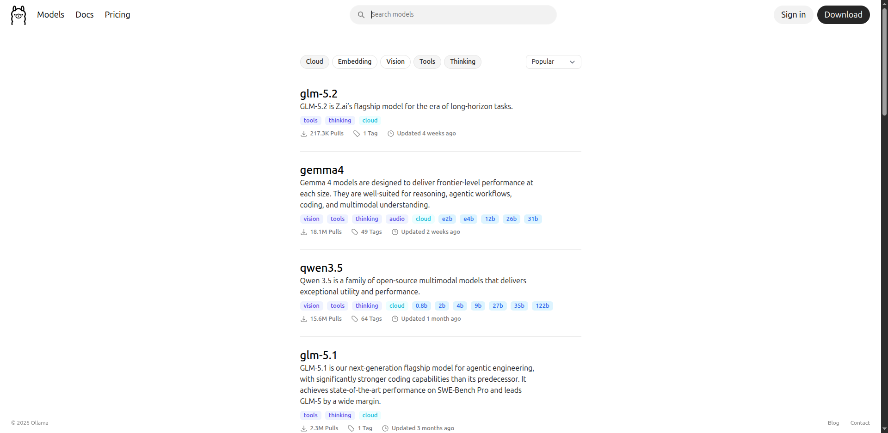

<!-- _paginate: false -->

# Claude vs Ollama

**Cloud proprietar vs local open-source** · bonus: memorie persistentă cu total-recall

**Autor:** Adrian Balaban
**Data:** 21 iulie 2026

---

## Ce iei din această sesiune

1. **Ce este Ollama**
2. **Claude vs Ollama**
3. **Integrarea Ollama cu Claude**
4. **Memorie persistentă cu total-recall**

---

## Agendă (~45 de minute)

1. **Claude vs Ollama** (~26 min, include intro-ul de ~2 min)
2. **Bonus: total-recall** — memorie persistentă (~5 min)
3. **Sinteză** (~5 min)
4. **Întrebări (Q&A)** (~7 min)

<!-- ✂️ Supape de timp (tăiabile dacă demo-urile derapează): GDPR, cq (Mozilla.ai). -->

---

## Firul roșu

> AI-ul cloud a devenit **scump** și cu **lock-in**; Ollama permite alternative **open**, cu avantaje reale — **cost, offline, confidențialitate**.

---

## Ce este Claude?

> **Claude** = **LLM-uri remote proprietare** (Fable, Sonnet, Opus, Haiku — rulează pe serverele Anthropic sau în cloud gestionat: AWS Bedrock, Google Vertex) + **agent local proprietar** (Claude Code — CLI-ul de pe mașina ta, care cheamă modelele remote).

```bash
claude       # pornește agentul (cont claude.ai sau API key)

/status      # ce model, ce endpoint, ce cont — sursa adevărului
/models      # modelele disponibile
/effort      # nivelul de raționament
```

Interfața web: <https://claude.ai>

---

## Ce este Ollama?

> **Runtime open-source** pentru rularea LLM-urilor **local**, pe propriul hardware — **zero conexiune la internet, zero cost per token** (pentru modelele locale).
>
> Modelele prea mari ca să încapă pe hardware-ul tău nu rulează local — Ollama face **proxy** către cloud-ul său.

> 💡 **WOW:** peste **100M descărcări** pe [Docker Hub](https://hub.docker.com/r/ollama/ollama) și **176k stars** pe [GitHub](https://github.com/ollama/ollama) _(iul 2026)_. Cel mai popular runtime local pentru LLM-uri.




Interfețe: <https://ollama.com> · <https://docs.ollama.com> · [github.com/ollama/ollama](https://github.com/ollama/ollama)

---

## Claude și Ollama față în față în consolă (model remote)

Doi clienți în paralel, **aceleași comenzi de verificare**:

| Client                  | Pornire                                      | Verificare                     |
| ----------------------- | -------------------------------------------- | ------------------------------ |
| Claude Code             | `claude`                                     | `/status`, `/model`, `/effort` |
| Claude Code prin Ollama | `ollama launch claude --model glm-5.2:cloud` | `/status`, `/model`, `/effort` |

Apoi **același prompt simplu** pe ambele (ex. „explain this repo in 3 bullets") — comparăm **rezultatul** ȘI **timpul de răspuns**.

Fallback (dacă demo-ul live derapează): `asciinema play casts/slide-7-claude.cast` · `casts/slide-7-ollama.cast`

---

## Demo Ollama (model local)

```bash
ollama run ornith:9b                          # direct în consolă
ollama launch claude --model ornith:9b        # Claude Code pe model local
```

Același prompt simplu („what day is today") în ambele — modelul local răspunde **offline**, fără API key.

Fallback: `asciinema play casts/slide-8-demo-model-local.cast`

---

## Avantajul Ollama: o interfață, modele locale și remote, multiple integrări

- **Aceeași CLI** pentru toate modelele (`ollama run <model>` local, `ollama run <model>:cloud` remote)
- **Endpoint-uri compatibile** cu API-uri existente: **OpenAI**, **Anthropic**…
- Lista completă de integrări: [docs.ollama.com/integrations](https://docs.ollama.com/integrations)



---

## Modelele Ollama: catalog, local vs remote, ce-i pe laptop

**Catalogul:** [ollama.com/library](https://ollama.com/library)

- **Locale** (le alegi după VRAM/RAM): Llama, Mistral, Gemma, Phi, Qwen…
- **Remote** (`:cloud`, cont ollama.com): `glm-5.2:cloud`, `kimi-k2.7-code:cloud` (detalii la „Modele remote de top")

**Pe laptopul de demo** (`ollama list`, Dell Latitude 5521 / MX450 2GB):

```
NAME                          ID              SIZE      MODIFIED     
gemma3:4b                     a2af6cc3eb7f    3.3 GB    25 hours ago    
bge-m3:latest                 790764642607    1.2 GB    26 hours ago    
nemotron-3-nano:30b           b725f1117407    24 GB     2 weeks ago     
mistral-medium-3.5:latest     0341632adb05    80 GB     2 weeks ago     
qwen3.6:latest                07d35212591f    23 GB     2 weeks ago     
qwen3.5:latest                6488c96fa5fa    6.6 GB    2 weeks ago     
gemma4:latest                 c6eb396dbd59    9.6 GB    2 weeks ago     
kimi-k2.7-code:cloud          eda07a659237    -         2 weeks ago     
ornith:9b                     a75697c14589    5.6 GB    2 weeks ago     
glm-5.2:cloud                 ce8fd6f94793    -         3 weeks ago     
north-mini-code-1.0:latest    d8b269ad5c7c    18 GB     3 weeks ago     
```

**Concluzie:** aici Claude API rămâne alegerea corectă; local = experimente offline. Test live: `ollama launch claude --model gemma3:4b`

📄 **Detalii** (limitări hardware, eGPU, costuri): [details-ro/modele-locale-limitari.md](details-ro/modele-locale-limitari.md)

---

## Ollama · Comenzi

```bash
ollama list                    # modelele instalate
ollama pull llama3.2           # doar download
ollama run llama3.2            # download + rulare, gata de conversație

# Modele remote (:cloud) — nimic de descărcat, cont ollama.com:
ollama signin
ollama run glm-5.2:cloud
```

---

## Integrare Ollama cu Claude și Gemini

> - **Claude nu există în Ollama** — doar imitații comunitare, de evitat. Pentru Claude real: API-ul Anthropic sau `ollama launch claude` (Claude Code cu alt model în spate).
> - **Gemini** (proprietar Google) **NU** e în Ollama; alternativa open-weight de la Google e **Gemma**: `ollama run gemma3:4b`.


---

## Modele remote de top în Ollama

Filtru: [ollama.com/search?c=cloud&c=tools&c=thinking](https://ollama.com/search?c=cloud&c=tools&c=thinking)



- **GLM-5.2** — context ~1M tokens (976K), 756B parametri, ~**3,6–5,7× mai ieftin** vs Claude Opus 4.8 ([sursă](https://llm-stats.com/blog/research/glm-5-2-vs-claude-opus-4-8)); API compatibil Claude, Terminal-Bench 2.1 **81.0 vs 85.0** (Opus 4.8) — [ollama.com/library/glm-5.2](https://ollama.com/library/glm-5.2)
- **Kimi-K2.7-Code** — specializat pe cod: code review, explicare cod legacy — [ollama.com/library/kimi-k2.7-code](https://ollama.com/library/kimi-k2.7-code)

---

## Comparație directă: Claude vs Ollama (optional)

> 💡 **Punctul-cheie:** nu e „care e mai bun", ci **ce optimizezi** — calitate maximă (Claude) vs suveranitate (Ollama) vs cost vs viteză.

**TTFT măsurat** pe laptopul de demo (`gemma3:4b` CPU warm vs `claude-sonnet-5`):

| Endpoint                       | TTFT (după warm-up)       |
| ------------------------------ | ------------------------- |
| `gemma3:4b` local (CPU)        | ~0.8–1.8 s (variază mult) |
| Claude API (`claude-sonnet-5`) | ~1.6 s (măsurat)          |

→ **comparabil**. Pe hardware slab avantajul Ollama **NU** e viteza, ci **cost / offline / confidențialitate**.

Măsurare: [scripts/ttft.sh](scripts/ttft.sh) (sau [scripts/demo-ttft.sh](scripts/demo-ttft.sh)) pe ambele endpoint-uri — rulează de 4–5 ori, variază.
Fallback: `asciinema play casts/slide-14-demo-ttft.cast` · 📄 [details-ro/masurare-ttft.md](details-ro/masurare-ttft.md)

<!-- ✂️ tăiabil — prima supapă de timp -->

---

## GDPR: unde ajung datele (optional)

<!-- ✂️ tăiabil (supapă de timp) -->

- Modelele `:cloud` **GLM-5.2**, **Kimi-K2.7-Code** procesează datele pe **servere în China** — jurisdicție fără GDPR
- **Claude**: pentru rezidență EU, necesită **AWS Bedrock / Vertex AI** pe regiuni EU (nuanțele complete, în handout)

---

## Costul real: Claude API vs Ollama (optional)

> 💡 **WOW:** un **'agentic developer'** care lucrează intens 'arde' **~$400/lună** pe API — un **RTX 4090 de $2.000** se amortizează în **~5 luni**. Dar dacă ești utilizator light ($30/lună), amortizarea durează ani.

| Profil                | Cheltuială API tipică | Amortizare hardware local       |
| --------------------- | --------------------- | ------------------------------- |
| Indie / light         | ~$30/lună             | ani — rămâi pe API sau CPU-only |
| Daily driver          | ~$100/lună            | ~6 luni (RTX 3080 SH ~$600)     |
| **Agentic developer** | **~$400/lună**        | **~5 luni (RTX 4090 ~$2.000)**  |

📄 **Detalii** (calculul $400/lună, tier-uri hardware, nota Sonnet 5): [details-ro/costul-real-claude-vs-ollama.md](details-ro/costul-real-claude-vs-ollama.md)

🔗 **Context piață:** [The Pulse — what can we learn from...](https://newsletter.pragmaticengineer.com/p/the-pulse-what-can-we-learn-from) (The Pragmatic Engineer) — analiză despre tendințele de adopție și cost ale tool-urilor AI agentice în industrie

🔗 **Rulare locală GLM-5.2:** [How to Run GLM-5.2 Locally (2026)](https://codersera.com/blog/how-to-run-glm-5-2-locally-2026/) — ghid practic de setup pentru GLM-5.2 pe hardware propriu (cerințe, cuantizare, pași de instalare)

🔗 **Self-hosting LLM-uri:** [Self-Hosting LLMs: The Complete Guide (2026)](https://codersera.com/blog/self-hosting-llms-complete-guide-2026/) — ghid complet despre self-hosting LLM-uri: hardware, tooling, trade-off-uri vs API cloud

---

## Confidențialitate și date: diferența crucială

> 💡 **WOW:** cu Ollama + model local, promptul și datele **nu părăsesc niciodată** mașina — merge și cu cablul de rețea scos (**air-gapped**). Pentru **finance / healthcare / NDA**, asta nu e „nice to have", e **singura opțiune legală**.

**Fluxul Claude API:**

```
Cerere utilizator
       │  (HTTPS la api.anthropic.com)
       ▼
Serverele Anthropic (US)
       ├── Procesare → răspuns
       ├── Logging (audit, safety) — politici Anthropic
       └── Training data? → Implicit NU, dar citiți ToS
```

---

## Confidențialitate și date · Practic, cu Claude (optional)

- **Codul tău** (parțial sau complet) este trimis la Anthropic
- **Secretele din prompt** ajung pe servere externe
- **GDPR:** Anthropic are DPA disponibil, dar datele **ies din EU**
- Contracte enterprise pot restricționa utilizarea API-ului cloud

> Pe scurt, Ollama: **local** = zero egress, merge air-gapped; `:cloud` = datele pleacă la furnizor, ca orice API.

📄 **Detalii** (fluxuri complete local vs `:cloud`, diagrame): [details-ro/confidentialitate-fluxuri.md](details-ro/confidentialitate-fluxuri.md)

---

## Ollama cu Claude Code · integrare & limitări

> **Integrarea oficială:** `ollama launch claude` — Ollama vorbește **direct formatul API Anthropic**, fără proxy.

```bash
ollama launch claude --model qwen3.5           # model local
ollama launch claude --model glm-5.2:cloud     # model cloud, fără download
```

**Limitări:** suportă **tool calling** și **extended thinking** (`budget_tokens` acceptat, dar **neaplicat**); **NU** suportă **prompt caching**; calitatea = calitatea modelului ales.

📄 **Detalii** (ce face `launch` in 'subteran', metoda manuală cu env vars, capabilități complete): [details-ro/integrare-claude-code-ollama.md](details-ro/integrare-claude-code-ollama.md)

---

## Ghid de decizie: Claude sau Ollama? (optional)

```
Datele tale pot ieși din infrastructura ta?
 ├── NU  → Ollama (local) — obligatoriu
 └── DA  → Ai nevoie de calitate top-tier (raționament complex, cod avansat)?
            ├── DA → Claude API (Sonnet/Opus)
            └── NU → Ollama cu model remote
```

📄 **A treia cale — Otari (Mozilla.ai):** gateway Anthropic-compatibil cu **bugete enforce-uite înainte de request** → [details-ro/otari-gateway.md](details-ro/otari-gateway.md)
📄 **Ghid de decizie pe o pagină (printabil):** [details-ro/decizie-o-pagina.md](details-ro/decizie-o-pagina.md)

---

## Bonus: total-recall (memorie persistentă) + rolul Ollama

> **La ce răspunde:** memorie **persistentă între sesiuni**, partajabilă în echipă. Clienți: **Claude Code** + **Gemini CLI**; **Copilot CLI** — de decis.

**Cum inserezi** o memorie: **locală** (personală) / **organizațională** (vault de echipă pe git).
**Cum cauți:** căutare simplă + **căutare semantică multi-limbă** (embeddings prin Ollama — tie-in cu partea Ollama).

> 💡 **WOW (demo):** stochezi în **română**, cauți în **engleză** (sau invers) → potrivire semantică prin embeddings **bge-m3** rulate în **Ollama local**.

Alternativ, **contrastul cu/fără memorie**: o întrebare care cere context din trecut → fără plugin Claude nu știe; cu total-recall îl recuperează.

📄 [details-ro/total-recall-pe-scurt.md](details-ro/total-recall-pe-scurt.md) · [details-ro/demo-contrast-cu-fara-memorie.md](details-ro/demo-contrast-cu-fara-memorie.md)
Fallback: `asciinema play casts/slide-21-demo-total-recall.cast`

---

## Sinteza · Claude vs Ollama

- **Claude API:** calitate maximă, cost per token, date în cloud
- **Ollama:** gratuit, 100% local, offline; `ollama launch claude` = Claude Code pe model local
- **Decizia cheie:** **confidențialitate > calitate > cost**

---

## Sinteza · Întrebări deschise

1. Cum integrezi **total-recall** într-o echipă? (org vault, drepturi de scriere) — vs **cq.exchange (Mozilla.ai)** (store partajat cu review uman)?
2. Ce **modele Ollama** ați testat pe hardware de lucru real?
3. Scenarii cu **ambele**: Ollama pentru cod, Claude pentru analiză?
4. Cum gestionați **actualizările de model** în Ollama ?
5. **Confidențialitate:** ce cod nu ar trebui să părăsească **niciodată** mașina?

---

## Resurse

**Ollama** — ollama.com · [ollama.com/library](https://ollama.com/library) · ollama.com/docs · [docs.ollama.com/integrations](https://docs.ollama.com/integrations) · [github.com/ollama/ollama](https://github.com/ollama/ollama) (176k ⭐) · [Docker Hub](https://hub.docker.com/r/ollama/ollama) (100M+ descărcări) · [căutare modele cloud/tools/thinking](https://ollama.com/search?c=cloud&c=tools&c=thinking)

**Claude API** — [docs.anthropic.com](https://docs.anthropic.com) · [anthropic.com/pricing](https://anthropic.com/pricing) · [anthropic.com/legal](https://anthropic.com/legal) (DPA/GDPR)

**Integrare Claude Code ↔ Ollama** — `ollama launch claude` · [docs.ollama.com/api/anthropic-compatibility](https://docs.ollama.com/api/anthropic-compatibility) · env vars `ANTHROPIC_BASE_URL`, `ANTHROPIC_AUTH_TOKEN`

**Modele remote (GLM-5.2, Kimi-K2.7-Code)** — [ollama.com/library/glm-5.2](https://ollama.com/library/glm-5.2) · [ollama.com/library/kimi-k2.7-code](https://ollama.com/library/kimi-k2.7-code) · [comparație GLM-5.2 vs Claude Opus 4.8 — llm-stats.com](https://llm-stats.com/blog/research/glm-5-2-vs-claude-opus-4-8)

**Rulare locală / self-hosting LLM-uri** — [How to Run GLM-5.2 Locally (2026)](https://codersera.com/blog/how-to-run-glm-5-2-locally-2026/) · [Self-Hosting LLMs: The Complete Guide (2026)](https://codersera.com/blog/self-hosting-llms-complete-guide-2026/)

**Ecosistem Mozilla.ai** — [Otari](https://github.com/mozilla-ai/otari) · [llamafile](https://github.com/mozilla-ai/llamafile) · [any-llm](https://github.com/mozilla-ai/any-llm) · [cq](https://github.com/mozilla-ai/cq) · „AI Got Expensive. Now What?" — blog.mozilla.ai

**Context piață** — [The Pulse — what can we learn from...](https://newsletter.pragmaticengineer.com/p/the-pulse-what-can-we-learn-from) (The Pragmatic Engineer)

**Handout-uri** — [details-ro/decizie-o-pagina.md](details-ro/decizie-o-pagina.md) (ghid de decizie printabil) · [details-ro/primele-10-minute.md](details-ro/primele-10-minute.md) (primele 10 minute cu total-recall)

**Total Recall (bonus)** — [github.com/adrian-balaban/total-recall](https://github.com/adrian-balaban/total-recall) · [details-ro/total-recall-pe-scurt.md](details-ro/total-recall-pe-scurt.md)

---

## Q&A — ~7 minute

> Mulțumesc pentru participare. Cod, arhitecturi și întrebări — le abordăm pe toate.

