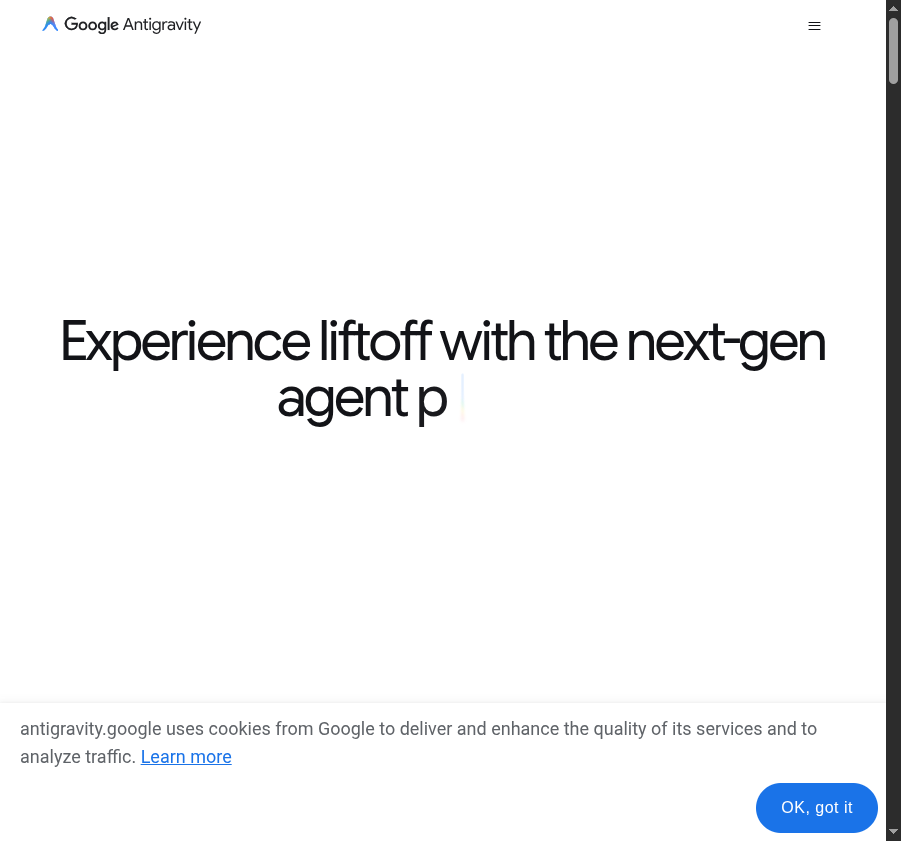

# Claude vs Ollama & Total Recall Plugin

**Autor:** Adrian Balaban  
**Data:** 16 iulie 2026

Două subiecte practice despre cum extindem și alegem uneltele AI în workflow-ul de zi cu zi:

- primul despre decizia „cloud sau local" când lucrezi cu LLM-uri
- al doilea despre persistența memoriei în Claude/Copilot/Gemini printr-un plugin MCP

---

## Slide 0 — Ce iei din această sesiune

> Nu teorie generică — decizii concrete pe care le poți folosi azi.

Cinci lucruri pe care le iei de aici:

1. **Ce este Ollama** — LLM-uri local, zero cost-per-token, zero date în cloud.
2. **Claude vs Ollama** — comparație directă + integrarea `ollama launch claude`.
3. **Când alegi fiecare** — ghid de decizie cu criterii clare.
4. **Cum funcționează total-recall** — MCP, vault-uri, hook-uri, căutare hibridă cu curbă de uitare.
5. **Cum îl instalezi** — Claude Code, Copilot CLI, Gemini CLI.

> 💡 **UTIL:** La finalul sesiunii ai un **ghid de decizie pe o singură pagină** pe care îl poți printa sau salva pentru echipă.

---

## Slide 1 — Agendă (~65 de minute)

1. **Claude vs Ollama** (25 min)
   - Ce este Ollama și cum funcționează → _Slide 2 & 6_
   - Cazul real (modele instalate local, eGPU, modele `:cloud`) → _Slide 3, 4, 5_
   - Compararea motorului: Ollama vs llama.cpp vs llamafile → _Slide 7_
   - Comparație directă: performanță, costuri, confidențialitate → _Slide 8, 9, 10_
   - Integrare practică cu Claude Code și ghid de decizie → _Slide 11 & 12_
   - Tipuri de agenți: Claude vs LangChain → _Slide 13_
2. **Total Recall Plugin** (25 min)
   - Ce este, structura pe disc și arhitectura → _Slide 14, 15, 16, 17_
   - De ce algoritmi proprii (securitate, determinism) → _Slide 18_
   - Managementul vault-ului dual și cele 17 unelte MCP → _Slide 19 & 20_
   - Algoritmul de căutare hibridă (TF-IDF + Ebbinghaus + vectori) → _Slide 21 & 22_
   - Hook-uri de sistem, instalare și compatibilitate → _Slide 23, 24, 25_
3. **Sinteză & Întrebări (Q&A)** (15 min) → _Slide 26 & 27_

---

## TEMA 1 — CLAUDE vs OLLAMA

---

## Slide 2 — Ce este Ollama?

> Ollama este un tool open-source care îți permite să rulezi modele LLM mari **local**,
> pe propriul hardware, fără nicio conexiune la internet și fără cost per token.

> 💡 **WOW:** Ollama a depășit **100 de milioane de descărcări** pe GitHub/Docker Hub în 2026. Este cel mai popular runtime local pentru LLM-uri (dar nu singurul — v. Slide 7 pentru llama.cpp și llamafile).

**Ce face Ollama:**

- Descarcă și rulează modele quantizate local (Llama, Mistral, Gemma, Phi, Qwen, etc.)
- Pentru modele care nu încap local sau sunt proprietare, oferă **modele `:cloud`** — proxy prin infrastructura Ollama (ex. `glm-5.2:cloud`, `gemini-3-flash-preview:cloud`); aceeași interfață CLI/API, inferența rulează la furnizor
- Expune API REST pe `http://localhost:11434`, compatibilă atât cu formatul **OpenAI**, cât și cu formatul **Anthropic** (`/v1/messages` — de asta merge `ollama launch claude`)
- Gestionează memoria GPU/CPU, contextul și concurența
- Funcționează pe macOS, Linux, Windows (cu/fără GPU)

**Instalare:**

```bash
# Instalare (ghid oficial): https://docs.ollama.com/quickstart
#   → download de pe ollama.com/download (macOS / Windows / Linux)

# După instalare, descarcă și pornește un model local
ollama pull llama3.2
ollama run llama3.2
# sau direct via API:
curl http://localhost:11434/api/generate \
  -d '{"model":"llama3.2","prompt":"Salut!"}'

# Modele proprietare/mari — NU se descarcă; rulează prin proxy :cloud (cont ollama.com)
ollama login
ollama run gemini-3-flash-preview:cloud   # Gemini proprietar, proxy oficial
ollama run glm-5.2:cloud                  # prea mare pentru local (756B)
```

**Modele populare disponibile** (local, verificate pe ollama.com/library):

| Model                | Dimensiune | VRAM necesar | Calitate                  |
| -------------------- | ---------- | ------------ | ------------------------- |
| `llama3.2:3b`        | ~2 GB      | 4 GB         | Bun pentru sarcini simple |
| `llama3.1:8b`        | ~5 GB      | 8 GB         | Echilibru bun             |
| `llama3.3:70b`       | ~40 GB     | 48+ GB       | Aproape de GPT-4o         |
| `mistral:7b`         | ~4 GB      | 8 GB         | Bun pentru cod            |
| `deepseek-coder:33b` | ~19 GB     | 24+ GB       | Specializat cod           |
| `qwen2.5-coder:32b`  | ~18 GB     | 24+ GB       | Cod, multilingual         |

Plus modele `:cloud` (proxy, nu local — verificate pe ollama.com/search?c=cloud): `glm-5.2`, `kimi-k2.7-code`, `minimax-m3`, `deepseek-v4-pro`, `gemini-3-flash-preview`, `gpt-oss:120b` etc.

> **⚠️ Unde sunt Claude, Gemini și GPT?** (verificat pe ollama.com, iul 2026)
>
> - **Local (`ollama pull`) rulează doar modele open-weight.** Claude, Gemini și GPT-frontier sunt proprietare — nu pot fi rulate local, oricât hardware ai avea.
> - **Gemini:** Google a publicat totuși `gemini-3-flash-preview:cloud` — proxy oficial prin Ollama, inferența la Google.
> - **GPT:** doar `gpt-oss` (20B/120B) — modelele _open-weight_ ale OpenAI; GPT-5.x proprietar nu există în Ollama.
> - **Claude:** nu există oficial, nici local, nici `:cloud` — doar imitații comunitare (fine-tune-uri „claude-style" pe Qwen/Gemma, de evitat). Pentru Claude real: API-ul Anthropic sau `ollama launch claude` cu alt model în spate.

> **Confuzia frecventă: Gemini ≠ Gemma.** Ambele sunt de la Google, dar:
>
> - **Gemini** = model închis, doar API (Google AI Studio / Vertex AI) → ❌ nu intră în Ollama
> - **Gemma** = fratele open-weight al Gemini (Gemma 2, **Gemma 3** cu multimodal) → ✅ rulează în Ollama: `ollama run gemma3`, `ollama run gemma3:27b`
>
> Așadar singura familie Google pe care o poți rula **local** prin Ollama este **Gemma** (open-weight); Gemini de frontieră există doar ca proxy `gemini-3-flash-preview:cloud`. Vrei experiența completă Gemini? Folosești API-ul Google sau **Antigravity IDE** — platforma agentică Google (IDE + CLI + SDK): descarcă de la [antigravity.google](https://antigravity.google/) (Linux/macOS/Windows).
>
> 

---

## Slide 3 — Modele instalate local: cazul real (`ollama list`)

> Live demo: ce ai pe mașina ta acum și ce poate rula efectiv pe **Dell Latitude 5521** (i7-11850H, MX450 2GB GDDR6).

```
$ ollama list
NAME                          SIZE      MODIFIED
nemotron-3-nano:30b           24 GB     8 days ago
mistral-medium-3.5:latest     80 GB     8 days ago
qwen3.6:latest                23 GB     8 days ago
qwen3.5:latest                6.6 GB    8 days ago
gemma4:latest                 9.6 GB    8 days ago
kimi-k2.7-code:cloud          —         8 days ago
ornith:9b                     5.6 GB    8 days ago
glm-5.2:cloud                 —         10 days ago
north-mini-code-1.0:latest    18 GB     12 days ago
```

**Concluzia practică:**

- MX450 (2GB VRAM) nu poate ține niciun model în VRAM — toate rulează pe CPU via RAM
- `qwen3.5` (6.6 GB) și `ornith:9b` (5.6 GB) sunt singurele care intră confortabil în 16 GB RAM → ~3–8 tok/s
- Modelele cu tag `:cloud` (kimi-k2.7-code, glm-5.2) sunt **API-uri externe proxiate prin Ollama** — nu rulează local
- **Pe acest laptop, Claude API rămâne alegerea corectă.** Modelele locale = experimente offline sau eGPU extern (Thunderbolt 4)

---

## Slide 4 — Pot adăuga GPU pe laptop? (Bonus)

> **TL;DR:** GPU-ul intern e soldat — singura opțiune e **eGPU extern via Thunderbolt 4**. Cu un enclosure SH + RTX 3060 12GB nou (~3.500 lei), rulezi modele de 7–13B complet pe GPU la 20–50 tok/s. Bottleneck-ul TB4 e irelevant pentru inference LLM (contează VRAM-ul, nu banda).


**Ce înseamnă „banda" aici:** lățimea de bandă a legăturii Thunderbolt 4 (~40 Gbps, echivalent PCIe x4) față de un slot PCIe x16 din desktop (de ~4× mai rapid). Banda contează doar când muți date **între** RAM/CPU și GPU. La inference LLM, greutățile modelului se copiază în VRAM **o singură dată, la încărcare** (câteva secunde în plus prin TB4); după aceea totul rulează în interiorul GPU-ului, iar prin cablu circulă doar promptul și tokenii generați — kilobytes. De asta TB4 „mai lent" nu-ți taie tok/s: bottleneck-ul real e dacă modelul **încape în VRAM**, nu cât de gros e cablul. Excepție: dacă modelul NU încape în VRAM și straturile se plimbă permanent între RAM și GPU — atunci banda devine exact bottleneck-ul, iar eGPU-ul suferă mai mult decât un GPU intern.

Explicația completă (lane-uri PCIe, calculul 40 Gbps vs 256 Gbps, de ce gaming-ul pierde 10–25% dar LLM-urile nu): [PCIExpress.md](PCIExpress.md)

---

## Slide 5 — La ce e util Ollama cu GLM-5.2 și Kimi-K2.7-Code?

> Ambele apar în `ollama list` cu `SIZE=—` și suffix `:cloud` — **nu sunt modele locale**.
> Sunt API-uri externe proxiate prin Ollama; inferența rulează pe serverele Zhipu AI / Moonshot AI din China.

### Ce înseamnă `:cloud` în Ollama?

```
kimi-k2.7-code:cloud    —     ← niciun fișier GGUF descarcat
glm-5.2:cloud           —     ← niciun fișier GGUF descarcat
```

- `SIZE=—` = nu există model local; Ollama trimite cererea la API-ul extern
- Tokenizarea și inferența se fac **pe serverele furnizorului**, nu pe CPU/GPU-ul tău
- Avantaj față de API-ul direct: aceeași interfață CLI (`ollama run <model>:cloud`) pentru toate modelele `:cloud`, cu endpoint-uri atât **OpenAI-compatible**, cât și **Anthropic-compatible** — verificat: pagina fiecărui model listează direct comenzile `ollama launch claude/codex/opencode/copilot --model <model>:cloud`
- Claude oficial NU există în Ollama (doar prin API Anthropic: [docs.anthropic.com](https://docs.anthropic.com)); Gemini există doar ca [gemini-3-flash-preview:cloud](https://ollama.com/library/gemini-3-flash-preview), iar experiența completă Gemini o dă [Antigravity IDE](https://antigravity.google/)

---

### GLM-5.2 — Zhipu AI (Beijing)

- Flagship-ul Z.ai (spin-off Tsinghua); context **~1M tokens** (976K — verificat pe [ollama.com/library/glm-5.2](https://ollama.com/library/glm-5.2)), 756B parametri, bun la raționament, agentic și cod
- Pentru un dev român: română slabă (rămâi pe Claude pentru RO), date sensibile → servere în China

> **Context rapid:** GLM-5.2 (lansat iun 2026) — performanță comparabilă cu Claude Opus 4.8 la ~6× mai ieftin, open-source MIT, 66% pe benchmarks de programare (vs 67% Claude). Modele chineze = 45% din traficul OpenRouter (2026).

---

### Kimi-K2.7-Code — Moonshot AI (Beijing)

- Specializat pe **generare și analiză de cod** (Python, TS, Java, Go, C++); concurent DeepSeek-Coder
- Puncte forte: boilerplate/scaffolding, code review, explicare cod legacy

---

### Comparație rapidă

| Model              | Companie       | Cel mai bun la                        | Cost vs Claude    | Risc GDPR          |
| ------------------ | -------------- | ------------------------------------- | ----------------- | ------------------ |
| **GLM-5.2**        | Zhipu AI 🇨🇳    | Text chinezo-englez, documente lungi  | ~50–70% din Haiku | ⚠️ Ridicat         |
| **Kimi-K2.7-Code** | Moonshot AI 🇨🇳 | Code review, generare cod             | ~50–60% din Haiku | ⚠️ Ridicat         |
| **Claude Haiku**   | Anthropic 🇺🇸   | Sarcini generale rapide, română       | Referință         | ✅ Scăzut (DPA EU) |
| **Claude Sonnet**  | Anthropic 🇺🇸   | Raționament, arhitectură, cod complex | ~4–5× Haiku       | ✅ Scăzut          |

---

### ⚠️ Atenție: confidențialitate și GDPR

- Ambele modele procesează datele pe **servere în China** (Zhipu AI Beijing, Moonshot AI Beijing)
- China = jurisdicție fără echivalent adecvat GDPR recunoscut de EU (spre deosebire de US post-Privacy Shield reînnoit)
- **Nu trimite prin aceste API-uri:** cod cu date personale ale clienților, IP proprietar, credențiale, contracte
- Pentru echipe enterprise EU: verificați DPA (Data Processing Agreement) înainte de utilizare

**Regula scurtă:** cod ne-sensibil + buget → :cloud chinezesc; română, date sensibile, raționament critic → Claude.

---

### Pot rula GLM-5.2 / Kimi-K2 local? (Bonus)

> **Răspuns scurt: nu pe hardware obișnuit.** Kimi-K2 = ~600 GB VRAM, GLM-5.x = 100–200 GB — doar clustere datacenter. Pe Ollama, întreaga familie GLM-5 e `:cloud`-only; singurul GLM rulabil local e `glm-4.7-flash` (30B, 12–24 GB VRAM). **„Open-weight" ≠ „încape pe hardware-ul tău".**

**Ce poți rula realist pe CPU:**

```bash
ollama pull qwen3:4b        # ~3 GB, ~3–8 tok/s
ollama pull llama3.2:3b     # ~2 GB
ollama pull gemma3:4b       # ~3 GB
```

**Cum folosești modelele `:cloud`:**

```bash
ollama login                           # cont pe ollama.com
ollama run glm-5.2:cloud               # direct
ollama launch claude --model glm-5.2:cloud  # în Claude Code
```

---

## Slide 6 — Cum funcționează Ollama intern

> 💡 **WOW:** quantizarea Q4 comprimă un model de 8× — un 70B care „cere" 280 GB încape în 48 GB VRAM, cu doar ~2–5% pierdere de calitate.

```
Cerere utilizator
       │
       ▼
┌─────────────────────────────────────────────────────────────┐
│                    Ollama daemon (local)                     │
│                                                             │
│   ┌─────────────┐     ┌──────────────┐    ┌─────────────┐  │
│   │  API REST   │────►│  Model mgr   │───►│  llama.cpp  │  │
│   │ :11434      │     │  (GGUF/Q4)   │    │  inference  │  │
│   └─────────────┘     └──────────────┘    └──────┬──────┘  │
│                                                   │         │
│                                          GPU (CUDA/Metal)   │
│                                          sau CPU fallback   │
└───────────────────────────────────────────────────┼─────────┘
                                                    │
                                               Răspuns tokenizat
```

**Quantizare** (de ce modelele de 70B încap pe 48GB VRAM):

- Parametrii modelului sunt comprimați de la float32 (4 bytes/param) la int4 (0.5 bytes/param)
- Pierdere de calitate: ~2-5% față de versiunea completă
- Format standard: **GGUF** (GPT-Generated Unified Format)

**Context window:** limitat de VRAM disponibil (model + KV cache asociat) — un model de 8B pe 8GB VRAM susține context de ~8K tokens; Llama 3.1 70B Q4 pe 48GB poate ajunge **la limită** la 128K tokens doar cu KV cache quantizat (modelul ~40GB lasă puțin spațiu; practic, 32–64K e mai realist pe 48GB).

---

## Slide 7 — Ollama vs llama.cpp vs llamafile: relația și când alegi care

> **Relația:** Ollama e construit **peste llama.cpp** — îl folosește ca motor de inference sub capotă, prin propriul wrapper în Go + un fork al nucleului GGML/llama.cpp. Deci nu sunt concurenți: Ollama = strat prietenos peste llama.cpp.

### Comparație directă

| Axa                   | **llama.cpp** (motorul, low-level)                                                                                           | **Ollama** (wrapper/runtime prietenos)                                                 |
| --------------------- | ---------------------------------------------------------------------------------------------------------------------------- | -------------------------------------------------------------------------------------- |
| **Nivel**             | Motor de inference C/C++                                                                                                     | Wrapper peste llama.cpp (Go + fork GGML)                                               |
| **Control**           | **Maxim** — flag-uri CLI directe, quantizare custom, `llama-server`, grammar-constrained decoding, tuning fin de GPU offload | Mai restrâns — expune ce consideră util                                                |
| **Management modele** | **Manual** — aduci/convertezi tu fișierele GGUF                                                                              | **Automat** — registry, versioning, `Modelfile`-uri pentru customizare                 |
| **UX**                | `./llama-server -m model.gguf ...` (curbă de învățare mai abruptă)                                                           | `ollama pull` / `ollama run` (drag-and-start)                                          |
| **API**               | `llama-server` (HTTP, mai brut)                                                                                              | **REST API la `:11434`** + endpoint **compatibil OpenAI**                              |
| **Caz tipic**         | Inference înglobat direct în altă aplicație; build-uri custom                                                                | Integrare API rapidă local (LangChain, agenți, Claude Code via `ollama launch claude`) |

### A treia opțiune: llamafile — „modelul E un fișier"

> 💡 **WOW:** un llamafile e **un singur executabil** care rulează pe Windows, macOS, Linux și BSD **fără instalare** — modelul, llama.cpp și runtime-ul într-un fișier pe care îl poți pune pe stick USB, arhiva sau șterge cu un simplu delete. (mozilla-ai/llamafile, 25k+ ⭐, revitalizat de Mozilla.ai)

```bash
curl -LO https://huggingface.co/mozilla-ai/llamafile_0.10/resolve/main/Qwen3.5-0.8B-Q8_0.llamafile
chmod +x Qwen3.5-0.8B-Q8_0.llamafile
./Qwen3.5-0.8B-Q8_0.llamafile        # gata — zero install, zero daemon
```

**Trade-off-uri oneste** (recunoscute chiar de Mozilla.ai): binarele sunt mari (runtime-ul se livrează cu fiecare model), swap-ul de modele e mai greoi decât `ollama pull`, iar pe Apple Silicon stack-urile MLX sunt mai rapide. llamafile e pentru cazul în care AI-ul trebuie să fie **portabil, vendor-free și cu adevărat al tău**.

### Critica de suveranitate: Ollama = „managed service wearing a hoodie" (Mozilla.ai)

> Critica **nu** e că Ollama ar fi closed-source — codul chiar e open source (MIT). Critica vizează **modul de operare**, care reproduce tiparele unui serviciu gestionat: arată a open source rebel, dar se comportă ca un vendor cloud.

Concret, trei mecanisme:

1. **Registry centralizat.** `ollama pull llama3.2` nu descarcă un fișier de oriunde — trage dintr-un registru controlat de compania Ollama (ollama.com/library), cu un sistem de manifest propriu, non-standard. Ce modele apar acolo, cum sunt denumite, ce tag-uri există — decide vendorul. E exact modelul Docker Hub: cod open source, canal de distribuție proprietar.

2. **Formatul „blob".** Modelele circulă în ecosistem ca fișiere **GGUF** standard — le poți lua de pe Hugging Face și rula cu llama.cpp, LM Studio, llamafile etc. Dar când Ollama le trage, le sparge și le stochează în cache-ul daemonului ca blob-uri cu nume hash (`~/.ollama/models/blobs/sha256-...`), plus manifeste proprii. Fișierul tău de 24 GB nu mai e un „fișier model" pe care să-l copiezi pe alt tool sau pe un stick — e un artefact pe care doar Ollama știe să-l folosească direct. (Tehnic blob-ul _conține_ GGUF-ul și poate fi recuperat, dar nu e formatul portabil pe care l-ai descărcat.)

3. **Daemon obligatoriu.** Nu rulezi „un model", rulezi un serviciu de fundal (`ollama serve`) care gestionează registry-ul, cache-ul și API-ul. Ești legat de ciclul lui de viață, update-urile lui, deciziile lui.

**Deci „soft lock-in" înseamnă:** nimic nu te _împiedică legal sau tehnic_ să pleci (codul e liber, GGUF-ul e recuperabil) — dar cu cât folosești mai mult, cu atât modelele, scripturile și workflow-ul tău depind de registrul, formatul de stocare și daemonul unui singur vendor. Costul de ieșire crește tăcut. Prin contrast, argumentul llamafile: „modelul e un fișier" — un singur executabil pe care îl copiezi, arhivezi, ștergi, fără registru și fără daemon.

> **Formularea pentru slide:** „Ollama e open source, dar distribuția e a vendorului: registry centralizat + blob-uri în format propriu + daemon obligatoriu. Nu e lacăt — e gravitație."

### Când alegi care

| Vrei…                                                                  | Alegi         |
| ---------------------------------------------------------------------- | ------------- |
| Setup rapid, swap între modele, API-first (agenți, Claude Code)        | **Ollama**    |
| Control maxim (cuantizare, offload, build custom)                      | **llama.cpp** |
| Portabilitate totală: un fișier, zero install, zero daemon, air-gapped | **llamafile** |

---

## Slide 8 — Comparație directă: Claude vs Ollama

> 💡 **Punctul-cheie:** nu e „care e mai bun", ci **ce optimizezi** — inteligență maximă (Claude) vs suveranitate totală: $0/token, offline, zero egress (Ollama).

> 📊 **WOW Metric:** Latența la primul token (TTFT) pe Ollama cu un model 8B pe GPU local este de **~120ms**, în timp ce prin API-ul Claude este de **~650ms** (de ~5 ori mai rapid local).

| Criteriu                  | Claude (API Anthropic)                     | Ollama (local)                                                                                      | Citeste pe web care sunt numerele la zi si actualizeaza-le |
| ------------------------- | ------------------------------------------ | --------------------------------------------------------------------------------------------------- | ---------------------------------------------------------- |
| **Modele disponibile**    | Claude Sonnet 4.6, Opus 4.8, Haiku 4.5     | Llama, Mistral, Gemma, Phi, Qwen, DeepSeek etc.                                                     |
| **Calitate top-tier**     | ✅ Claude Opus 4.8 = state of the art      | Llama 3.3 70B ≈ GPT-4o, dar sub Opus                                                                |
| **Cost per token**        | $3–$15 / 1M tokens (input $3 / output $15) | $0 — hardware propriu                                                                               |
| **Cost infrastructură**   | $0 (fără server propriu)                   | GPU bun: $500–$3000+                                                                                |
| **Confidențialitate**     | Date trimise la Anthropic                  | 100% local, zero egress                                                                             |
| **Latență**               | ~500ms–2s primul token                     | ~100ms–500ms (GPU local)                                                                            |
| **Context window**        | 200K tokens (Sonnet/Opus)                  | 4K–128K (depinde de model+VRAM)                                                                     |
| **Raționament avansat**   | ✅ Excelent (extended thinking)            | Limitat la modele mici-medii                                                                        |
| **Disponibilitate**       | Necesită internet + API key                | Funcționează offline                                                                                |
| **Actualizări model**     | Automate (Anthropic)                       | Manual (`ollama pull`)                                                                              |
| **Integrare Claude Code** | ✅ Nativă (este produsul Anthropic)        | ✅ Nativă prin `ollama launch claude` (Ollama expune endpoint compatibil API Anthropic, fără proxy) |
| **Limită rate**           | Există (nivel API)                         | Nelimitată (hardware propriu)                                                                       |
| **GDPR / compliante**     | Politici Anthropic                         | On-premise complet                                                                                  |

---

## Slide 9 — Costul real: Claude API vs Ollama

> 💡 **WOW:** un 'agentic developer' ce lucreaza intens arde ~$400/lună pe API — un RTX 4090 de $2.000 se amortizează în ~5 luni. Dar dacă ești utilizator light ($30/lună), amortizarea durează ani.

> 📊 **WOW (datat):** 1 iunie 2026 — Copilot a mutat Claude Opus de la **3× la 27×** multiplicator și Sonnet de la **1× la 9×**; tier-ul gratuit GPT-4o a dispărut. „Era AI-ului cloud ieftin s-a terminat" (Mozilla.ai, _AI Got Expensive. Now What?_, mai 2026). Ăsta e forcing function-ul întregii discuții cloud-vs-local. Sursa numerelor: [blog.mozilla.ai/ai-got-expensive-now-what](https://blog.mozilla.ai/ai-got-expensive-now-what/) (Anushri Gupta, 26 mai 2026).

### Claude API (Sonnet 4.6)

```
Input:  $3.00 / 1M tokens
Output: $15.00 / 1M tokens

Sesiune agentică intensă (8h/zi, multe tool calls, context re-reads):
  Input:  ~3M tokens/zi    → $9/zi
  Output: ~600K tokens/zi  → $9/zi
  TOTAL:  ~$18/zi → ~$400/lună (22 zile lucrătoare)
```

### Ollama pe hardware local

```
GPU RTX 4090 (24GB VRAM): ~$2,000 hardware
  → rulează Llama 3.3 70B Q4, DeepSeek-Coder 33B
  → ROI față de API la nivel developer: ~5-6 luni de utilizare intensă

GPU RTX 3080 (10GB VRAM): ~$600 second-hand
  → rulează Llama 3.1 8B, Mistral 7B, Qwen 7B
  → calitate mai mică, dar zero cost operațional
  → ROI: ~1-2 luni

Fără GPU (CPU only):
  → Phi-3 mini 3.8B, Gemma 2B: lent (3-8 tok/s) dar funcțional
  → Hardware cost: $0
```

**Concluzie financiară:** Pentru un developer cu utilizare agentică intensă (~$400/lună API), Ollama devine mai ieftin decât API-ul Claude în 2-6 luni cu un GPU decent. Utilizatorii light (~$30/lună) recuperează hardware-ul în câțiva ani, nu luni — ROI-ul în luni presupune utilizare intensă. Sub un GPU de ~$600, diferența de calitate poate să nu merite.

---

## Slide 10 — Confidențialitate și date: diferența crucială

> 💡 **WOW:** cu Ollama, promptul tău nu părăsește **niciodată** mașina — funcționează și cu cablul de rețea scos (air-gapped). Pentru finance/healthcare/NDA, asta nu e un „nice to have", e singura opțiune legală.

### Claude API

```
Cerere utilizator
       │  (HTTPS la api.anthropic.com)
       ▼
Serverele Anthropic (US)
       │
       ├── Procesare → răspuns
       ├── Logging (audit, safety) — politici Anthropic
       └── Training data? → Implicit NU, dar citiți ToS (Terms of Service —
           condițiile de utilizare Anthropic; ele definesc ce are voie
           furnizorul să facă cu datele trimise: logging, retenție, training)
```

**Ce înseamnă practic:**

- Codul tău (parțial sau complet) este trimis la Anthropic
- Secretele din prompt ajung pe servere externe
- GDPR: Anthropic are DPA disponibil, dar datele ies din EU
- Contracte enterprise pot restricționa utilizarea API-ului cloud

### Ollama (local)

```
Cerere utilizator
       │
       ▼
localhost:11434
       │
       ▼
Model GGUF în RAM/VRAM — NICIODATĂ în afara mașinii
```

**Ce înseamnă practic:**

- Codul tău, secretele, datele clientului — rămân pe mașina ta
- Zero egress de date
- Funcționează în rețele izolate (air-gapped)
- Util în: finance, healthcare, proiecte cu NDA strict, codebases proprietare

---

## Slide 11 — Ollama cu Claude Code: integrarea practică

**Metoda oficială: `ollama launch claude`** — pornește clientul Claude Code cu Ollama ca backend, nativ (fără proxy):

```bash
# Model local (pe GPU propriu, ex. RTX 3060)
ollama launch claude --model qwen3.5

# Model cloud (fără download local)
ollama launch claude --model glm-5.2:cloud

# Non-interactiv / scriptat
ollama launch claude --model glm-5.2:cloud --yes -- -p "how does this repo work?"
```

Ce face comanda automat:

- instalează/pornește **clientul Claude Code**
- setează `ANTHROPIC_BASE_URL=http://localhost:11434`, `ANTHROPIC_AUTH_TOKEN=ollama`, `ANTHROPIC_API_KEY=""`
- Ollama expune **endpoint compatibil API Anthropic** la `localhost:11434` → cerere în format Anthropic → model Ollama răspunde → răspuns re-ambalat în format Anthropic

### Distincția cheie: formatul e Anthropic, inteligența e Ollama

Ollama vorbește **nativ** formatul API Anthropic la `localhost:11434` — **nu există proxy separat**. Clientul Claude Code „crede" că vorbește cu Anthropic; de fapt răspunde modelul ales cu `--model`:

```
cerere în format Anthropic → Ollama traduce intern → modelul Ollama răspunde
      → răspuns re-ambalat în format Anthropic → clientul Claude Code îl consumă
```

**Metoda manuală (alternativă, fără `launch`):**

```bash
ollama pull qwen3.5
export ANTHROPIC_BASE_URL=http://localhost:11434
export ANTHROPIC_AUTH_TOKEN=ollama
claude --model qwen3.5
```

Sau permanent în `~/.claude/settings.json`:

```json
{
  "env": {
    "ANTHROPIC_BASE_URL": "http://localhost:11434",
    "ANTHROPIC_AUTH_TOKEN": "ollama"
  }
}
```

> **⚠️ Gotcha subscription hijack:** pe calea manuală NU seta `ANTHROPIC_API_KEY=""` — șirul gol = „nu e setat", iar cu Claude Max/Pro cererile pleacă pe OAuth la `api.anthropic.com` în loc de Ollama. `ANTHROPIC_AUTH_TOKEN=ollama` e suficient. Verifică cu `/status` că base URL-ul e `localhost:11434`.
>
> **De ce contează diferența dintre cele două variabile:** `ANTHROPIC_API_KEY` pleacă pe fir ca header `x-api-key`, în timp ce `ANTHROPIC_AUTH_TOKEN` devine `Authorization: Bearer <token>` — backend-urile non-Anthropic (Ollama, Otari) citesc de regulă doar Bearer. Și încă un detaliu: Claude Code adaugă singur `/v1/messages` la URL, deci `ANTHROPIC_BASE_URL` trebuie să fie **root-ul** serverului (fără `/v1` la coadă).

**Capabilități suportate (toate condiționate de modelul ales):** tool calling, file edits, subagents, web search/fetch, vision, thinking controls.

**Limitări cunoscute când folosești Ollama cu Claude Code:**

- Endpoint-ul Anthropic-compatibil din Ollama suportă: messages, streaming, system prompts, vision, **tool calling**, **extended thinking**. **Nu** suportă: **prompt caching** (deci fără cache hit-uri / cost savings), `tool_choice`, `metadata`, PDF, citations, `count_tokens`. Computer use nu trece prin acest endpoint.
- Calitatea output-ului depinde complet de modelul ales — harness-ul e același, inteligența o pune modelul
- Tool use / function calling: funcționează doar cu modele care suportă (Llama 3.x, Mistral, Qwen 2.5, Qwen3, qwen3-coder)
- Context window mai mic poate trunchia fișiere mari (recomandat 64K+ pentru repo-uri mari)

---

## Slide 11b — A treia cale: Otari, gateway Anthropic-compatibil (Bonus)

> 💡 **WOW:** același truc `ANTHROPIC_BASE_URL`, dar cu **buget enforcement ÎNAINTE de request, nu după factură.**

**Otari** (Mozilla.ai, open-source, lansat mai 2026, construit peste `any-llm`) e un gateway LLM self-hosted care expune și endpoint-ul Anthropic (`POST /v1/messages`) — deci Claude Code poate rula prin el exact ca prin Ollama, dar cu stratul operațional pe care Ollama nu-l are:

- **Bugete** per user / per cheie, aplicate _înainte_ ca cererea să ruleze
- **Chei virtuale** — clientul nu vede niciodată cheia reală Anthropic/OpenAI; le poți revoca oricând
- **Usage & spend tracking** în timp real, pe toate modelele (40+ provideri prin any-llm)
- Rulezi Claude real, GPT, Mistral sau modele locale prin **același endpoint**

```bash
docker run --rm -p 8000:8000 \
  -e OTARI_MASTER_KEY=... -e ANTHROPIC_API_KEY=... \
  mzdotai/otari:latest otari serve

export ANTHROPIC_BASE_URL=http://localhost:8000   # root, fără /v1
export ANTHROPIC_AUTH_TOKEN=<cheia-ta-otari>      # Bearer, nu x-api-key
export ANTHROPIC_MODEL="anthropic:claude-sonnet-4-6"
claude
```

**Când are sens:** echipă care vrea Claude real + modele alternative + control central de buget și chei — fără să dea fiecărui developer cheia API brută.

---

## Slide 12 — Ghid de decizie: Claude API sau Ollama?

```
┌─────────────────────────────────────────────────────────────────┐
│                     Întrebare de pornire                        │
│           Datele tale pot ieși din infrastructura ta?           │
└─────────────────────────┬───────────────┬───────────────────────┘
                          │ NU            │ DA
                          ▼               ▼
              ┌────────────────────┐  ┌──────────────────────────┐
              │   Ollama (local)   │  │  Alege după alte criterii │
              │   obligatoriu      │  └──────────┬───────────────┘
              └────────────────────┘             │
                                    ┌────────────▼────────────────┐
                                    │  Ai nevoie de calitate      │
                                    │  top-tier (raționament      │
                                    │  complex, cod avansat)?     │
                                    └────────────┬────────────────┘
                                         NU │         │ DA
                                             ▼         ▼
                                      Ollama cu   Claude API
                                      model 7-8B  (Sonnet/Opus)
                                      + cost $0   + calitate max
```

> 💡 **UTIL:** Salvează această schemă sau rulează direct `ollama launch claude` pentru a testa local înainte de a decide implementarea în producție.

**Scenarii recomandate:**

| Scenariu                                                            | Alegere                         | Model recomandat                                             |
| ------------------------------------------------------------------- | ------------------------------- | ------------------------------------------------------------ |
| Proiect cu date sensibile / NDA                                     | Ollama                          | DeepSeek Coder 33B sau Qwen 2.5 Coder 32B                    |
| Echipă enterprise cu restricții cloud                               | Ollama                          | Llama 3.3 70B (server local)                                 |
| Prototipare rapidă, calitate maximă                                 | Claude API                      | Sonnet 4.6 sau Opus 4.8                                      |
| Developer indie, buget limitat                                      | Ollama                          | Llama 3.1 8B sau Qwen 2.5 7B                                 |
| Sarcini critice de raționament                                      | Claude API                      | Opus 4.8 cu extended thinking                                |
| Cod cu context mare (>50K tokens)                                   | Claude API                      | Sonnet 4.6 (200K context)                                    |
| Offline / air-gapped                                                | Ollama                          | Orice model descărcat prealabil                              |
| Echipă cu GPU server partajat                                       | Ollama                          | Llama 3.3 70B, server central                                |
| Echipă care vrea Claude + modele locale + control buget centralizat | **Otari gateway** (self-hosted) | Claude real + orice provider, chei virtuale, bugete per user |

---

## Slide 13 — Agent Claude vs agent LangChain

> Confuzia vine din faptul că „agent Claude" și „agent LangChain" trăiesc la **niveluri diferite de stivă**:
> unul e _model + harness_, celălalt e _framework model-agnostic_.

### Diferența fundamentală

| Axa                      | Agent Claude (Claude Code / Agent SDK)                                                                                                                                            | Agent LangChain (LangChain / LangGraph)                                                                                                                     |
| ------------------------ | --------------------------------------------------------------------------------------------------------------------------------------------------------------------------------- | ----------------------------------------------------------------------------------------------------------------------------------------------------------- |
| **Modelul**              | Clientul e prins de **Claude/Anthropic** (format API Anthropic), DAR din `ollama launch claude` (vezi mai jos) backend-ul poate fi **Ollama** — client Claude Code + model local. | **Model-agnostic** la nivel de framework — Claude, GPT, Gemini, **Ollama local**, orice                                                                     |
| **Cine deține loop-ul**  | Anthropic: harness închis, opinat (plan mode, hooks, permisiuni, subagents, MCP, compaction). Configurezi, nu scrii loop-ul.                                                      | Tu scrii loop-ul / graful. LangGraph = mașină de stări explicită (noduri, muchii, routing condiționat, checkpointuri).                                      |
| **Starea**               | Conversație + memorie fișier + MCP (ex. total-recall). Compactare de context built-in.                                                                                            | Abstracții pluggable: `BufferMemory`, summary, retriever vectorial; LangGraph are checkpointer (in-mem/SQLite/Postgres) pentru stare durabilă între rulări. |
| **Tool-uri**             | **MCP** e standardul. Subagents (Task), hooks (Pre/PostToolUse), skills.                                                                                                          | Funcții `@tool` + integrări (loaders, retrievers, vector stores). Are și adaptoare MCP acum.                                                                |
| **Computer use / mediu** | First-class: bash, edit fișiere, computer use (ecran/tastatură) în Agent SDK. Claude Code = harness specializat cod.                                                              | Doar ce-i dai tu ca tool. Fără computer use built-in decât dacă-l wirezi.                                                                                   |
| **Control flow**         | Modelul decide mult; îl direcționezi cu CLAUDE.md, skills, permission mode.                                                                                                       | **Tu controlezi** graful — routing forțat, ramuri paralele, human-in-the-loop gates. Mai mult workflow-engine decât agent liber.                            |
| **Taxa de abstracție**   | Subțire, aproape de API.                                                                                                                                                          | Straturi groase, schimbări breaking între versiuni, abstracții leaky (mulți au migrat la LangGraph sau API raw).                                            |

> **Alternativa „subțire" la LangChain pentru multi-provider:** **any-llm** (Mozilla.ai, 2.1k ⭐) — un singur `completion()` peste 40+ provideri (OpenAI, Anthropic, Mistral, Ollama…), fără taxa de abstracție LangChain. Dacă tot ce vrei e „schimb providerul dintr-un string", nu-ți trebuie un framework de agenți.

### Cele trei forme de „agent Claude"

```
Claude Code       → „vreau un agent care să-mi lucreze în repo, ruleze teste,
                     editeze fișiere, cu permisiuni și plan mode — gata din cutie"
                     (nu scrii cod de agent)

Agent SDK         → „vreau un agent Claude programabil propriu" — Claude e creierul,
                     tool-urile și suprafața sunt ale tale. Loop subțire:
                     model + tools + max turns.

LangChain/LangGraph → „vreau un pipeline model-agnostic cu control flow explicit,
                        stare durabilă, human-in-the-loop, sau pot schimba
                        între Claude și un model local"
```

### Pentru cazul nostru: de ce contează pe 16 iulie

|                                            | Agent Claude                                                                                                                                                                                                             | Agent LangChain                                                                                     |
| ------------------------------------------ | ------------------------------------------------------------------------------------------------------------------------------------------------------------------------------------------------------------------------ | --------------------------------------------------------------------------------------------------- |
| Poate rula pe **Ollama** (RTX 3060 local)? | **DA, din `ollama launch claude`** — client Claude Code + backend Ollama (fără proxy, Ollama vorbește nativ format Anthropic).                                                                                           | **DA** — `ChatOllama`, rulează pe GPU local, zero cost per token, offline, datele nu ies din mașină |
| Inteligență                                | Cu Claude real: maximă (Opus 4.8). Cu Ollama: **depinde de modelul local** (mai slab decât Claude; endpoint-ul Anthropic-compatibil suportă extended thinking și tool calling, dar **nu** prompt caching — v. Slide 10). | Depinde de modelul local (mai slab decât Claude)                                                    |
| Privatitate                                | Cu Claude real: date → Anthropic. Cu Ollama: **100% on-premise**.                                                                                                                                                        | 100% on-premise                                                                                     |
| Cost                                       | Cu Claude: plat per token. Cu Ollama: **zero**.                                                                                                                                                                          | Zero                                                                                                |

> **Nuanța cheie:** "Claude agent e lipit de Anthropic" nu mai e adevărat — backend-ul poate fi Ollama prin `ollama launch claude`. Limitarea reală: **calitatea = calitatea modelului local ales**. Iar `total-recall` (MCP server) funcționează ca memorie persistentă **pentru ambele runtime-uri** — același vault, indiferent de backend.

### Regulă de decizie

| Vrei…                                                                     | Alegi                                                       |
| ------------------------------------------------------------------------- | ----------------------------------------------------------- |
| Cod / inginerie în repo, calitate maximă, accept cloud                    | **Claude Code** (cu Claude real)                            |
| Agent custom cu Claude ca creier, tool-uri proprii                        | **Claude Agent SDK**                                        |
| **Harness-ul Claude Code, dar pe model local** (offline, zero cost)       | **`ollama launch claude`** (client Claude + backend Ollama) |
| Control flow explicit, stare durabilă, sau agent model-agnostic pe Ollama | **LangGraph** (nu LangChain clasic)                         |

---

## TEMA 2 — TOTAL RECALL PLUGIN

---

## Slide 14 — Problema: Claude uită tot după sesiune

> La sfârșitul fiecărei conversații, Claude pierde tot contextul acumulat.
> Decizii, preferințe, arhitecturi discutate — totul dispare.

> 📊 **WOW Stat:** În medie, un 'agentic developer' **re-explică aceleași preferințe și detalii de proiect de ~15 ori pe lună** în sesiuni noi, pierzând peste 2 ore de productivitate.

**Simptomele:**

- Reexplici același context la fiecare sesiune nouă
- Preferințele tale de cod trebuie re-menționate de fiecare dată
- Deciziile de arhitectură nu se acumulează nicăieri
- Feedback-ul pe care l-ai dat modelului nu persistă

**Consecința:** Cu cât lucrezi mai mult cu Claude Code, cu atât pierzi mai mult timp re-explicând ceea ce ai deja explicat.

> **Nu ești singurul care vrea asta:** Mozilla.ai a lansat `cq` (1.2k ⭐) — un standard deschis pentru _shared agent learning_: agenții propun «knowledge units» (workaround-uri, API-uri nedocumentate) într-un store comun, cu review uman. **Complementar, nu concurent:** cq = lecții operaționale partajate între agenți; total-recall = memoria TA de context (decizii, preferințe, arhitectură) cu curbă de uitare Ebbinghaus — fișiere `.md` + git, fără server și fără review pipeline.

---

## Slide 15 — Soluția: total-recall

> Un plugin Claude Code care dă AI-ului memorie persistentă, căutabilă, între sesiuni.

> 🛠️ **Demo Rapid:** Rulează comanda de mai jos pentru a vedea pluginul în acțiune local:
> `claude -p "Reaminteste-ti decizia noastra despre baza de date"` (va apela automat unealta `recall_memory`).

**Ce este:**

- **Plugin Claude Code** instalat din marketplace
- **MCP server** cu 17 unelte (stdio, înregistrat via `claude mcp add`)
- **Vault de fișiere Markdown** stocat local la `~/.total-recall/`
- **Hook-uri automate** care injectează contextul la fiecare sesiune nouă
- **Skill `/memory-workflow`** pentru sesiuni structurate de recall/store

**Ce nu este:**

- Nu trimite date în cloud (vaultul personal este complet local)
- Nu folosește o bază de date opacă — fiecare memorie este un fișier `.md` citibil
- Nu suprascrie context — injectează, nu înlocuiește

---

## Slide 16 — Structura pe disk

> 💡 **WOW:** zero bază de date opacă — memoria AI-ului tău e un folder de fișiere `.md` pe care le poți citi, edita, versiona cu git și deschide în Obsidian.

```
~/.total-recall/
├── index.json               ← index plat: key → MemoryMetadata
├── invertedIndex.json       ← TF-IDF inverted index: token → {docs, idf}
├── .index-cache.txt         ← rezumat injectat la SessionStart (shell-readable)
├── personal-vault/
│   ├── architecture/
│   │   └── db-choice.md     ← memorie individuală: frontmatter YAML + corp Markdown
│   ├── feedback/
│   ├── knowledge/
│   ├── project/
│   └── vectors.db           ← embeddings sqlite-vec (opțional)
└── org/
    └── org-vault/
        └── architecture/
            └── team-decision.md   ← memorii partajate cu echipa, sync pe git
```

> **Ce e TF-IDF?** Term Frequency × Inverse Document Frequency — algoritmul clasic de căutare text: un cuvânt punctează mult dacă apare **des în documentul respectiv** (TF) dar **rar în restul colecției** (IDF). „postgresql" care apare de 5 ori într-o memorie și aproape nicăieri altundeva = scor mare; „proiect", care apare peste tot = scor aproape zero. _Inverted index_ = harta inversă `cuvânt → lista documentelor care îl conțin`, ca indexul de la finalul unei cărți — de asta căutarea nu citește fișierele, doar indexul.

**Fiecare memorie** este un fișier `.md` cu frontmatter:

```markdown
---
title: "Preferă PostgreSQL pentru date relaționale"
tags: [architecture, database, feedback]
author: adrianb
importanceScore: 0.8
created: 2026-06-01T10:00:00Z
updated: 2026-06-15T14:30:00Z
---

## Executive Summary

Preferă PostgreSQL față de MySQL pentru proiecte noi...
```

---

## Slide 17 — Arhitectura: modulele principale

> 💡 **WOW:** un motor de căutare hibrid complet (TF-IDF + vector + curbă de uitare) în ~20 de fișiere TypeScript, cu **o singură dependență obligatorie** (`@modelcontextprotocol/sdk`).

```
src/
├── index.ts          ← boot: signal handlers + main()
├── server.ts         ← MCP Server, 12 scheme tool, dispatch
├── state.ts          ← singletons partajate: memIndex, invertedIndex
├── paths.ts          ← căile vault, EXCLUDED_DIRS, ensureDir
├── types.ts          ← MemoryFrontmatter, MemoryMetadata, Index
├── lru-cache.ts      ← LRUCache class + shared contentCache instance (100 entries, 30 min TTL)
├── persistence.ts    ← loadIndexes, scheduleSave (debounce 1s), flushPending
├── frontmatter.ts    ← parser YAML minimal (fără gray-matter, fără CVE-uri)
├── vault-scan.ts     ← reconcileIndex, slugify, tokenEstimate
├── tfidf.ts          ← tokenize, rebuildInvertedIndex, tfidfSearch
├── ebbinghaus.ts     ← computeRetentionStrength, daysSince
├── rrf.ts            ← Reciprocal Rank Fusion (k=60)
├── embeddings.ts     ← HuggingFace pipeline (opțional)
├── vectorStore.ts    ← sqlite-vec: upsert/search/delete
└── tools/
    ├── store.ts      ← store_memory
    ├── recall.ts     ← recall_memory, search_index
    ├── query.ts      ← list_memories, get_memories_by_keys, get_stats,
    │                    get_timeline, get_related_memories, prune_memories
    └── mutate.ts     ← update_memory, delete_memory, rebuild_index
```

---

## Slide 18 — De ce algoritmi proprii (fără dependențe grele)

> **O singură dependență obligatorie** (`@modelcontextprotocol/sdk`). Toți algoritmii cheie — TF-IDF, Ebbinghaus, RRF, frontmatter parser — sunt scriși de la zero.

**Ce câștigi:**

1. **Securitate:** fără `gray-matter` → fără CVE-ul `js-yaml` (GHSA-h67p-54hq-rp68)
2. **Scoring coerent:** title-boost, tag-boost, Ebbinghaus = o singură formulă, nu trei librării
3. **Determinism:** zero apeluri LLM, zero cost, merge offline / air-gapped
4. **Auditabilitate:** fiecare decizie de scoring e observabilă prin `get_stats`

> **Filozofia:** dependențele grele = risc de CVE + breaking-change + black-box. Doar ONNX și sqlite-vec rămân externe — și ele opționale.

---

## Slide 19 — Dual Vault: personal vs org

> 💡 **WOW:** un simplu tag `org` transformă memoria personală în cunoaștere de echipă — cu filtru de confidențialitate **fail-closed**: dacă nu poate garanta că nu scapă secrete, nu face push.

```
store_memory(tags=[...])
       │
       ├── conține "org"  ──►  ORG VAULT  (~/.total-recall/org/org-vault/)
       │                        key prefix: "org/"
       │                        scriere protejată de autor
       │                        sync automat → git repo echipă (branch org-vault)
       │                        filtru de confidențialitate înainte de push
       │
       └── altfel         ──►  PERSONAL VAULT  (~/.total-recall/personal-vault/)
                                key: cale relativă simplă
                                jurnal auto-adăugat la fiecare store
```

**Regulă cheie:** tagurile `personal` și `org` sunt mutual exclusive — `store_memory` aruncă eroare dacă ambele sunt prezente.

**Filtru de confidențialitate (org sync):**

- Blochează token-uri cu entropie ridicată (secrete, chei API)
- Detectează și **secrete etichetate** — ex. `aws_secret_access_key = …`: un `~/.aws/credentials` lipit din greșeală e blocat înainte de push
- Blochează toate adresele email (cu excepția domeniilor din allowlist)
- Fail-closed: dacă filtrul nu poate analiza conținutul, NU face push

---

## Slide 20 — Cele 17 unelte MCP

> 💡 **Util:** CRUD complet + căutare + întreținere, în limbaj natural — spui „reține că…" / „reamintește-mi…" și modelul alege singur unealta potrivită.

### Scriere

| Unealtă           | Ce face                                                                           |
| ----------------- | --------------------------------------------------------------------------------- |
| `store_memory`    | Creează o memorie nouă; `force=true` suprascrie                                   |
| `update_memory`   | Modifică titlu/conținut/taguri/importanceScore                                    |
| `delete_memory`   | Șterge fișierul + intrarea din index + vectorul                                   |
| `delete_memories` | Bulk delete cu confirmare explicită                                               |
| `confirm_memory`  | Bump `confirmations`/`flags` — feedback de calitate integrat în scorul Ebbinghaus |

### Căutare / Citire

| Unealtă                | Ce face                                                                 |
| ---------------------- | ----------------------------------------------------------------------- |
| `recall_memory`        | TF-IDF + Ebbinghaus + opțional vector search via RRF                    |
| `search_index`         | TF-IDF doar pe metadate (fără citire fișiere, fără bump accessCount)    |
| `get_memories_by_keys` | Lookup direct după cheie; trece prin LRU cache                          |
| `rerank_memories`      | Semantic rerank: top-N din `recall_memory`, reordonat de LLM-ul apelant |

### Listare / Interogare

| Unealtă                | Ce face                                                           |
| ---------------------- | ----------------------------------------------------------------- |
| `list_memories`        | Inventar paginat cu filtre pe categorie/tag                       |
| `get_related_memories` | Similaritate Jaccard pe taguri + boost categorie (0.2)            |
| `get_timeline`         | Memorii ordonate după `updated`                                   |
| `get_stats`            | Contoare, statistici cache, percentile performanță, erori recente |

### Întreținere

| Unealtă           | Ce face                                                                     |
| ----------------- | --------------------------------------------------------------------------- |
| `rebuild_index`   | `reconcileIndex()` + rebuild TF-IDF; păstrează `accessCount`/`lastAccessed` |
| `prune_memories`  | **Listează** candidații cu retenție scăzută (Ebbinghaus); NU șterge automat |
| `export_memories` | Export portabil al vault-ului (scenariul „schimb laptopul")                 |
| `import_memories` | Import dintr-un export, cu dedup                                            |

---

## Slide 21 — Algoritmul de căutare: TF-IDF + Ebbinghaus

> 💡 **WOW:** memoria AI-ului **uită ca un om** — curba uitării lui Ebbinghaus (1885) aplicată în cod: memoriile neimportante și neaccesate se estompează din rezultate, fiecare accesare le „reîmprospătează" cu +20%.

### Pipeline `recall_memory`

```
query (text liber)
  │
  ├─ tfidfSearch(query)
  │    ├─ tokenize(query) → tokens
  │    ├─ pentru fiecare token: lookup în invertedIndex
  │    ├─ scor = TF × IDF × title-boost(2×) × tag-boost(1.5×)
  │    └─ × computeRetentionStrength(importance, daysSince, accessCount)
  │
  ├─ [opțional: hybrid=true + dependențe instalate]
  │    ├─ embed(query) → vector query
  │    ├─ searchVector(db, qvec, 50) → rezultate vectoriale
  │    └─ Reciprocal Rank Fusion([tfidf, vector], k=60)
  │              scor(d) = Σ 1/(60 + rank(d)) pe ambele liste
  │
  └─ slice la `limit`, bump accessCount, returnează cu/fără conținut complet
```

### Curba Ebbinghaus (uitarea modelată matematic)

```
λ     = 0.16 × (1 − importanceScore × 0.8)
decay = importanceScore × exp(−λ × daysSince) × (1 + accessCount × 0.2)
```

| importanceScore | λ (viteza de uitare) | Comportament                                    |
| --------------- | -------------------- | ----------------------------------------------- |
| 1.0 (critic)    | 0.032                | Decay lent — memoria rămâne relevantă săptămâni |
| 0.5 (normal)    | 0.096                | Decay mediu                                     |
| 0.3 (scăzut)    | 0.122                | Decay rapid — dispare din rezultate în zile     |

Fiecare acces adaugă +20% forță de retenție (`accessCount × 0.2`).

---

## Slide 22 — Embeddings și căutare multilinguală (opționale)

> Embeddings = opționale, lazy-load, complet locale (sau via Ollama / Vertex AI). Fără ele, pluginul degradează curat la TF-IDF.

**Provideri configurabili** (în `~/.total-recall/config.json`): `huggingface` (implicit, local MiniLM), `ollama` (API local, `bge-m3`), `vertexai` (Google Cloud, `text-embedding-004`).

**Căutare multilinguală:** flag-ul `enableMultilingualSearch: true` activează expansiune de tokeni EN↔RO (ex. „decizie" găsește și „decision").

**Exemplu live pentru prezentare** — memoria e stocată în engleză, întrebarea vine în română:

```
# 1. Stochează (în engleză):
> "remember that we chose PostgreSQL over MySQL because of JSONB support"
→ store_memory(title="Database decision: PostgreSQL", tags=["architecture", "database"])

# 2. Într-o sesiune nouă, întreabă în ROMÂNĂ:
> "care a fost decizia noastră despre baza de date?"
→ recall_memory(query="decizie baza de date")
→ expansiunea EN↔RO mapează „decizie"→"decision", „baza de date"→"database"
→ găsește memoria englezească, scor TF-IDF pe tokenii expandați ✅
```

---

## Slide 23 — Hook-urile: integrarea automată (Claude Code / Copilot / Gemini)

> 💡 **WOW:** înainte de compactarea contextului (`PreCompact`), pluginul **salvează automat learnings-urile sesiunii** — cunoașterea supraviețuiește chiar și când contextul e șters.

> Deși inițial create exclusiv pentru Claude Code, hook-urile de lifecycle rulează acum și pe **GitHub Copilot CLI** și **Gemini CLI** (prin `hooks.copilot.json` și `hooks.gemini.json`).

### Execuția pe clienți non-Claude (Copilot și Gemini CLI)

- **Cum funcționează:** La pornirea sau pe parcursul sesiunii, clientul Copilot sau Gemini apelează hook-ul corespunzător.
- **Side-effects executate:** Hook-urile de fundal rulează normal (trag ultimele memorii din git, reconstruiesc cache-ul indexului local, execută push/sync automat în org-vault).
- **Limitare (graceful degradation):** Deoarece acești clienți drops/ignoră output-ul stdout al hook-urilor, **injectarea automată a indexului de context (`additionalContext`) în memoria de conversație este dezactivată**. Modelul nu vede rezumatul memoriilor la pornire, însă le poate interoga oricând manual prin uneltele MCP.

### `SessionStart` (4 pași, secvențiali)

```
1. pull-org-vault.sh       — git pull pe branch-ul org-vault (dacă e configurat)
2. build-memory-index.sh   — scanare awk a frontmatter-ului → .index-cache.txt
3. load-memory-index.sh    — cat .index-cache.txt → injectat în context (doar Claude Code)
4. load-open-questions.sh  — cat open-questions.md → injectat în context (doar Claude Code)
```

**Efect:** La fiecare nouă sesiune Claude, modelul primește automat rezumatul tuturor memoriilor tale — fără să ceri explicit.

### `PostToolUse` (declanșator: `store_memory|update_memory|delete_memory`)

```
sync-org-memory.sh
  ├─ verifică dacă memoria are tag "org"
  ├─ aplică filtrul de confidențialitate
  └─ git add/commit/push → branch org-vault al echipei
  + rebuild .index-cache.txt
```

### `PreCompact` (când contextul e aproape de limită)

```
extract-and-store-memories.sh
  ├─ citește transcriptul sesiunii din stdin JSON (transcript_path)
  ├─ cere lui Claude să extragă 0–3 learnings cheie ca JSON lines
  └─ store-learning.mjs → scrie direct ca fișiere .md în personal-vault
       (fără round-trip MCP; nu suprascrie memorii existente)
```

### `SessionEnd` — cleanup: loghează sesiunea și asigură flush-ul embeddings-urilor înainte de exit.

---

## Slide 24 — Instalare și utilizare practică

> 💡 **Util:** același plugin, 4 clienți — Claude Code, Copilot CLI, Gemini CLI, standalone — cu un singur `install.sh`.

### Instalare bazată pe client

Scriptul `install.sh` este acum conștient de starea clientului și acceptă argumente specifice:

```bash
# 1. Clonează marketplace-ul și construiește pluginul
git clone https://github.com/adrian-balaban/my-claude-plugins-marketplace.git
cd my-claude-plugins-marketplace/plugins/total-recall
npm install && npm run build

# 2. Înregistrează în funcție de clientul tău:

# Pentru Claude Code (nativ):
claude plugin install "$(pwd)"

# Pentru GitHub Copilot CLI (MCP + hooks.copilot.json):
./install.sh --copilot

# Pentru Gemini CLI (MCP + hooks.gemini.json):
./install.sh --gemini

# Pentru instalare Standalone (scrie căi absolute în settings.json):
./install.sh --standalone
```

### Utilizare în sesiune Claude Code

```
# Caută memorii
> "reamintește-mi decizia despre baza de date"
→ recall_memory(query="decizie baza de date")

# Stochează o memorie
> "reține că preferăm PostgreSQL cu partitionare pe lună"
→ store_memory(title="...", content="...", tags=["architecture", "database"])

# Listează tot
> "arată-mi toate memoriile de arhitectură"
→ list_memories(category="architecture")

# Skill dedicat
> /total-recall:memory-workflow
```

### Ordinea de recuperare (din eficiență → completitudine)

1. Index injectat la SessionStart (gratuit — deja în context)
2. `get_memories_by_keys(summary=true)` — dacă știi cheia
3. `search_index(query=...)` — metadate rapid, fără citire fișiere
4. `recall_memory(query=..., full=false)` — TF-IDF + Ebbinghaus
5. `recall_memory(query=..., full=true)` — cu conținut complet

---

## Slide 25 — Compatibilitate: Claude Code vs Copilot vs Gemini vs Codex

| Capabilitate                  | Claude Code                 | GitHub Copilot CLI        | Gemini CLI                | OpenAI Codex CLI          |
| ----------------------------- | --------------------------- | ------------------------- | ------------------------- | ------------------------- |
| **MCP Server (17 unelte)**    | ✅ Nativ                    | ✅ stdio MCP suportat     | ✅ stdio MCP suportat     | ✅ `~/.codex/config.toml` |
| **Side Effects (Sync/Index)** | ✅ Da                       | ✅ Da (hooks automate)    | ✅ Da (hooks automate)    | ❌ Nu (manual)            |
| **Context Injection**         | ✅ Da (`additionalContext`) | ❌ Nu (ignorat de client) | ❌ Nu (ignorat de client) | ❌ Nu                     |
| **Playbook Skills**           | ✅ Da (nativ)               | ❌ Nu                     | ❌ Nu                     | ❌ Nu                     |

> **Bonus:** vault-urile total-recall se deschid nativ în **Obsidian** (fișiere `.md` cu frontmatter YAML). Nu folosi Obsidian Sync pe `org-vault` — sync-ul trebuie să treacă prin git-ul total-recall.

> **„De ce nu folosiți cq?"** — comparație onestă: `cq` (Mozilla.ai) acoperă **7 host-uri** (Claude, Codex, Copilot, Cursor, OpenCode, Pi, Windsurf), dar **fără context injection** — agentul trebuie să interogheze explicit store-ul. total-recall acoperă 3 clienți cu hooks automate (+ context injection nativ în Claude Code) și obiect diferit: memorie de context, nu knowledge units partajate.

---

## Slide 25b — Noutăți: ultimele 7 îmbunătățiri din total-recall

Șapte îmbunătățiri recent implementate în plugin:

| #   | Îmbunătățire                                                                                                              | De ce contează                                                                                                                                        |
| --- | ------------------------------------------------------------------------------------------------------------------------- | ----------------------------------------------------------------------------------------------------------------------------------------------------- |
| 1   | **Semantic rerank** (`rerank_memories`) — ia top-N din `recall_memory` și cere LLM-ului apelant să reordoneze rezultatele | Plafonul calității de recall — exact produsul. Ieftin, fără dependențe noi.                                                                           |
| 2   | **Reconcile după `git pull`** — `pull-org-vault.sh` declanșează rebuild de index după un pull reușit                      | Înainte, memoriile push-uite de colegi nu apăreau până la restart/`rebuild_index`. Fix mic, impact mare pe „team memory".                             |
| 3   | **Re-embed la update de tags/importanceScore**                                                                            | Înainte se re-embedda doar la schimbarea de `content` — vectorul rămânea stale la update de metadate.                                                 |
| 4   | **Coalescing pe sync hook** — sentinel + un singur proces de sync per sesiune                                             | Hook-ul PostToolUse forka node+git la fiecare store/update/delete.                                                                                    |
| 5   | **`export_memories` / `import_memories`** + bulk delete cu confirmare (`delete_memories`)                                 | Închide loop-ul `prune_memories` (care doar lista) și scenariul „schimb laptopul".                                                                    |
| 6   | **Semnale confirm/flag** (`confirm_memory`) — câmp `confirmations`/`flags` pe memorie, integrat în scorul Ebbinghaus      | Idee validată de `cq` (endorsement ca semnal de calitate): o memorie accesată des dar flag-uită „greșită" nu mai rămâne sus — semnalele o corectează. |
| 7   | **Test property-based pe frontmatter** (fast-check)                                                                       | Cea mai ieftină asigurare contra următoarei regresii clasa js-yaml.                                                                                   |

> 💡 **WOW:** punctul 6 e locul unde cele două lumi se întâlnesc — mecanismul de _endorsement_ din cq (Mozilla.ai) aplicat pe curba de uitare Ebbinghaus din total-recall: memoria nu doar „îmbătrânește", ci primește feedback.

---

## Slide 26 — Sinteza finală și întrebări deschise

### Ce am acoperit

**Claude vs Ollama:**

- Claude API: calitate maximă, cost per token, date în cloud · Ollama: gratuit, 100% local, offline
- `ollama launch claude`: harness-ul Claude Code pe model local — fără proxy
- Agent Claude vs LangChain: diferența e **cine deține loop-ul**, nu dacă pot rula local
- Decizia cheie: **confidențialitate > calitate > cost**

**Total Recall:**

- Plugin MCP (17 unelte) pentru memorie persistentă — Claude Code, Copilot, Gemini CLI
- Vault dual (personal local + org pe git cu privacy filter), căutare hibridă cu Ebbinghaus decay
- Memoria = fișiere Markdown: git-abile, Obsidian-abile, ale tale

> 💡 **UTIL Takeaway:** Mâine dimineață: (1) Instalează Ollama, (2) rulează `ollama launch claude --model gemma3:4b` pentru teste locale rapide și (3) adaugă `total-recall` pentru memorie persistentă între sesiuni.

### Întrebări deschise pentru discuție

1. Cum integrezi total-recall într-o echipă? (org vault, drepturi de scriere) — și unde trage linia față de un standard extern: cq.exchange (store partajat cu review uman) vs git-ul echipei (total-recall org-vault)?
2. Ce modele Ollama ați testat pe hardware de lucru real?
3. Există scenarii unde ați combina ambele: Ollama pentru cod, Claude pentru analiză?
4. Cum gestionezi actualizările de model în Ollama față de API (fără breaking changes)?
5. Strategii de backup pentru vaultul total-recall?

---

## Slide 27 — Resurse

### Total Recall

- **Repo:** `github/total-recall/`
- **Arhitectura detaliată:** `plugins/total-recall/ARCHITECTURE.md`
- **Instalare:** `plugins/total-recall/install.sh --help`
- **README:** `plugins/total-recall/README.md`

### Ollama

- **Site oficial:** ollama.com
- **Hub modele:** ollama.com/library
- **API reference:** ollama.com/docs (compatibilă OpenAI)

### Claude API

- **Documentație:** docs.anthropic.com
- **Modele curente:** claude-sonnet-4-6, claude-opus-4-8, claude-haiku-4-5
- **Prețuri:** anthropic.com/pricing
- **DPA / GDPR:** anthropic.com/legal

### Integrare Claude Code ↔ Ollama

- **Comandă oficială:** `ollama launch claude` (docs.ollama.com/integrations/claude-code)
- **Compatibilitate API Anthropic:** docs.ollama.com/api/anthropic-compatibility
- **Variabile de mediu:** `ANTHROPIC_BASE_URL`, `ANTHROPIC_AUTH_TOKEN` (nu seta `ANTHROPIC_API_KEY` pe calea manuală — v. Slide 10)

### Ecosistemul Mozilla.ai (Slide 7, 9, 11b, 13, 14)

- **Otari gateway:** github.com/mozilla-ai/otari (+ `docs/use-with-claude-code.md`)
- **llamafile:** github.com/mozilla-ai/llamafile · docs.mozilla.ai/llamafile
- **any-llm:** github.com/mozilla-ai/any-llm
- **cq (shared agent learning):** github.com/mozilla-ai/cq
- **Articolul „AI Got Expensive. Now What?":** blog.mozilla.ai/ai-got-expensive-now-what

---

**Q&A — 15 minute**

> Mulțumesc pentru participare. Cod, arhitecturi și întrebări — le abordăm pe toate.
