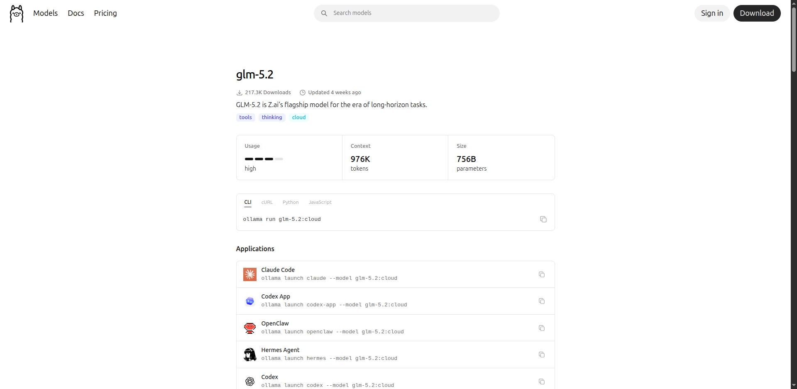

<!-- _paginate: false -->

# Claude vs Ollama & Total Recall Plugin

**Autor:** Adrian Balaban  
**Data:** 21 iulie 2026

Două teme despre unelte AI:

TEMA 1 : LLM+agent proprietar si remote (Claude) sau proxy open (Ollama) catre LLM open, remote si local
TEMA 2 : Plugin de memorie persistentă in agent AI via plugin MCP (total-recall)

---

## Ce iei din această sesiune

1. **Ce este Ollama**
2. **Claude vs Ollama**
3. **Integrarea Ollama cu Claude/Gemini/??**
4. **Total-recall plugin - la ce nevoi raspunde si cum funcționează**
5. **Total-recall plugin - cum îl instalezi** — Claude Code, Gemini CLI.

---

## Agendă (~65 de minute)

1. **Claude vs Ollama** (25 min)
2. **Total Recall Plugin** (25 min)
3. **Sinteză & Întrebări (Q&A)** (10 min)

<!--
Expansion joints — dacă timpul scade la ~45 min, taie în ordinea:
1. „Pot adăuga GPU pe laptop?" (eGPU, Bonus)
2. „A treia cale: Otari" (Bonus)
4. Scurtează algoritmul de căutare la WOW + tabelul de comportament.
-->

---

## TEMA 1 din 2 — CLAUDE vs OLLAMA (~25 min)

> **Firul roșu:** AI-ul cloud a devenit scump și cu 'lock-in'; Ollama permite alternative open, accesibile — și e doar una dintre alternative.

---

## Ce este Claude?

> **Claude** = LLM-uri **remote proprietare** (Fable, Sonnet, Opus, Haiku — rulează exclusiv pe serverele Anthropic) + **agent local proprietar** (Claude Code — CLI-ul de pe mașina ta, care cheamă modelele remote).

**Setări necesare, rulare și verificare:**

```bash
claude       # pornește agentul (cont claude.ai sau API key)

/status      # ce model, ce endpoint, ce cont — sursa adevărului
/models      # modelele disponibile
/effort      # nivelul de raționament
```

---

## Pregătire: 4 agenți față în față, în consolă

**Pregătire:** conturi active pe **Claude**, **Ollama**, **Copilot** și **Gemini**.

Aceleași comenzi de verificare, 4 agenți în paralel:

| Agent                   | Lansare                 | Verificare                      |
| ----------------------- | ----------------------- | ------------------------------- |
| Claude Code             | `claude`                | `/status`, `/models`, `/effort` |
| Claude Code prin Ollama | `ollama launch claude`  | `/status`, `/models`, `/effort` |
| Copilot CLI pe Ollama   | `ollama launch copilot` | `/status`, `/models`, `/effort` |
| Gemini CLI              | `gemini`                | `/status`, `/models`, `/effort` |

---

## Demo-uri față în față · Memorie, review, model local

**Memoria (total-recall), pe cel 4 console/clienti:**

- același prompt de afișare a memoriilor disponibile + `/total-recall:status`, în paralel
- pe unul: adaugă o memorie **org** și una **personală**; pe altul, după repornire: afișează-le după cheie

**Review pe LLM remote, în paralel:**

- același prompt de review pe toți 4 → rezultate scrise în `REVIEW-<model>.txt`
- comparăm **rezultatul** și **timpul de răspuns**

**Model local prin Ollama:**

- același prompt de memorii + `/total-recall:status`
- prompt simplu („what day is today") prin clientul Claude Code vs direct în `ollama run`

---

## Ce este Ollama?

> Ollama este un tool open-source care îți permite să rulezi modele LLM **local**,
> pe propriul hardware, fără nicio conexiune la internet și fără cost per token.
>
> Pentru modelele prea mari ca să încapă pe hardware-ul tău, Ollama nu rulează local — face **proxy** către infrastructura sa cloud, prin aceleași comenzi CLI/API (`ollama run <model>:cloud`).

> 💡 **WOW:** peste **100 de milioane de descărcări** pe [Docker Hub](https://hub.docker.com/r/ollama/ollama) (imaginea `ollama/ollama`) și **176k stars** pe [GitHub](https://github.com/ollama/ollama) _(verificat iul 2026)_. Este cel mai popular runtime local pentru LLM-uri.


**Practic:**

- Disponibil pe toate cele **3 SO-uri** (Linux, macOS, Windows) — [ollama.com/download](https://ollama.com/download)
- Se instalează ca **serviciu** (daemon-ul ascultă pe `localhost:11434`)
- Modelele **remote** (`:cloud`) necesită **cont** pe ollama.com (`ollama signin`)

---

## Avantajul Ollama: o interfață, modele locale si remote, multiple integrari API (Claude,Codex,Copilot...) si asistenti

- aceeași interfață CLI (`ollama run <model>:cloud`) pentru toate modelele
- endpoint-uri compatibile cu multiple API-uri: **OpenAI**, **Anthropic**,...
- lista completă de integrări: [docs.ollama.com/integrations](https://docs.ollama.com/integrations)


---

## Ce este Ollama? · Modelele disponibile

**Catalogul:** [ollama.com/library](https://ollama.com/library) (screenshot-uri în handout). Cum le alegem:

- **Locale**: Llama, Mistral, Gemma, Phi, Qwen etc. — le alegi după VRAM/RAM-ul disponibil
- **Remote** (`:cloud`, cont necesar): `glm-5.2:cloud`, `kimi-k2.7-code:cloud`, `gemini-3-flash-preview:cloud`, `gpt-oss:120b-cloud`
- API compatibil Claude: [ollama.com/library/glm-5.2](https://ollama.com/library/glm-5.2) — Terminal-Bench 2.1: 81.0 vs 85.0 (Opus 4.8)



**Ce am instalat până acum?** → `ollama list` pe mașina reală, câteva slide-uri mai încolo.

---

## Ollama · Comenzi

```bash
ollama list                    # modelele instalate
ollama pull llama3.2           # doar download
ollama run llama3.2            # download + rulare, gata de conversație

# Modele remote (:cloud) — nimic de descărcat, cont ollama.com:
ollama signin
ollama run glm-5.2:cloud
```

---

## Integrare Ollama cu Claude și Gemini

> - **Claude nu există în Ollama** — doar imitații comunitare, de evitat. Pentru Claude real: API-ul Anthropic sau `ollama launch claude` cu alt model în spate
> - Gemini există doar cu versiunea remote: `ollama launch claude --model gemini-3-flash-preview:cloud`

---

## Modele de top remote în Ollama

Filtrul de căutare: [ollama.com/search?c=cloud&c=tools&c=thinking](https://ollama.com/search?c=cloud&c=tools&c=thinking)


- **GLM-5.2** — context ~1M tokens (976K), 756B parametri. Aproape de Claude Opus 4.8 pe Terminal-Bench 2.1 (**81.0 vs 85.0** — verificat pe [ollama.com/library/glm-5.2](https://ollama.com/library/glm-5.2) la 11 iul 2026), la preț API de **~12–20× mai mic**.
- **Kimi-K2.7-Code** — specializat pe generare și analiză de cod; puncte forte: code review, explicare cod legacy ([ollama.com/library/kimi-k2.7-code](https://ollama.com/library/kimi-k2.7-code)).

**Comparația din rulările anterioare:** demo-ul `REVIEW-<model>.txt` de la început — același prompt de review, rezultat și timp de răspuns, față în față.

---

## Modele locale în Ollama instalate (`ollama list`)

Mașina: **Dell Latitude 5521** (i7-11850H, MX450 2GB GDDR6).

```
$ ollama list
NAME                          SIZE      MODIFIED
nemotron-3-nano:30b           24 GB     8 days ago
mistral-medium-3.5:latest     80 GB     8 days ago
qwen3.6:latest                23 GB     8 days ago
qwen3.5:latest                6.6 GB    8 days ago
gemma4:latest                 9.6 GB    8 days ago
kimi-k2.7-code:cloud          —         8 days ago
ornith:9b                     5.6 GB    8 days ago
glm-5.2:cloud                 —         10 days ago
north-mini-code-1.0:latest    18 GB     12 days ago
```

---

## Modele locale · Limitări și concluzia practică

**Limitări pe acest hardware:**

- MX450 (2GB VRAM) nu poate ține niciun model în VRAM — toate rulează pe CPU via RAM
- `qwen3.5` (6.6 GB) și `ornith:9b` (5.6 GB) sunt singurele care intră confortabil în 16 GB RAM → ~3–8 tok/s
- Modelele cu tag `:cloud` (kimi-k2.7-code, glm-5.2) sunt **API-uri externe proxiate prin Ollama** — nu rulează local

**Extinderi posibile pentru a rula local:**

- GLM-5.2 necesita investitie de minim ~7000 euro conform [insiderllm.com/guides/run-glm-5-2-locally](https://insiderllm.com/guides/run-glm-5-2-locally/)
- realist: un LLM local mic (`qwen3.5`, `gemma4`) plus eGPU extern (slide-ul următor) necesita investitie de minim ~700 euro

**Concluzia practică:** pe acest laptop, Claude API rămâne alegerea corectă; modelele locale = experimente offline.

---

## Cum pot adăuga GPU pe laptop? (Bonus)

> **TL;DR:** Teoretic: GPU-ul intern e soldat — singura opțiune e **eGPU extern via Thunderbolt 4**. Cu un enclosure + RTX 3060 12GB nou (minim ~3.500 lei), rulezi modele de 7–13B complet pe GPU la 20–50 tok/s. Bottleneck-ul TB4 e irelevant pentru inference LLM (contează VRAM-ul, nu banda).

**Ce modele?** Cu 12 GB VRAM: Llama 3.1 8B, Mistral 7B, Qwen 7–14B, DeepSeek-Coder 6.7B — complet pe GPU.


---

## Comparație directă: Claude vs Ollama

> 💡 **Punctul-cheie:** nu e „care e mai bun", ci **ce optimizezi** — inteligență maximă (Claude) vs suveranitate totală: $0/token, offline, zero egress (Ollama).

> 📊 **WOW Metric:** Latența la primul token (TTFT) pe Ollama cu un model 8B pe GPU local este de **~120ms**, în timp ce prin API-ul Claude este de **~650ms** (de ~5 ori mai rapid local).

**Cum se măsoară** — același script pe ambele endpoint-uri ([scripts/ttft.sh](scripts/ttft.sh)): cronometrezi primul byte din răspunsul streaming.

```bash
# local:  ./scripts/ttft.sh http://localhost:11434/api/generate '{"model":"gemma3:4b","prompt":"Salut","stream":true}'
# Claude: ./scripts/ttft.sh https://api.anthropic.com/v1/messages '{...,"stream":true}' -H "x-api-key: $ANTHROPIC_API_KEY" ...
```

⚠️ Măsurat pe laptopul de demo (CPU-only): local ~800–900 ms — cifra de ~120ms cere GPU cu VRAM suficient.

📄 **Detalii** (script complet, protocol, rezultate măsurate): [details/masurare-ttft.md](details/masurare-ttft.md)

---

## GDPR: unde ajung datele

- Modelele `:cloud` GLM-5.2, Kimi-K2.7-Code procesează datele pe **servere în China** — jurisdicție fără GDPR
- Nici Claude nu e „gratuit" GDPR — pentru rezidență EU: AWS Bedrock / Vertex AI pe regiuni EU (nuanțele complete, în handout)

---

## Costul real: Claude API vs Ollama

> 💡 **WOW:** un 'agentic developer' ce lucreaza intens arde ~$400/lună pe API — un RTX 4090 de $2.000 se amortizează în ~5 luni. Dar dacă ești utilizator light ($30/lună), amortizarea durează ani.

| Profil                | Cheltuială API tipică | Amortizare hardware local       |
| --------------------- | --------------------- | ------------------------------- |
| Indie / light         | ~$30/lună             | ani — rămâi pe API sau CPU-only |
| Daily driver          | ~$100/lună            | ~6 luni (RTX 3080 SH ~$600)     |
| **Agentic developer** | **~$400/lună**        | **~5 luni (RTX 4090 ~$2.000)**  |

📄 **Detalii** (calculul $400/lună, tier-uri hardware, „AI Got Expensive" Mozilla.ai, nota Sonnet 5): [details/costul-real-claude-vs-ollama.md](details/costul-real-claude-vs-ollama.md)

---

## Confidențialitate și date: diferența crucială

> 💡 **WOW:** cu Ollama si model local, promptul si datele nu părăsesc **niciodată** mașina — funcționează și cu cablul de rețea scos (air-gapped). Pentru finance/healthcare/NDA, asta nu e un „nice to have", e singura opțiune legală.

### Claude API

```
Cerere utilizator
       │  (HTTPS la api.anthropic.com)
       ▼
Serverele Anthropic (US)
       │
       ├── Procesare → răspuns
       ├── Logging (audit, safety) — politici Anthropic
       └── Training data? → Implicit NU, dar citiți ToS (Terms of Service —
           condițiile de utilizare Anthropic; ele definesc ce are voie
           furnizorul să facă cu datele trimise: logging, retenție, training)
```

---

## Confidențialitate și date · Practic, cu Claude

**Ce înseamnă practic:**

- Codul tău (parțial sau complet) este trimis la Anthropic
- Secretele din prompt ajung pe servere externe
- GDPR: Anthropic are DPA disponibil, dar datele ies din EU
- Contracte enterprise pot restricționa utilizarea API-ului cloud

---

## Confidențialitate și date · Ollama remote (`:cloud`)

```
Cerere utilizator
       │
       ▼
localhost:11434 (daemon Ollama)
       │  (HTTPS către furnizor)
       ▼
Serverele furnizorului: Ollama Cloud / Zhipu AI / Moonshot AI
```

**Practic:** `:cloud` ≠ local — datele **pleacă** de pe mașină exact ca la orice API cloud; pentru furnizorii din China, fără decizie de adecvare GDPR (v. slide-ul GDPR).

---

## Confidențialitate și date · Ollama (local)

### Ollama (local)

```
Cerere utilizator
       │
       ▼
localhost:11434
       │
       ▼
Model GGUF în RAM/VRAM — NICIODATĂ în afara mașinii
```

**Ce înseamnă practic:**

- Codul tău, secretele, datele clientului — rămân pe mașina ta
- Zero egress de date
- Funcționează în rețele izolate (air-gapped)
- Util în: finance, healthcare, proiecte cu NDA strict, codebases proprietare

---

## Ollama cu Claude Code: integrarea practică

> 💡 **WOW — gotcha-ul „subscription hijack":** configurezi manual Claude Code pe Ollama, totul pare OK… dar cu abonament Claude Max/Pro cererile pleacă **silențios pe OAuth la api.anthropic.com**, nu la Ollama. Cauza: `ANTHROPIC_API_KEY=""` — șirul gol înseamnă „nu e setat". Fix-ul pe o linie: setează doar `ANTHROPIC_AUTH_TOKEN=ollama` și verifică cu `/status` că base URL-ul e `localhost:11434`.

---

## Ollama cu Claude Code · Metoda oficială

**Metoda oficială: `ollama launch claude`** — pornește clientul Claude Code cu Ollama ca backend, nativ (fără proxy):

```bash
# Model local (pe GPU propriu, ex. RTX 3060)
ollama launch claude --model qwen3.5

# Model cloud (fără download local)
ollama launch claude --model glm-5.2:cloud

# Non-interactiv / scriptat
ollama launch claude --model glm-5.2:cloud --yes -- -p "how does this repo work?"
```

---

## Ollama cu Claude Code · Ce face comanda

Ce face comanda automat:

- instalează/pornește **clientul Claude Code**
- setează `ANTHROPIC_BASE_URL=http://localhost:11434`, `ANTHROPIC_AUTH_TOKEN=ollama`, `ANTHROPIC_API_KEY=""`

### Distincția cheie: formatul e Anthropic, inteligența e Ollama

Ollama vorbește **nativ** formatul API Anthropic la `localhost:11434` — **nu există proxy separat**. Clientul Claude Code „crede" că vorbește cu Anthropic; de fapt răspunde modelul ales cu `--model`:

```
cerere în format Anthropic → Ollama traduce intern → modelul Ollama răspunde
      → răspuns re-ambalat în format Anthropic → clientul Claude Code îl consumă
```

---

## Ollama cu Claude Code · Metoda manuală

**Metoda manuală (alternativă, fără `launch`):**

```bash
ollama pull qwen3.5
export ANTHROPIC_BASE_URL=http://localhost:11434
export ANTHROPIC_AUTH_TOKEN=ollama
claude --model qwen3.5
```

Sau permanent în `~/.claude/settings.json`:

```json
{
  "env": {
    "ANTHROPIC_BASE_URL": "http://localhost:11434",
    "ANTHROPIC_AUTH_TOKEN": "ollama"
  }
}
```

---

## Ollama cu Claude Code · Limitări

**Esențialul limitărilor:** endpoint-ul Anthropic-compatibil suportă tool calling și extended thinking (suport basic — `budget_tokens` acceptat dar **neaplicat**), dar **nu** prompt caching; calitatea = calitatea modelului local ales.

📄 **Detalii** (mecanica `x-api-key` vs `Bearer`, lista completă de capabilități și limitări, modele cu tool calling): [details/integrare-claude-code-ollama.md](details/integrare-claude-code-ollama.md)

---

## A treia cale: Otari de la Mozilla, gateway Anthropic-compatibil (Bonus)

<!-- Expansion joint: al doilea slide de tăiat la 45 min. -->

> 💡 **WOW:** același truc `ANTHROPIC_BASE_URL`, dar cu **buget enforcement ÎNAINTE de request, nu după factură.**

**Otari** (Mozilla.ai, open-source, lansat mai 2026, construit peste `any-llm`) e un gateway LLM self-hosted care expune și endpoint-ul Anthropic (`POST /v1/messages`) — deci Claude Code poate rula prin el exact ca prin Ollama, dar cu stratul operațional pe care Ollama nu-l are:

- **Bugete** per user / per cheie, aplicate _înainte_ ca cererea să ruleze
- **Chei virtuale** — clientul nu vede niciodată cheia reală Anthropic/OpenAI; le poți revoca oricând
- **Usage & spend tracking** în timp real, pe toate modelele (40+ provideri prin any-llm)
- Rulezi Claude real, GPT, Mistral sau modele locale prin **același endpoint**

---

## Ghid de decizie: Claude sau Ollama?

```
Datele tale pot ieși din infrastructura ta?
 ├── NU  → Ollama (local) — obligatoriu
 └── DA  → Ai nevoie de calitate top-tier (raționament complex, cod avansat)?
            ├── DA → Claude API (Sonnet/Opus)
            └── NU → Ollama cu model remote
```
---

## TEMA 2 din 2 — TOTAL RECALL PLUGIN (~25 min)

> **Puntea între teme:** ai ales runtime-ul (cloud sau local). Acum să-l faci să țină minte cine ești si ce ai facut — altfel fiecare sesiune o iei de la zero.

---

## Problema: Claude uită tot după sesiune

> La sfârșitul fiecărei conversații, Claude pierde tot contextul acumulat.
> Decizii, preferințe, arhitecturi discutate — totul dispare.

**Simptomele:**

- Reexplici același context la fiecare sesiune nouă
- Preferințele tale de cod trebuie re-menționate de fiecare dată
- Deciziile de arhitectură, info. de infra. si alte categorii de informatii nu se acumulează nicăieri

**Consecința:** Cu cât lucrezi mai mult cu un agent (Claude Code...), cu atât pierzi mai mult timp re-explicând ceea ce ai deja explicat.

---

## Problema · Cine mai vrea asta: cq (Mozilla.ai)

> **Cine mai vrea aceasta:** Mozilla.ai a lansat [`cq`](https://github.com/mozilla-ai/cq) (1.2k ⭐) — standard deschis pentru _shared agent learning_. **Complementar, nu concurent** cu total-recall — comparația onestă vine la finalul temei.

---

## Demo: aceeași întrebare, cu și fără memorie

<!--
🎬 Regie — payoff-ul emoțional al întregii teme.
Lipsync: varianta primară e clipul pre-înregistrat de 20 s (images/demo-cu-fara-memorie.gif); live doar dacă sala permite.

Pregătire înainte de prezentare — stochează memoria:
  „stochează memoria urmatoare de architecture pentru db-choice: am ales PostgreSQL față de MySQL pentru JSONB"
  → Stocat: architecture/db-choice (personal vault, importanceScore 0.7, taguri: database, postgresql, mysql, jsonb, adr, decision).
  Pluginul verifică duplicatele cu search_index și scrie Executive Summary cu WHY/HOW; opțional tag no-prune (imutabil, ca un ADR formal) sau tag org (decizie de echipă → org vault).
-->

```

FĂRĂ total-recall (sesiune Claude nouă):          CU total-recall (sesiune nouă, același prompt):
──────────────────────────────────────            ──────────────────────────────────────────────
> care DB am ales pentru proiect?                 > care DB am ales pentru proiect?

„Nu am context despre o decizie                   → recall_memory(query="DB proiect")
anterioară legată de baza de date.                „Conform memoriei architecture/db-choice (creatムazi, 13 iulie 2026):Ai ales PostgreSQL (respins MySQL). Motivul decisiv: JSONB e€” stocare binarムa documentelor JSON cu indexare ...
```

Publicul nu trebuie să creadă pe cuvânt — vede diferența pe ecran în 20 de secunde.

---

## Soluția: total-recall

> Un plugin Claude Code care dă AI-ului memorie persistentă, căutabilă, între sesiuni.

<!--
🎬 Regie: rulează pe ecran `claude -p "Reaminteste-ti decizia noastra despre baza de date"` și arată apelul recall_memory în output. Lipsync: GIF pre-înregistrat ca plasă de siguranță. Pentru public, comanda e „tema de acasă" din handout.
-->

---

## Soluția: total-recall · Ce este

**Ce este:**

- **Plugin Claude Code** instalat din marketplace
- **MCP server** cu 17 unelte (stdio, înregistrat via `claude mcp add`)
- **Vault de fișiere Markdown** stocat local la `~/.total-recall/`
- **Hook-uri automate** care injectează contextul la fiecare sesiune nouă
- **Skill `/total-recall:memory-workflow`** pentru sesiuni structurate de recall/store

---

## Soluția: total-recall · Ce NU este

**Ce nu este:**

- Nu trimite date în cloud (vaultul personal este complet local)
- Nu folosește o bază de date opacă — fiecare memorie este un fișier `.md` citibil
- Nu suprascrie context — injectează, nu înlocuiește (Modelul vede: system prompt + CLAUDE.md + memoriile tale (index) + mesajul tău — toate coexistă.)

---

## Structura pe disc

> 💡 **WOW:** zero bază de date — memoria AI-ului tău e un folder de fișiere `.md` pe care le poți citi, edita, versiona cu git și deschide în Obsidian.

```
~/.total-recall/
├── index.json               ← index plat: key → MemoryMetadata
├── invertedIndex.json       ← TF-IDF inverted index: token → {docs, idf}
├── .index-cache.txt         ← rezumat injectat la SessionStart (shell-readable)
├── personal-vault/
│   ├── architecture/
│   │   └── db-choice.md     ← memorie individuală: frontmatter YAML + corp Markdown
│   ├── decisions/
│   ├── troubleshooting/
│   ├── meetings/
│   ├── knowledge/
│   ├── journal/
│   └── vectors.db           ← embeddings sqlite-vec (opțional)
└── org/
    └── org-vault/
        └── architecture/
            └── team-decision.md   ← memorii partajate cu echipa, sync pe git
```

---

## Structura pe disc · Anatomia unei memorii

**Fiecare memorie** este un fișier `.md` cu frontmatter:

```markdown
---
title: "Preferă PostgreSQL pentru date relaționale"
tags: [architecture, database, feedback]
author: adrianb
importanceScore: 0.8
created: 2026-06-01T10:00:00Z
updated: 2026-06-15T14:30:00Z
---

## Executive Summary

Preferă PostgreSQL față de MySQL pentru proiecte noi...
```

---

## Arhitectura: modulele principale

> 💡 **WOW — cifra de pe ecran: `1`.** Un motor de căutare hibrid complet (TF-IDF + vector + curbă de uitare) în ~24 de fișiere TypeScript, cu **o singură dependență obligatorie** (`@modelcontextprotocol/sdk`). Restul — TF-IDF, Ebbinghaus, RRF, parser frontmatter — scris de la zero.

```
┌──────────────────────────┐   ┌──────────────────────────┐
│  INDEX & PERSISTENȚĂ     │   │  CĂUTARE                 │
│  index/state/persistence │   │  tfidf + ebbinghaus      │
│  vault-scan, frontmatter │   │  + rrf + embeddings      │
│  (parser YAML propriu)   │   │  (vector = opțional)     │
└──────────────────────────┘   └──────────────────────────┘
┌──────────────────────────┐   ┌──────────────────────────┐
│  HOOKS & SIGURANȚĂ       │   │  UNELTE MCP (17)         │
│  auto-reconcile, journal │   │  tools/: store, recall,  │
│  privacy-filter          │   │  query, mutate, bulk,    │
│  (fail-closed la push)   │   │  rerank                  │
└──────────────────────────┘   └──────────────────────────┘
```

📄 **Detalii** (arborele complet al celor 24 de fișiere, cu ce face fiecare): [details/arhitectura-module.md](details/arhitectura-module.md)

---

## De ce algoritmi proprii (fără hard dependencies)

**Ce câștigi:**

1. **Securitate:** fără `gray-matter` → fără CVE-ul `js-yaml` (GHSA-h67p-54hq-rp68)
2. **Scoring coerent:** title-boost, tag-boost, Ebbinghaus = o singură formulă, nu trei librării
3. **Determinism:** zero apeluri LLM, zero cost, merge offline / air-gapped
4. **Auditabilitate:** fiecare decizie de scoring e observabilă prin `get_stats`

> **Filozofia:** dependențele grele = risc de CVE + breaking-change + black-box. Doar ONNX și sqlite-vec rămân externe — și ele opționale.

---

## Dual Vault: personal vs org

> 💡 **WOW:** un simplu tag `org` transformă memoria personală în cunoaștere de echipă — cu filtru de confidențialitate **fail-closed**: dacă nu poate garanta că nu scapă secrete, nu face push.

```
store_memory(tags=[...])
       │
       ├── conține "org"  ──►  ORG VAULT  (~/.total-recall/org/org-vault/)
       │                        key prefix: "org/"
       │                        scriere protejată de autor
       │                        sync automat → git repo echipă (branch org-vault)
       │                        filtru de confidențialitate înainte de push
       │
       └── altfel         ──►  PERSONAL VAULT  (~/.total-recall/personal-vault/)
                                key: cale relativă simplă
                                jurnal auto-adăugat la fiecare store
```

**Regulă cheie:** tagurile `personal` și `org` sunt mutual exclusive — `store_memory` aruncă eroare dacă ambele sunt prezente.

---

## Dual Vault · Filtrul de confidențialitate

**Filtru de confidențialitate (org sync):**

- Blochează secrete și chei API după tipare cunoscute (chei PEM, `sk-`, `ghp_`, `AKIA`, JWT, Slack/GitLab/Google tokens etc.)
- Detectează și **secrete etichetate** — ex. `aws_secret_access_key = …`: un `~/.aws/credentials` lipit din greșeală e blocat înainte de push
- Blochează toate adresele email (cu excepția domeniilor din allowlist)
- Fail-closed: dacă filtrul nu poate analiza conținutul, NU face push

---

## Cele 17 unelte MCP

<!--
🎬 Regie — ideea sticky demonstrată, nu enunțată: spui „reține că prefer PostgreSQL" → modelul alege singur store_memory; întrebi „ce am decis despre DB?" → alege recall_memory. Lipsync: GIF pre-înregistrat ca plasă de siguranță.
-->

> 💡 CRUD complet + căutare + întreținere, **în limbaj natural** — nu înveți 17 nume de unelte.

Harta pe 4 cadrane (cu uneltele-erou):

```
┌── SCRIE ──────────────────────┐  ┌── CITEȘTE ───────────────────────┐
│  store_memory  ★              │  │  recall_memory  ★                │
│  (+ update, delete, confirm)  │  │  (+ search_index, rerank, keys)  │
└───────────────────────────────┘  └──────────────────────────────────┘
┌── LISTEAZĂ ───────────────────┐  ┌── ÎNTREȚINE ─────────────────────┐
│  list_memories                │  │  prune_memories  ★  (doar listă) │
│  (+ timeline, related, stats) │  │  export_memories ★  (portabil)   │
└───────────────────────────────┘  └──────────────────────────────────┘
```

- `rerank_memories` = semantic rerank **local**: re-embeddează query + candidați și sortează după scor cosine — fără niciun apel LLM
- `confirm_memory` = feedback confirm/flag integrat direct în scorul Ebbinghaus

📄 **Detalii** (toate cele 17 unelte, cu descrierea fiecăreia): [details/unelte-mcp.md](details/unelte-mcp.md)

---

## Algoritmul de căutare: TF-IDF + Ebbinghaus

> 💡 **WOW:** memoria AI-ului **uită ca un om** — [curba uitării lui Ebbinghaus](https://en.wikipedia.org/wiki/Forgetting_curve) (1885) aplicată în cod: memoriile neimportante și neaccesate se estompează din rezultate, fiecare accesare le „reîmprospătează" cu +20%.

---

## Algoritmul de căutare · Esența

**TF-IDF pe scurt:** un cuvânt punctează mult dacă apare **des în memoria respectivă**, dar **rar în restul colecției** — căutarea citește doar indexul, nu fișierele. Peste scorul textual se aplică uitarea:

```
decay = importanceScore × exp(−λ × daysSince)
        × (1 + accessCount × 0.2 + confirmations × 0.1 − flags × 0.1)
```

| importanceScore | λ (viteza de uitare) | Comportament                                    |
| --------------- | -------------------- | ----------------------------------------------- |
| 1.0 (critic)    | 0.032                | Decay lent — memoria rămâne relevantă săptămâni |
| 0.5 (normal)    | 0.096                | Decay mediu                                     |
| 0.3 (scăzut)    | 0.122                | Decay rapid — dispare din rezultate în zile     |

Fiecare acces +20% retenție, confirmare +10%, flag −10% (`confirm_memory`) — memoria nu doar „îmbătrânește", ci primește feedback.

📄 **Detalii** (pipeline-ul complet `recall_memory`, TF-IDF & inverted index, RRF, formula λ): [details/algoritm-cautare.md](details/algoritm-cautare.md)

---

## Embeddings și căutare multilinguală (opționale)

> Embeddings = opționale, lazy-load, complet locale (sau via Ollama cu model local). Fără ele, pluginul downgrades la TF-IDF.

**Provideri configurabili** (în `~/.total-recall/config.json`): `huggingface` (implicit, local MiniLM), `ollama` (API local, `bge-m3`).

**Căutare multilinguală:** flag-ul `enableMultilingualSearch: true` activează expansiune de tokeni EN↔RO (ex. „decizie" găsește și „decision").

---

## Embeddings și multilingual · Demo-ul EN↔RO

<!--
🎬 Climaxul TEMEI 2 — momentul pe care dev-ii îl povestesc mai departe.
Lipsync: varianta primară e clipul pre-înregistrat (images/demo-multilingv.gif); live doar dacă rețeaua și sala permit.
-->

Stochezi memoria în **engleză**, apoi într-o sesiune nouă întrebi în **română** — expansiunea „decizie"→„decision" o găsește:

```
# 1. Stochează (în engleză):
> "remember that we chose PostgreSQL over MySQL because of JSONB support"
→ store_memory(title="Database decision: PostgreSQL", tags=["architecture", "database"])

# 2. Într-o sesiune nouă, întreabă în ROMÂNĂ:
> "care a fost decizia noastră despre baza de date?"
→ recall_memory(query="decizie baza de date")
→ expansiunea EN↔RO mapează „decizie"→"decision", „baza de date"→"database"
→ găsește memoria englezească, scor TF-IDF pe tokenii expandați ✅
```

📄 **Detalii** (cum funcționează embeddings & vectorizarea, pipeline-ul ONNX local, sqlite-vec): [details/embeddings-vectorizare.md](details/embeddings-vectorizare.md)

---

## Hook-urile: integrarea automată (Claude Code / Copilot / Gemini)

> 💡 **WOW:** înainte de compactarea contextului (`PreCompact`), pluginul **salvează automat learnings-urile sesiunii** — cunoașterea supraviețuiește chiar și când contextul e șters.

> Deși inițial create exclusiv pentru Claude Code, hook-urile de lifecycle rulează acum și pe **GitHub Copilot CLI** și **Gemini CLI** (prin `hooks.copilot.json` și `hooks.gemini.json`).

---

## Hook-urile · Pe Copilot și Gemini CLI

### Execuția pe clienți non-Claude (Copilot și Gemini CLI)

- **Cum funcționează:** La pornirea sau pe parcursul sesiunii, clientul Copilot sau Gemini apelează hook-ul corespunzător.
- **Side-effects executate:** Hook-urile de fundal rulează normal (trag ultimele memorii din git, reconstruiesc cache-ul indexului local, execută push/sync automat în org-vault).
- **Limitare (graceful degradation):** acești clienți ignoră stdout-ul hook-urilor → **injectarea automată a contextului (`additionalContext`) e dezactivată**; modelul poate interoga memoriile oricând prin uneltele MCP.

---

## Hook-urile · SessionStart

### `SessionStart` (4 pași, secvențiali)

```
1. pull-org-vault.sh       — git pull pe branch-ul org-vault (dacă e configurat)
2. build-memory-index.sh   — scanare awk a frontmatter-ului → .index-cache.txt
3. load-memory-index.sh    — cat .index-cache.txt → injectat în context (doar Claude Code)
4. load-open-questions.sh  — cat open-questions.md → injectat în context (doar Claude Code)
```

**Efect:** La fiecare nouă sesiune Claude, modelul primește automat rezumatul tuturor memoriilor tale — fără să ceri explicit.

---

## Hook-urile · PostToolUse

### `PostToolUse` (declanșator: `store_memory|update_memory|delete_memory`)

```
sync-org-memory.sh
  ├─ verifică dacă memoria are tag "org"
  ├─ aplică filtrul de confidențialitate
  └─ git add/commit/push → branch org-vault al echipei
  + rebuild .index-cache.txt
```

---

## Hook-urile · PreCompact și SessionEnd

### `PreCompact` (când contextul e aproape de limită)

```
extract-and-store-memories.sh
  ├─ citește transcriptul sesiunii din stdin JSON (transcript_path)
  ├─ cere lui Claude să extragă 0–3 learnings cheie ca JSON lines
  └─ store-learning.mjs → scrie direct ca fișiere .md în personal-vault
       (fără round-trip MCP; nu suprascrie memorii existente)
```

### `SessionEnd` — cleanup: loghează sesiunea și asigură flush-ul embeddings-urilor înainte de exit.

---

## Instalare și utilizare practică

> 💡 **Util:** același plugin, 4 clienți — Claude Code, Copilot CLI, Gemini CLI, standalone — cu un singur `install.sh`.

---

## Instalare · Build din marketplace

### Instalare bazată pe client

Scriptul `install.sh` este acum conștient de starea clientului și acceptă argumente specifice:

```bash
# 1. Clonează marketplace-ul și construiește pluginul
git clone https://github.com/adrian-balaban/my-claude-plugins-marketplace.git
cd my-claude-plugins-marketplace/plugins/total-recall
npm install && npm run build
```

---

## Instalare · Per client

```bash
# 2. Înregistrează în funcție de clientul tău:

# Pentru Claude Code (nativ):
claude plugin install "$(pwd)"

# Pentru GitHub Copilot CLI (MCP + hooks.copilot.json):
./install.sh --copilot

# Pentru Gemini CLI (MCP + hooks.gemini.json):
./install.sh --gemini

# Pentru instalare Standalone (scrie căi absolute în settings.json):
./install.sh --standalone
```

---

## Instalare · Org vault = opțional

> **Org vault = opțional, dezactivat implicit** (pasul 6 din `install.sh`, default „n"). Cine instalează doar pentru uz personal poate ignora complet acest pas — memoria locală (`personal-vault`) funcționează 100% de la prima rulare, fără git. Vaultul org e strict pentru cine vrea memorie partajată de echipă pe git (necesită `gh` CLI autentificat, cerut **doar** la acest pas).

---

## Instalare · Utilizare în sesiune

### Utilizare în sesiune Claude Code

```
# Caută memorii
> "reamintește-mi decizia despre baza de date"
→ recall_memory(query="decizie baza de date")

# Stochează o memorie
> "reține că preferăm PostgreSQL cu partitionare pe lună"
→ store_memory(title="...", content="...", tags=["architecture", "database"])

# Listează tot
> "arată-mi toate memoriile de arhitectură"
→ list_memories(category="architecture")

# Skill dedicat
> /total-recall:memory-workflow
```

---

## Compatibilitate: Claude Code vs Copilot vs Gemini vs Codex

**Trei niveluri de integrare** (povestea din spatele matricei):

1. **Full** — Claude Code: unelte MCP + context injection automat + skills
2. **Parțial** — Copilot / Gemini CLI: uneltele și hooks merg, dar contextul nu se auto-injectează — modelul trebuie să întrebe
3. **Manual** — Codex CLI: doar unelte MCP, fără hooks

---

## Compatibilitate · Matricea (1/2)

| Capabilitate                  | Claude Code | GitHub Copilot CLI     | Gemini CLI             | OpenAI Codex CLI          |
| ----------------------------- | ----------- | ---------------------- | ---------------------- | ------------------------- |
| **MCP Server (17 unelte)**    | ✅ Nativ    | ✅ stdio MCP suportat  | ✅ stdio MCP suportat  | ✅ `~/.codex/config.toml` |
| **Side Effects (Sync/Index)** | ✅ Da       | ✅ Da (hooks automate) | ✅ Da (hooks automate) | ❌ Nu (manual)            |

---

## Compatibilitate · Matricea (2/2)

| Capabilitate          | Claude Code                 | GitHub Copilot CLI        | Gemini CLI                | OpenAI Codex CLI |
| --------------------- | --------------------------- | ------------------------- | ------------------------- | ---------------- |
| **Context Injection** | ✅ Da (`additionalContext`) | ❌ Nu (ignorat de client) | ❌ Nu (ignorat de client) | ❌ Nu            |
| **Playbook Skills**   | ✅ Da (nativ)               | ❌ Nu                     | ❌ Nu                     | ❌ Nu            |

---

## Compatibilitate · Obsidian și cq

> **Bonus:** vault-urile total-recall se deschid nativ în **Obsidian** (fișiere `.md` cu frontmatter YAML). Nu folosi Obsidian Sync pe `org-vault` — sync-ul trebuie să treacă prin git-ul total-recall.

> **„De ce nu folosiți cq?"** (promis la începutul temei) — `cq` acoperă **7 host-uri** (Claude, Codex, Copilot, Cursor, OpenCode, Pi, Windsurf), dar **fără context injection**; total-recall acoperă 3 clienți cu hooks automate + context injection nativ în Claude Code. Obiecte diferite: memorie de context vs knowledge units partajate.

---

## Sinteza finală și întrebări deschise

> 💡 **UTIL Takeaway — 3 lucruri de făcut mâine dimineață:** (1) Instalează Ollama, (2) rulează `ollama launch claude --model gemma3:4b` pentru teste locale rapide, (3) adaugă `total-recall` pentru memorie persistentă între sesiuni. Primele 10 minute cu total-recall, pas cu pas: [details/primele-10-minute.md](details/primele-10-minute.md) · Ghidul de decizie printabil: [details/decizie-o-pagina.md](details/decizie-o-pagina.md)

---

## Sinteza · Claude vs Ollama

### Ce am acoperit

**Claude vs Ollama:**

- Claude API: calitate maximă, cost per token, date în cloud · Ollama: gratuit, 100% local, offline
- `ollama launch claude`: harness-ul Claude Code pe model local — fără proxy
- Agent Claude vs LangChain: diferența e **cine deține loop-ul**, nu dacă pot rula local
- Decizia cheie: **confidențialitate > calitate > cost**

---

## Sinteza · Total Recall + firul Mozilla.ai

**Total Recall:**

- Plugin MCP (17 unelte) pentru memorie persistentă — Claude Code, Copilot, Gemini CLI
- Vault dual (personal local + org pe git cu privacy filter), căutare hibridă cu Ebbinghaus decay
- Memoria = fișiere Markdown: git-abile, Obsidian-abile, ale tale

**Firul Mozilla.ai, recapitulat ca un kit de suveranitate:** llamafile = portabilitate totală · any-llm = multi-provider fără framework · Otari = gateway cu bugete · cq = shared agent learning. Le-am întâlnit pe parcurs; împreună sunt răspunsul open-source la „AI-ul cloud s-a scumpit".

---

## Sinteza · Întrebări deschise

### Întrebări deschise pentru discuție

1. Cum integrezi total-recall într-o echipă? (org vault, drepturi de scriere) — și unde trage linia față de un standard extern: cq.exchange (store partajat cu review uman) vs git-ul echipei (total-recall org-vault)?
2. Ce modele Ollama ați testat pe hardware de lucru real?
3. Există scenarii unde ați combina ambele: Ollama pentru cod, Claude pentru analiză?
4. Cum gestionezi actualizările de model în Ollama față de API (fără breaking changes)?
5. Strategii de backup pentru vaultul total-recall?

---

## Resurse

### Ollama

- **Site oficial:** ollama.com
- **Hub modele:** ollama.com/library
- **API reference:** ollama.com/docs (compatibilă OpenAI)
- **Integrări:** [docs.ollama.com/integrations](https://docs.ollama.com/integrations)

---

## Resurse · Claude API

### Claude API

- **Documentație:** docs.anthropic.com
- **Modele curente:** claude-sonnet-5 (preț introductiv $2/$10 per MTok până la 31 aug 2026, apoi $3/$15 — verificat 11 iul 2026), claude-sonnet-4-6, claude-opus-4-8, claude-haiku-4-5 (ID canonic: `claude-haiku-4-5-20251001`), claude-fable-5
- **Prețuri:** anthropic.com/pricing
- **DPA / GDPR:** anthropic.com/legal

---

## Resurse · Integrare Claude Code ↔ Ollama

### Integrare Claude Code ↔ Ollama

- **Comandă oficială:** `ollama launch claude` (docs.ollama.com/integrations/claude-code)
- **Compatibilitate API Anthropic:** docs.ollama.com/api/anthropic-compatibility
- **Variabile de mediu:** `ANTHROPIC_BASE_URL`, `ANTHROPIC_AUTH_TOKEN` (nu seta `ANTHROPIC_API_KEY` pe calea manuală — v. secțiunea „Ollama cu Claude Code")

---

## Resurse · Ecosistemul Mozilla.ai

### Ecosistemul Mozilla.ai (întâlnit pe parcurs)

- **Otari gateway:** github.com/mozilla-ai/otari (+ `docs/use-with-claude-code.md`)
- **llamafile:** github.com/mozilla-ai/llamafile · docs.mozilla.ai/llamafile
- **any-llm:** github.com/mozilla-ai/any-llm
- **cq (shared agent learning):** github.com/mozilla-ai/cq
- **Articolul „AI Got Expensive. Now What?":** blog.mozilla.ai/ai-got-expensive-now-what

---

## Resurse · Total Recall

### Total Recall

- **Repo:** `github/total-recall/`
- **Arhitectura detaliată:** `plugins/total-recall/ARCHITECTURE.md`
- **Instalare:** `plugins/total-recall/install.sh --help`
- **README:** `plugins/total-recall/README.md`

---

## Resurse · Handout-uri

### Handout-uri (folderul `details/` din acest repo)

- **Ghidul de decizie pe o pagină (printabil):** [details/decizie-o-pagina.md](details/decizie-o-pagina.md)
- **Primele 10 minute cu total-recall:** [details/primele-10-minute.md](details/primele-10-minute.md)
- Restul materialelor de sprijin sunt linkate din fiecare slide (📄 **Detalii**)

---

**Q&A — 10 minute**

> Mulțumesc pentru participare. Cod, arhitecturi și întrebări — le abordăm pe toate.

<!--
Regie Q&A:
- Echo Chamber: repetă fiecare întrebare înainte să răspunzi — confirmi că ai auzit-o și câștigi timp de gândire.
- Seeding the First Question: roagă un coleg să deschidă cu „poate total-recall să ruleze complet offline, cu embeddings prin Ollama?" — face puntea între cele două teme.
- Posse: dacă ai colegi în sală, așază-i în față — fețe prietenoase + backup la întrebări dificile.
-->
