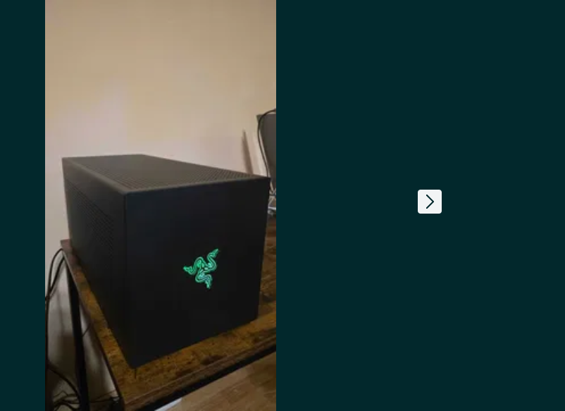

# Total Recall Plugin & Claude vs Ollama

**Autor:** Adrian Balaban  
**Data:** 16 iulie 2026

Două subiecte practice despre cum extindem și alegem uneltele AI în workflow-ul de zi cu zi:
- primul despre decizia „cloud sau local" când lucrezi cu LLM-uri; 
- al doilea despre persistența memoriei în Claude/Copilot/Gemini printr-un plugin MCP

---

## Slide 0 — Ce iei din această sesiune

> Nu teorie generică — decizii concrete pe care le poți lua mâine dimineață.

Cinci lucruri pe care le iei de aici:

1. **Ce este Ollama și de ce contează** — modele cloud egale ca performanță cu cele de la Anthropic și modele locale, zero cost-per-token, fără date trimise în cloud.
2. **Comparație directă Claude vs Ollama** — capabilități, confidențialitate, cost, viteză, integrare cu Claude Code (`ollama launch claude`).
3. **Când să alegi fiecare** — un ghid de decizie cu criterii clare.
4. **Cum funcționează total-recall** — arhitectura MCP, vaulturile (personal & org), hook-urile automate, integrarea Obsidian și algoritmul de căutare hibrid (TF-IDF + vector + multilingual + Ebbinghaus decay).
5. **Cum îl instalezi și îl configurezi** — suport multi-client (Claude Code, Copilot CLI, Gemini CLI) și opțiuni avansate (Ollama, Vertex AI, allowlist-uri de email).

---

## Slide 0b — Agendă (~65 de minute)

1. **Claude vs Ollama** (25 min)
   - Ce este Ollama → *Slide 1 & 5*
   - Deep-dive (opțional, dacă timpul permite): modele instalate real, eGPU pe laptop, modele `:cloud` → *Slide 2 / 3 / 4*
   - Ollama vs llama.cpp (motorul de dedesubt) → *Slide 6*
   - Comparație directă & Costuri & Date → *Slide 7–9*
   - Integrare Ollama ↔ Claude Code → *Slide 10*
   - Ghid de decizie → *Slide 11*
   - Agent Claude vs agent LangChain → *Slide 12*
   - Sinteză și resurse → *Slide 24–25*

2. **Total Recall Plugin** (25 min)
   - Ce este și de ce există → *Slide 13–14*
   - Arhitectura și componentele → *Slide 15–17*
   - De ce algoritmi proprii (fără dependențe grele) → *Slide 16b*
   - Cele 12 unelte MCP → *Slide 18*
   - Algoritmul de căutare (hibrid, multilingual) → *Slide 19*
   - Provideri de Embeddings (Ollama / Vertex AI / HF) → *Slide 19b*
   - Hook-urile pe diverse terminale → *Slide 20*
   - Instalare dedicată per client → *Slide 21*
   - Compatibilitate extinsă (Claude / Copilot / Gemini / Codex) → *Slide 22*
   - Integrare nativă cu Obsidian → *Slide 22b*

3. **Q&A** (15 min)

---

## TEMA 1 — CLAUDE vs OLLAMA

---

## Slide 1 — Ce este Ollama?

> Ollama este un tool open-source care îți permite să rulezi modele LLM mari **local**,
> pe propriul hardware, fără nicio conexiune la internet și fără cost per token.

**Ce face Ollama:**
- Descarcă și rulează modele quantizate local (Llama, Mistral, Gemma, Phi, Qwen, etc.)
- Expune o **API REST compatibilă cu OpenAI** pe `http://localhost:11434`
- Gestionează memoria GPU/CPU, contextul și concurența
- Funcționează pe macOS, Linux, Windows (cu/fără GPU)

**Instalare:**

```bash
# Instalare (ghid oficial): https://docs.ollama.com/quickstart
#   → download de pe ollama.com/download (macOS / Windows / Linux)

# După instalare, descarcă și pornește un model
ollama pull llama3.2
ollama run llama3.2
# sau direct via API:
curl http://localhost:11434/api/generate \
  -d '{"model":"llama3.2","prompt":"Salut!"}'
```

**Modele populare disponibile:**

| Model | Dimensiune | VRAM necesar | Calitate |
|---|---|---|---|
| `llama3.2:3b` | ~2 GB | 4 GB | Bun pentru sarcini simple |
| `llama3.1:8b` | ~5 GB | 8 GB | Echilibru bun |
| `llama3.3:70b` | ~40 GB | 48+ GB | Aproape de GPT-4o |
| `mistral:7b` | ~4 GB | 8 GB | Bun pentru cod |
| `deepseek-coder:33b` | ~19 GB | 24+ GB | Specializat cod |
| `qwen2.5-coder:32b` | ~18 GB | 24+ GB | Cod, multilingual |

> **⚠️ De ce nu vezi Claude, Gemini sau GPT în listă?**
> Ollama rulează **doar modele open-weight** — adică modele AI ale căror greutăți pot fi descărcate și rulate pe hardware propriu. Claude (Anthropic), Gemini (Google) și GPT (OpenAI) sunt **modele proprietare** — nu pot fi rulate local în Ollama, oricât de mult hardware ai avea.

> **Confuzia frecventă: Gemini ≠ Gemma.** Ambele sunt de la Google, dar:
> - **Gemini** = model închis, doar API (Google AI Studio / Vertex AI) → ❌ nu intră în Ollama
> - **Gemma** = fratele open-weight al Gemini (Gemma 2, **Gemma 3** cu multimodal) → ✅ rulează în Ollama: `ollama run gemma3`, `ollama run gemma3:27b`
>
> Așadar singura familie Google pe care o poți rula local prin Ollama este **Gemma**, tocmai pentru că e open-weight. Vrei Gemini (modelul de frontieră)? Atunci folosești API-ul Google, nu Ollama.

---

## Slide 2 — Modele instalate local: cazul real (`ollama list`)

> Live demo: ce ai pe mașina ta acum și ce poate rula efectiv pe **Dell Latitude 5521** (i7-11850H, MX450 2GB GDDR6).

```
$ ollama list
NAME                          SIZE      MODIFIED
nemotron-3-nano:30b           24 GB     8 days ago
mistral-medium-3.5:latest     80 GB     8 days ago
qwen3.6:latest                23 GB     8 days ago
qwen3.5:latest                6.6 GB    8 days ago
gemma4:latest                 9.6 GB    8 days ago
kimi-k2.7-code:cloud          —         8 days ago
ornith:9b                     5.6 GB    8 days ago
glm-5.2:cloud                 —         10 days ago
north-mini-code-1.0:latest    18 GB     12 days ago
```

| Model | Disk | Parametri (est.)* | Specializare | VRAM necesar | Pe MX450? |
|---|---|---|---|---|---|
| `mistral-medium-3.5` | 80 GB | ~140–160B | General, reasoning, multilingual | 80+ GB | ❌ CPU only, lent |
| `nemotron-3-nano:30b` | 24 GB | 30B (din nume) | Reasoning, STEM (NVIDIA) | 24 GB | ❌ CPU only |
| `qwen3.6` | 23 GB | ~40B | Multilingual, cod, math | 23 GB | ❌ CPU only |
| `north-mini-code-1.0` | 18 GB | ~32B | Cod | 18 GB | ❌ CPU only |
| `gemma4` | 9.6 GB | ~17B | General, multimodal text | 10 GB | ❌ CPU only |
| `qwen3.5` | 6.6 GB | ~12B | General, multilingual | 7 GB | ❌ CPU only |
| `ornith:9b` | 5.6 GB | 9B (din nume) | Fine-tune comunitar | 6 GB | ❌ CPU only |
| `kimi-k2.7-code` | — | N/A | Cod (Moonshot AI, **cloud**) | 0 | ✅ API |
| `glm-5.2` | — | N/A | General CN/EN (Zhipu AI, **cloud**) | 0 | ✅ API |

\* *estimat din mărimea pe disk la Q4 (~0.55 GB/mld. parametri); cifre aproximative.*

**Lecția practică:**

- MX450 (2GB VRAM) nu poate ține niciun model în VRAM — toate rulează pe CPU via RAM de sistem
- `qwen3.5` (6.6GB) și `ornith:9b` (5.6GB) sunt singurele care intră confortabil în 16GB RAM → ~3–8 tok/s pe i7-11850H
- `mistral-medium-3.5` la 80GB necesită 80GB RAM liber — imposibil pe laptop
- `kimi-k2.7-code:cloud` și `glm-5.2:cloud` sunt de fapt **API cloud** mascate în Ollama — nu rulează local
- **Concluzie pentru acest laptop:** Claude API rămâne alegerea corectă; modelele locale sunt bune doar pentru experimente offline sau dacă se conectează un eGPU extern via **Thunderbolt 4**

---

## Slide 3 — Pot adăuga GPU pe laptopul meu? Prețuri reale (RO)

> Cazul concret: **Dell Latitude 5521**, i7-11850H, MX450 2GB (soldat) — ce opțiuni există?

### Ce e posibil și ce nu

| Variantă | Posibil? | De ce |
|---|---|---|
| Scot MX450 și pun alt GPU intern | **NU** | GPU-ul e soldat pe placă, nu există slot MXM |
| eGPU extern via **Thunderbolt 4** | **DA** | 2x TB4 disponibil (PCIe x4 3.0, ~32 Gbps) |

### eGPU vs laptop refurbished cu Quadro — comparație pentru LLM

| Criteriu | Precision 7530 + Quadro P2000 | eGPU + RTX 3060 12GB (pe Latitude 5521) |
|---|---|---|
| VRAM | 4 GB (Pascal, 2017) | **12 GB** (Ampere, 2020) |
| Tensor cores | ✗ nu are | ✅ gen 2 (FP16/BF16) |
| Modele 7B Q4 | ⚠️ offload CPU, ~3–5 tok/s | ✅ complet în VRAM, ~40–50 tok/s |
| Modele 13B Q4 | ✗ imposibil decent | ✅ ~8 GB, ~20–25 tok/s |
| CPU | i7-8850H (gen 8, mai slab) | i7-11850H (gen 11) — **îl ai deja** |
| Preț estimat | 2.200–2.800 lei | ~2.400–3.500 lei |
| Portabil | ✅ integrat | ✗ cutie ~7 kg, staționar |

> **Bottleneck TB4 la LLM:** PCIe x4 reduce viteza cu 15–25% față de desktop — dar **pentru inference LLM contează doar VRAM** (datele stau pe GPU, banda spre host contează doar la load inițial). Dezavantajul TB4 e practic irelevant pentru Ollama.

### Prețuri concrete România (date live, 2026)



> *Sursă: anunț OLX Cluj-Napoca, iun 2026 — 1.600 lei.*

Enclosure Razer Core X: ~1.400 lei SH / ~2.900 lei nou · RTX 3060 12GB: ~1.000 lei SH / ~2.100 lei nou (eMAG, garanție)

**Bundle-uri recomandate:**

| Variantă | Enclosure | Placă | Total est. | Profil |
|---|---|---|---|---|
| **Economic** | Razer Core X SH ~1.400 lei | RTX 3060 12GB SH ~1.000 lei | **~2.400 lei** | Risc mic de defecte, fără garanție |
| **Echilibrat** ⭐ | Razer Core X SH ~1.400 lei | RTX 3060 12GB nou ~2.100 lei | **~3.500 lei** | Garanție pe placă, enclosure solid SH |
| **Safe** | Razer Core X nou ~2.900 lei | RTX 3060 12GB nou ~2.100 lei | **~5.000 lei** | Totul nou, garanție completă |

### Concluzie pentru use-case Ollama

**Recomandarea clară: bundle Echilibrat (~3.500 lei)** — Razer Core X second-hand + RTX 3060 12GB nou.

- Reutilizezi Latitude 5521 (CPU mai bun, RAM mai mult) — nu cumperi un al doilea laptop cu hardware mai slab
- 12 GB VRAM: rulezi `qwen3.5` (6.6 GB), `gemma4` (9.6 GB) **complet pe GPU**, rapid
- Enclosure-ul second-hand se strică rar; placa nouă vine cu garanție 2 ani
- Dacă mai târziu vrei un laptop cu TB5 — enclosure-ul TB5 (1.500 lei) e deja compatibil

---

## Slide 4 — La ce e util Ollama cu GLM-5.2 și Kimi-K2.7-Code?

> Ambele apar în `ollama list` cu `SIZE=—` și suffix `:cloud` — **nu sunt modele locale**.
> Sunt API-uri externe proxiate prin Ollama; inferența rulează pe serverele Zhipu AI / Moonshot AI din China.

### Ce înseamnă `:cloud` în Ollama?

```
kimi-k2.7-code:cloud    —     ← niciun fișier GGUF descarcat
glm-5.2:cloud           —     ← niciun fișier GGUF descarcat
```

- `SIZE=—` = nu există model local; Ollama trimite cererea la API-ul extern
- Tokenizarea și inferența se fac **pe serverele furnizorului**, nu pe CPU/GPU-ul tău
- Avantaj față de API-ul direct: aceeași interfață CLI (`ollama run`) și protocol OpenAI-compatible

---

### GLM-5.2 — Zhipu AI (Beijing)

- Flagship-ul Z.ai (spin-off Tsinghua); context ~128k, bun la raționament, agentic și cod
- Pentru un dev român: română slabă (rămâi pe Claude pentru RO), date sensibile → servere în China

> **Din presă (context) — GLM-5.2, lansat 13 iunie 2026:**
> - **Performanță comparabilă cu Claude Opus 4.8 și GPT-5.5, la ~6× mai ieftin** (apreciere atribuită lui David Sacks și Marc Andreessen).
> - **66% pe 103 sarcini complexe de programare** (raport Snowflake) — foarte aproape de 67% al modelului Claude, dar la cost semnificativ mai mic.
> - **Open-source, licență MIT**, rulat pe **cipuri Huawei Ascend** produse local — semnal al ambiției Chinei de a egala SUA.
> - **Adopție profesională în creștere:** modelele chineze au atins **45% din traficul pe OpenRouter (aprilie 2026)**, față de 30% în 2025; pe platformele de consum (ChatGPT/Gemini/Claude) modelele americane încă domină (87–93%).
> - **Limitări notate:** tendința de a supra-analiza detalii eronate și consum de memorie mai ridicat.
> - *Context politic:* lansare la o zi după interdicția SUA (12 iun 2026) de export al modelelor AI de vârf, revocată pe 30 iun 2026.
>
> *Sursă: Libertatea (după Panorama.it) — [Strategia Chinei în competiția AI: modele open-source pe cipuri Huawei](https://www.libertatea.ro/stiri/zhipu-ai-model-china-rival-openai-anthropic-cost-de-sase-ori-mai-mic-5809983)*

---

### Kimi-K2.7-Code — Moonshot AI (Beijing)

- Specializat pe **generare și analiză de cod** (Python, TS, Java, Go, C++); concurent DeepSeek-Coder
- Puncte forte: boilerplate/scaffolding, code review, explicare cod legacy

---

### Comparație rapidă

| Model | Companie | Cel mai bun la | Cost vs Claude | Risc GDPR |
|---|---|---|---|---|
| **GLM-5.2** | Zhipu AI 🇨🇳 | Text chinezo-englez, documente lungi | ~50–70% din Haiku | ⚠️ Ridicat |
| **Kimi-K2.7-Code** | Moonshot AI 🇨🇳 | Code review, generare cod | ~50–60% din Haiku | ⚠️ Ridicat |
| **Claude Haiku** | Anthropic 🇺🇸 | Sarcini generale rapide, română | Referință | ✅ Scăzut (DPA EU) |
| **Claude Sonnet** | Anthropic 🇺🇸 | Raționament, arhitectură, cod complex | ~4–5× Haiku | ✅ Scăzut |

---

### ⚠️ Atenție: confidențialitate și GDPR

- Ambele modele procesează datele pe **servere în China** (Zhipu AI Beijing, Moonshot AI Beijing)
- China = jurisdicție fără echivalent adecvat GDPR recunoscut de EU (spre deosebire de US post-Privacy Shield reînnoit)
- **Nu trimite prin aceste API-uri:** cod cu date personale ale clienților, IP proprietar, credențiale, contracte
- Pentru echipe enterprise EU: verificați DPA (Data Processing Agreement) înainte de utilizare

**Regula scurtă:** cod ne-sensibil + buget → :cloud chinezesc; română, date sensibile, raționament critic → Claude.

---

### Ce îmi trebuie ca să rulez GLM-5.2 / Kimi-K2.7-Code local?

> Răspuns scurt: **nu poți pe hardware obișnuit** — tagul `:cloud` înseamnă exact asta: rulează pe serverele Ollama, ai nevoie doar de `ollama login` + internet.

**De ce nu merge local pe hardware obișnuit:**

- **Kimi-K2** = arhitectură MoE ~1T parametri (~256B activi): chiar cuantizat Q4, necesită ~600+ GB VRAM — doar clustere multi-GPU (8×H100 80GB)
- **GLM-5.x** = 100–200 GB VRAM în variantele grele — 2–4×H100/A100 80GB

Pe Dell Latitude 5521 (MX450 2GB VRAM) nici un model serios de 7B nu încape în VRAM — glm-5.2 / kimi-k2 local e exclus complet.

> **Împăcarea celor două afirmații (posibilă întrebare la Q&A):** presa (v. Slide 4, GLM-5.2) spune că GLM-5.2 e **open-source, licență MIT** — deci *weights descărcabile liber*. Aici spun că `glm-5.2:cloud` **nu rulează pe laptopul meu**. Ambele sunt adevărate simultan: **„open-weight" ≠ „încape pe hardware-ul tău"**. Weights-urile pot fi publice și totuși modelul să ceară 100–200 GB VRAM (datacenter). De aceea Ollama îl oferă ca `:cloud` (API remote) — comoditate, nu o limitare de licență. Cu destul hardware (sau eGPU + cuantizare agresivă pentru variantele mici) **l-ai putea** rula local; pe MX450 pur și simplu nu încape.

### `ollama pull` la un model GLM-5* — ce se poate și ce nu

> Verificat live pe [ollama.com/search?q=glm](https://ollama.com/search?q=glm). Atenție: în registry, **întreaga familie GLM-5 e cloud-only** — nu există GGUF de descărcat.

| Model în registry Ollama | Tag-uri | Local? | `ollama pull` |
|---|---|---|---|
| `glm-5.2` (flagship Z.ai) | `tools thinking cloud`, 1 tag | ❌ doar cloud | `ollama run glm-5.2:cloud` (după `ollama login`) |
| `glm-5.1` | `cloud`, 1 tag | ❌ doar cloud | idem `:cloud` |
| `glm-5` (744B total / 40B activi) | `cloud`, 1 tag | ❌ doar cloud | idem `:cloud` |
| `glm-4.7-flash` (**cel mai puternic din clasa 30B**) | `tools thinking`, 4 tag-uri, **fără `cloud`** | ✅ **da** | `ollama pull glm-4.7-flash` |
| `glm4` (9B, vechi) | `9b`, 32 tag-uri | ✅ da | `ollama pull glm4:9b` |

**Concluzie practică:**
- **Nu poți** face `ollama pull glm-5.2` — pe Ollama e cloud-only. Singurul GLM „de generație 5" rulabil local prin Ollama este **`glm-4.7-flash`** (clasa 30B; intră pe ~12–24 GB VRAM cuantizat, ex. RTX 3060 12GB la variantele mici).
- **Vrei GLM-5.2 chiar local?** Nu prin Ollama, ci cu **GGUF-uri Unsloth** de pe HuggingFace + llama.cpp — dar dimensiunile sunt de clasă datacenter: `UD-IQ2_M` ~239 GB (budget, ~82% acuratețe), `UD-Q3_K_XL` ~343 GB, `UD-Q4_K_XL` ~467 GB, BF16 ~1.51 TB. Realist: Mac Studio M3 Ultra 256–512 GB sau 4–8× GPU datacenter. Pentru 95% dintre cazuri, ghidul recomandă tot API-ul (DeepInfra/Fireworks FP8, ~$0.80/1M tokens) în locul investiției în hardware.
- *Surse:* [InsiderLLM — Run GLM-5.2 Locally](https://insiderllm.com/guides/run-glm-5-2-locally/) · [Codersera — How to Run GLM-5.2 Locally (2026)](https://codersera.com/blog/how-to-run-glm-5-2-locally-2026/)

**Rețeta concretă (dacă chiar vrei GLM-5.2 local, via llama.cpp + GGUF Unsloth):**

```bash
# 1. Build llama.cpp cu CUDA
git clone https://github.com/ggml-org/llama.cpp && cd llama.cpp
cmake -B build -DGGML_CUDA=ON && cmake --build build --config Release -j $(nproc)

# 2. Descarcă GGUF 2-bit (~239 GB)
pip install "huggingface_hub[cli]"
huggingface-cli download unsloth/GLM-5.2-GGUF --include "UD-IQ2_M/*" --local-dir ~/models/glm-5-2

# 3. Server, cu offload MoE pe CPU (cheia care-l face fezabil pe VRAM limitat)
./build/bin/llama-server --model ~/models/glm-5-2/UD-IQ2_M/GLM-5.2-UD-IQ2_M-00001-of-00006.gguf \
  --ctx-size 32768 --n-gpu-layers 999 --ot "exps=CPU" --threads $(nproc) --port 8080
```

- **Trucul `--ot "exps=CPU"`:** straturile MoE merg pe CPU/RAM, attention rămâne pe GPU → un model de ~239 GB devine rulabil pe VRAM mult mai mic.
- **Path realist:** 4× RTX 3090 (96 GB VRAM) + 192 GB RAM → ~3–9 tok/s; ~$5–7k doar plăcile.
- **Alternativa API Z.ai** (endpoint **compatibil Anthropic**, drop-in): ~$1.40/1M input, $4.40/1M output, sau plan coding $3–80/lună — pentru majoritatea, mai ieftin decât hardware-ul.

**What you can run locally, realistically (on CPU, with system RAM):**

```bash
ollama pull qwen3:4b        # ~3 GB, rulează ok pe CPU, ~3–8 tok/s
ollama pull llama3.2:3b     # ~2 GB
ollama pull gemma3:4b       # ~3 GB
ollama pull deepseek-r1:7b  # ~5 GB, lent pe CPU
```

**How to use the `:cloud` variants (the models listed in `ollama list`):**

```bash
# 1. Instalează Ollama (dacă nu ai) — https://docs.ollama.com/quickstart
#    (download de pe ollama.com/download)

# 2. Login — necesar pentru :cloud
ollama login        # cont pe ollama.com

# 3. Lansează direct
ollama run glm-5.2:cloud
ollama run kimi-k2.7-code:cloud

# 4. Sau din Claude Code (Slide 10)
ollama launch claude --model glm-5.2:cloud
```

**Dacă vrei frontier local (cu eGPU — Slide 3):**

Un RTX 3090/4090 24GB rulează local modele de ~30–70B parametri cuantizate (GGUF Q4). **Dar „frontieră locală" e un framing greșit**: în picker-ul Ollama, modelele de coding de top (glm-5.2, kimi-k2.7-code, minimax-m3, nemotron-3-super) sunt toate `:cloud` — API remote, zero VRAM local. Local-feasibil pe 12–24GB: `gemma4`, `qwen3.6`, `nemotron-3-nano:30b`. Big-open care ar *vrea* local (Qwen3-235B ≈ 142GB ≈ 6×24GB, DeepSeek-V3 ≈ 400GB ≈ 17×24GB, Kimi-K2 ≈ 600GB ≈ 25×24GB) cer hardware datacenter — de aceea le accesezi prin `:cloud`, nu pe GPU propriu.

> **Recomandare pentru demo la prezentare:** folosește `glm-5.2:cloud` / `kimi-k2.7-code:cloud` pentru exemplul „model de frontieră", și `qwen3:4b` local pentru demo-ul „rulează pe laptopul meu, offline". Contrastul ăsta ilustrează perfect tensiunea cloud ↔ local din titlul prezentării.

---

## Slide 5 — Cum funcționează Ollama intern

```
Cerere utilizator
       │
       ▼
┌─────────────────────────────────────────────────────────────┐
│                    Ollama daemon (local)                     │
│                                                             │
│   ┌─────────────┐     ┌──────────────┐    ┌─────────────┐  │
│   │  API REST   │────►│  Model mgr   │───►│  llama.cpp  │  │
│   │ :11434      │     │  (GGUF/Q4)   │    │  inference  │  │
│   └─────────────┘     └──────────────┘    └──────┬──────┘  │
│                                                   │         │
│                                          GPU (CUDA/Metal)   │
│                                          sau CPU fallback   │
└───────────────────────────────────────────────────┼─────────┘
                                                    │
                                               Răspuns tokenizat
```

**Quantizare** (de ce modelele de 70B încap pe 48GB VRAM):
- Parametrii modelului sunt comprimați de la float32 (4 bytes/param) la int4 (0.5 bytes/param)
- Pierdere de calitate: ~2-5% față de versiunea completă
- Format standard: **GGUF** (GPT-Generated Unified Format)

**Context window:** limitat de VRAM disponibil (model + KV cache asociat) — un model de 8B pe 8GB VRAM susține context de ~8K tokens; Llama 3.1 70B Q4 pe 48GB poate ajunge **la limită** la 128K tokens doar cu KV cache quantizat (modelul ~40GB lasă puțin spațiu; practic, 32–64K e mai realist pe 48GB).

---

## Slide 6 — Ollama vs llama.cpp: relația și când alegi care

> **Relația:** Ollama e construit **peste llama.cpp** — îl folosește ca motor de inference sub capotă, prin propriul wrapper în Go + un fork al nucleului GGML/llama.cpp. Deci nu sunt concurenți: Ollama = strat prietenos peste llama.cpp.

### Comparație directă

| Axa | **llama.cpp** (motorul, low-level) | **Ollama** (wrapper/runtime prietenos) |
|---|---|---|
| **Nivel** | Motor de inference C/C++ | Wrapper peste llama.cpp (Go + fork GGML) |
| **Control** | **Maxim** — flag-uri CLI directe, quantizare custom, `llama-server`, grammar-constrained decoding, tuning fin de GPU offload | Mai restrâns — expune ce consideră util |
| **Management modele** | **Manual** — aduci/convertezi tu fișierele GGUF | **Automat** — registry, versioning, `Modelfile`-uri pentru customizare |
| **UX** | `./llama-server -m model.gguf ...` (curbă de învățare mai abruptă) | `ollama pull` / `ollama run` (drag-and-start) |
| **API** | `llama-server` (HTTP, mai brut) | **REST API la `:11434`** + endpoint **compatibil OpenAI** |
| **Caz tipic** | Inference înglobat direct în altă aplicație; build-uri custom | Integrare API rapidă local (LangChain, agenți, Claude Code via `ollama launch claude`) |

### Performanță

- **llama.cpp direct** e adesea **ușor mai rapid / cu amprentă mai mică de resurse** — fără overhead de wrapper, și expune mai multe manete: rope scaling, tensor split pe mai multe GPU-uri, formate/flag-uri bleeding-edge.
- **Ollama** a închis majoritatea gap-ului pentru cazurile comune, dar rămâne în urmă la flag-uri/formate de quant bleeding-edge (nu tot ce apare în llama.cpp ajunge imediat în wrapper).

### Când alegi care

| Vrei… | Alegi |
|---|---|
| Setup rapid, swap între modele, workflow API-first (agenți, LangChain, Claude Code) | **Ollama** |
| Tuning de performanță maximă, build custom, sau inference înglobat direct într-o aplicație | **llama.cpp** |
| VRAM strâns — controlezi fin cuantizarea/offload-ul | **llama.cpp** |

> **Pentru GLM-4 / Kimi-K2 local:** Ollama e calea ușoară (`ollama pull`); llama.cpp îți dă control pe cuantizare/offload când ești la limită cu VRAM-ul (ex. RTX 3060 12GB).

---

## Slide 7 — Comparație directă: Claude vs Ollama

| Criteriu | Claude (API Anthropic) | Ollama (local) |
|---|---|---|
| **Modele disponibile** | Claude Sonnet 4.6, Opus 4.8, Haiku 4.5 | Llama, Mistral, Gemma, Phi, Qwen, DeepSeek etc. |
| **Calitate top-tier** | ✅ Claude Opus 4.8 = state of the art | Llama 3.3 70B ≈ GPT-4o, dar sub Opus |
| **Cost per token** | $3–$15 / 1M tokens (input $3 / output $15) | $0 — hardware propriu |
| **Cost infrastructură** | $0 (fără server propriu) | GPU bun: $500–$3000+ |
| **Confidențialitate** | Date trimise la Anthropic | 100% local, zero egress |
| **Latență** | ~500ms–2s primul token | ~100ms–500ms (GPU local) |
| **Context window** | 200K tokens (Sonnet/Opus) | 4K–128K (depinde de model+VRAM) |
| **Raționament avansat** | ✅ Excelent (extended thinking) | Limitat la modele mici-medii |
| **Disponibilitate** | Necesită internet + API key | Funcționează offline |
| **Actualizări model** | Automate (Anthropic) | Manual (`ollama pull`) |
| **Integrare Claude Code** | ✅ Nativă (este produsul Anthropic) | ✅ Nativă prin `ollama launch claude` (Ollama expune endpoint compatibil API Anthropic, fără proxy) |
| **Limită rate** | Există (nivel API) | Nelimitată (hardware propriu) |
| **GDPR / compliante** | Politici Anthropic | On-premise complet |

---

## Slide 8 — Costul real: Claude API vs Ollama

### Claude API (Sonnet 4.6)

```
Input:  $3.00 / 1M tokens
Output: $15.00 / 1M tokens

Sesiune agentică intensă (8h/zi, multe tool calls, context re-reads):
  Input:  ~3M tokens/zi    → $9/zi
  Output: ~600K tokens/zi  → $9/zi
  TOTAL:  ~$18/zi → ~$400/lună (22 zile lucrătoare)
```

### Ollama pe hardware local

```
GPU RTX 4090 (24GB VRAM): ~$2,000 hardware
  → rulează Llama 3.3 70B Q4, DeepSeek-Coder 33B
  → ROI față de API la nivel developer: ~5-6 luni de utilizare intensă

GPU RTX 3080 (10GB VRAM): ~$600 second-hand
  → rulează Llama 3.1 8B, Mistral 7B, Qwen 7B
  → calitate mai mică, dar zero cost operațional
  → ROI: ~1-2 luni

Fără GPU (CPU only):
  → Phi-3 mini 3.8B, Gemma 2B: lent (3-8 tok/s) dar funcțional
  → Hardware cost: $0
```

**Concluzie financiară:** Pentru un developer cu utilizare agentică intensă (~$400/lună API), Ollama devine mai ieftin decât API-ul Claude în 2-6 luni cu un GPU decent. Utilizatorii light (~$30/lună) recuperează hardware-ul în câțiva ani, nu luni — ROI-ul în luni presupune utilizare intensă. Sub un GPU de ~$600, diferența de calitate poate să nu merite.

---

## Slide 9 — Confidențialitate și date: diferența crucială

### Claude API

```
Cerere utilizator
       │  (HTTPS la api.anthropic.com)
       ▼
Serverele Anthropic (US)
       │
       ├── Procesare → răspuns
       ├── Logging (audit, safety) — politici Anthropic
       └── Training data? → Implicit NU, dar citiți ToS
```

**Ce înseamnă practic:**
- Codul tău (parțial sau complet) este trimis la Anthropic
- Secretele din prompt ajung pe servere externe
- GDPR: Anthropic are DPA disponibil, dar datele ies din EU
- Contracte enterprise pot restricționa utilizarea API-ului cloud

### Ollama (local)

```
Cerere utilizator
       │
       ▼
localhost:11434
       │
       ▼
Model GGUF în RAM/VRAM — NICIODATĂ în afara mașinii
```

**Ce înseamnă practic:**
- Codul tău, secretele, datele clientului — rămân pe mașina ta
- Zero egress de date
- Funcționează în rețele izolate (air-gapped)
- Util în: finance, healthcare, proiecte cu NDA strict, codebases proprietare

---

## Slide 10 — Ollama cu Claude Code: integrarea practică

**Metoda oficială: `ollama launch claude`** — pornește clientul Claude Code cu Ollama ca backend, nativ (fără proxy):

```bash
# Model local (pe GPU propriu, ex. RTX 3060)
ollama launch claude --model qwen3.5

# Model cloud (fără download local)
ollama launch claude --model glm-5.2:cloud

# Non-interactiv / scriptat
ollama launch claude --model glm-5.2:cloud --yes -- -p "how does this repo work?"
```

Ce face comanda automat:
- instalează/pornește **clientul Claude Code**
- setează `ANTHROPIC_BASE_URL=http://localhost:11434`, `ANTHROPIC_AUTH_TOKEN=ollama`, `ANTHROPIC_API_KEY=""`
- Ollama expune **endpoint compatibil API Anthropic** la `localhost:11434` → cerere în format Anthropic → model Ollama răspunde → răspuns re-ambalat în format Anthropic

### Distincția cheie: formatul e Anthropic, inteligența e Ollama

Ollama vorbește **nativ** formatul API Anthropic la `localhost:11434` — **nu există proxy separat**. Clientul Claude Code „crede" că vorbește cu Anthropic; de fapt răspunde modelul ales cu `--model`:

```
cerere în format Anthropic → Ollama traduce intern → modelul Ollama răspunde
      → răspuns re-ambalat în format Anthropic → clientul Claude Code îl consumă
```

**Metoda manuală (alternativă, fără `launch`):**

```bash
ollama pull qwen3.5
export ANTHROPIC_BASE_URL=http://localhost:11434
export ANTHROPIC_AUTH_TOKEN=ollama
claude --model qwen3.5
```

Sau permanent în `~/.claude/settings.json`:

```json
{
  "env": {
    "ANTHROPIC_BASE_URL": "http://localhost:11434",
    "ANTHROPIC_AUTH_TOKEN": "ollama"
  }
}
```

> **⚠️ Gotcha subscription hijack:** NU seta `ANTHROPIC_API_KEY=""` pe calea manuală. Un șir gol e tratat ca „nu e setat" → dacă ai Claude Max/Pro, Claude Code recurge la OAuth-ul abonamentului și trimite cererile la `api.anthropic.com` în loc de Ollama. Lasă `ANTHROPIC_AUTH_TOKEN=ollama` să facă toată treaba (are prioritate și suprascrie fallback-ul OAuth); nu seta deloc `ANTHROPIC_API_KEY`. Verifică cu `/status` în sesiune că base URL-ul e `http://localhost:11434`. (`ollama launch claude` evită capcana setând `ANTHROPIC_AUTH_TOKEN=ollama` + `ANTHROPIC_BASE_URL` pentru tine, plus modelele implicite.)

**Capabilități suportate (toate condiționate de modelul ales):** tool calling, file edits, subagents, web search/fetch, vision, thinking controls.

**Limitări cunoscute când folosești Ollama cu Claude Code:**
- Endpoint-ul Anthropic-compatibil din Ollama suportă: messages, streaming, system prompts, vision, **tool calling**, **extended thinking**. **Nu** suportă: **prompt caching** (deci fără cache hit-uri / cost savings), `tool_choice`, `metadata`, PDF, citations, `count_tokens`. Computer use nu trece prin acest endpoint.
- Calitatea output-ului depinde complet de modelul ales — harness-ul e același, inteligența o pune modelul
- Tool use / function calling: funcționează doar cu modele care suportă (Llama 3.x, Mistral, Qwen 2.5, Qwen3, qwen3-coder)
- Context window mai mic poate trunchia fișiere mari (recomandat 64K+ pentru repo-uri mari)

---

## Slide 11 — Ghid de decizie: Claude API sau Ollama?

```
┌─────────────────────────────────────────────────────────────────┐
│                     Întrebare de pornire                        │
│           Datele tale pot ieși din infrastructura ta?           │
└─────────────────────────┬───────────────┬───────────────────────┘
                          │ NU            │ DA
                          ▼               ▼
              ┌────────────────────┐  ┌──────────────────────────┐
              │   Ollama (local)   │  │  Alege după alte criterii │
              │   obligatoriu      │  └──────────┬───────────────┘
              └────────────────────┘             │
                                    ┌────────────▼────────────────┐
                                    │  Ai nevoie de calitate      │
                                    │  top-tier (raționament      │
                                    │  complex, cod avansat)?     │
                                    └────────────┬────────────────┘
                                         NU │         │ DA
                                             ▼         ▼
                                      Ollama cu   Claude API
                                      model 7-8B  (Sonnet/Opus)
                                      + cost $0   + calitate max
```

**Scenarii recomandate:**

| Scenariu | Alegere | Model recomandat |
|---|---|---|
| Proiect cu date sensibile / NDA | Ollama | DeepSeek Coder 33B sau Qwen 2.5 Coder 32B |
| Echipă enterprise cu restricții cloud | Ollama | Llama 3.3 70B (server local) |
| Prototipare rapidă, calitate maximă | Claude API | Sonnet 4.6 sau Opus 4.8 |
| Developer indie, buget limitat | Ollama | Llama 3.1 8B sau Qwen 2.5 7B |
| Sarcini critice de raționament | Claude API | Opus 4.8 cu extended thinking |
| Cod cu context mare (>50K tokens) | Claude API | Sonnet 4.6 (200K context) |
| Offline / air-gapped | Ollama | Orice model descărcat prealabil |
| Echipă cu GPU server partajat | Ollama | Llama 3.3 70B, server central |

---

## Slide 12 — Agent Claude vs agent LangChain

> Confuzia vine din faptul că „agent Claude" și „agent LangChain" trăiesc la **niveluri diferite de stivă**:
> unul e *model + harness*, celălalt e *framework model-agnostic*.

### Diferența fundamentală

| Axa | Agent Claude (Claude Code / Agent SDK) | Agent LangChain (LangChain / LangGraph) |
|---|---|---|
| **Modelul** | Clientul e prins de **Claude/Anthropic** (format API Anthropic), DAR din `ollama launch claude` (vezi mai jos) backend-ul poate fi **Ollama** — client Claude Code + model local. | **Model-agnostic** la nivel de framework — Claude, GPT, Gemini, **Ollama local**, orice |
| **Cine deține loop-ul** | Anthropic: harness închis, opinat (plan mode, hooks, permisiuni, subagents, MCP, compaction). Configurezi, nu scrii loop-ul. | Tu scrii loop-ul / graful. LangGraph = mașină de stări explicită (noduri, muchii, routing condiționat, checkpointuri). |
| **Starea** | Conversație + memorie fișier + MCP (ex. total-recall). Compactare de context built-in. | Abstracții pluggable: `BufferMemory`, summary, retriever vectorial; LangGraph are checkpointer (in-mem/SQLite/Postgres) pentru stare durabilă între rulări. |
| **Tool-uri** | **MCP** e standardul. Subagents (Task), hooks (Pre/PostToolUse), skills. | Funcții `@tool` + integrări (loaders, retrievers, vector stores). Are și adaptoare MCP acum. |
| **Computer use / mediu** | First-class: bash, edit fișiere, computer use (ecran/tastatură) în Agent SDK. Claude Code = harness specializat cod. | Doar ce-i dai tu ca tool. Fără computer use built-in decât dacă-l wirezi. |
| **Control flow** | Modelul decide mult; îl direcționezi cu CLAUDE.md, skills, permission mode. | **Tu controlezi** graful — routing forțat, ramuri paralele, human-in-the-loop gates. Mai mult workflow-engine decât agent liber. |
| **Taxa de abstracție** | Subțire, aproape de API. | Straturi groase, schimbări breaking între versiuni, abstracții leaky (mulți au migrat la LangGraph sau API raw). |

### Cele trei forme de „agent Claude"

```
Claude Code       → „vreau un agent care să-mi lucreze în repo, ruleze teste,
                     editeze fișiere, cu permisiuni și plan mode — gata din cutie"
                     (nu scrii cod de agent)

Agent SDK         → „vreau un agent Claude programabil propriu" — Claude e creierul,
                     tool-urile și suprafața sunt ale tale. Loop subțire:
                     model + tools + max turns.

LangChain/LangGraph → „vreau un pipeline model-agnostic cu control flow explicit,
                        stare durabilă, human-in-the-loop, sau pot schimba
                        între Claude și un model local"
```

### Pentru cazul nostru: de ce contează pe 16 iulie

| | Agent Claude | Agent LangChain |
|---|---|---|
| Poate rula pe **Ollama** (RTX 3060 local)? | **DA, din `ollama launch claude`** — client Claude Code + backend Ollama (fără proxy, Ollama vorbește nativ format Anthropic). | **DA** — `ChatOllama`, rulează pe GPU local, zero cost per token, offline, datele nu ies din mașină |
| Inteligență | Cu Claude real: maximă (Opus 4.8). Cu Ollama: **depinde de modelul local** (mai slab decât Claude; endpoint-ul Anthropic-compatibil suportă extended thinking și tool calling, dar **nu** prompt caching — v. Slide 10). | Depinde de modelul local (mai slab decât Claude) |
| Privatitate | Cu Claude real: date → Anthropic. Cu Ollama: **100% on-premise**. | 100% on-premise |
| Cost | Cu Claude: plat per token. Cu Ollama: **zero**. | Zero |

> **Nuanța cheie:** "Claude agent e lipit de Anthropic" nu mai e adevărat — backend-ul poate fi Ollama prin `ollama launch claude`. Limitarea reală: **calitatea = calitatea modelului local ales**.

> **Tensiunea pe care o discutăm:** agent Claude cu Claude real = inteligență maximă + harness polish, dar **dependent de cloud, cost, privatitate**. Agent Claude + Ollama (via `ollama launch claude`) = harness polish + **suveran** (local, gratuit, offline), dar **inteligența o pune modelul local**, nu Claude. Agent LangChain + Ollama = suveran și **tu controlezi loop-ul**, dar tot calitatea modelului local e limitarea.

### Unde se întâlnesc cele două lumi: total-recall

`total-recall` este un **MCP server** — poate fi backend de memorie **pentru ambele**:

- **Claude Code/Copilot/Gemini** îl folosește nativ (cele 12 unelte, hook-uri auto)

Aici converg cele două teme ale prezentării: **memorie persistentă comună** (total-recall), **backend de inteligență interschimbabil** (Claude cloud ↔ Ollama local). Același vault, două runtime-uri diferite.

### Regulă de decizie

| Vrei… | Alegi |
|---|---|
| Cod / inginerie în repo, calitate maximă, accept cloud | **Claude Code** (cu Claude real) |
| Agent custom cu Claude ca creier, tool-uri proprii | **Claude Agent SDK** |
| **Harness-ul Claude Code, dar pe model local** (offline, zero cost) | **`ollama launch claude`** (client Claude + backend Ollama) |
| Control flow explicit, stare durabilă, sau agent model-agnostic pe Ollama | **LangGraph** (nu LangChain clasic) |

---

## TEMA 2 — TOTAL RECALL PLUGIN

---

## Slide 13 — Problema: Claude uită tot după sesiune

> La sfârșitul fiecărei conversații, Claude pierde tot contextul acumulat.
> Decizii, preferințe, arhitecturi discutate — totul dispare.

**Simptomele:**
- Reexplici același context la fiecare sesiune nouă
- Preferințele tale de cod trebuie re-menționate de fiecare dată
- Deciziile de arhitectură nu se acumulează nicăieri
- Feedback-ul pe care l-ai dat modelului nu persistă

**Consecința:** Cu cât lucrezi mai mult cu Claude Code, cu atât pierzi mai mult timp re-explicând ceea ce ai deja explicat.

---

## Slide 14 — Soluția: total-recall

> Un plugin Claude Code care dă AI-ului memorie persistentă, căutabilă, între sesiuni.

**Ce este:**
- **Plugin Claude Code** instalat din marketplace
- **MCP server** cu 12 unelte (stdio, înregistrat via `claude mcp add`)
- **Vault de fișiere Markdown** stocat local la `~/.total-recall/`
- **Hook-uri automate** care injectează contextul la fiecare sesiune nouă
- **Skill `/memory-workflow`** pentru sesiuni structurate de recall/store

**Ce nu este:**
- Nu trimite date în cloud (vaultul personal este complet local)
- Nu folosește o bază de date opacă — fiecare memorie este un fișier `.md` citibil
- Nu suprascrie context — injectează, nu înlocuiește

---

## Slide 15 — Structura pe disk

```
~/.total-recall/
├── index.json               ← index plat: key → MemoryMetadata
├── invertedIndex.json       ← TF-IDF inverted index: token → {docs, idf}
├── .index-cache.txt         ← rezumat injectat la SessionStart (shell-readable)
├── personal-vault/
│   ├── architecture/
│   │   └── db-choice.md     ← memorie individuală: frontmatter YAML + corp Markdown
│   ├── feedback/
│   ├── knowledge/
│   ├── project/
│   └── vectors.db           ← embeddings sqlite-vec (opțional)
└── org/
    └── org-vault/
        └── architecture/
            └── team-decision.md   ← memorii partajate cu echipa, sync pe git
```

**Fiecare memorie** este un fișier `.md` cu frontmatter:

```markdown
---
title: "Preferă PostgreSQL pentru date relaționale"
tags: [architecture, database, feedback]
author: adrianb
importanceScore: 0.8
created: 2026-06-01T10:00:00Z
updated: 2026-06-15T14:30:00Z
---

## Executive Summary

Preferă PostgreSQL față de MySQL pentru proiecte noi...
```

---

## Slide 16 — Arhitectura: modulele principale

```
src/
├── index.ts          ← boot: signal handlers + main()
├── server.ts         ← MCP Server, 12 scheme tool, dispatch
├── state.ts          ← singletons partajate: memIndex, invertedIndex
├── paths.ts          ← căile vault, EXCLUDED_DIRS, ensureDir
├── types.ts          ← MemoryFrontmatter, MemoryMetadata, Index
├── lru-cache.ts      ← LRUCache class + shared contentCache instance (100 entries, 30 min TTL)
├── persistence.ts    ← loadIndexes, scheduleSave (debounce 1s), flushPending
├── frontmatter.ts    ← parser YAML minimal (fără gray-matter, fără CVE-uri)
├── vault-scan.ts     ← reconcileIndex, slugify, tokenEstimate
├── tfidf.ts          ← tokenize, rebuildInvertedIndex, tfidfSearch
├── ebbinghaus.ts     ← computeRetentionStrength, daysSince
├── rrf.ts            ← Reciprocal Rank Fusion (k=60)
├── embeddings.ts     ← HuggingFace pipeline (opțional)
├── vectorStore.ts    ← sqlite-vec: upsert/search/delete
└── tools/
    ├── store.ts      ← store_memory
    ├── recall.ts     ← recall_memory, search_index
    ├── query.ts      ← list_memories, get_memories_by_keys, get_stats,
    │                    get_timeline, get_related_memories, prune_memories
    └── mutate.ts     ← update_memory, delete_memory, rebuild_index
```

---

## Slide 16b — De ce algoritmi proprii (fără dependențe grele)

> Toți algoritmii cheie sunt **scrisi de la zero în plugin**, nu luați din librării externe: căutare vectorială (KNN peste sqlite-vec), serializare frontmatter, logica de retenție Ebbinghaus, ranking TF-IDF, RRF. De ce?

| Algoritm / modul | De ce e in-house, nu din librărie |
|---|---|
| **Frontmatter parser** (`frontmatter.ts`) | Înlocuiește `gray-matter`, care depindea de `js-yaml 3.x` (**CVE GHSA-h67p-54hq-rp68**). Parser-ul propriu procesează **doar ce scrie plugin-ul** — imun la YAML merge-key DoS, fără YAML arbitrar. |
| **TF-IDF + inverted index** (`tfidf.ts`) | Scorul e combinat cu **title-boost (2×), tag-boost (1.5×)** și **decay Ebbinghaus** — o librărie generică de TF-IDF nu le știe pe toate trei; le-am co-scris ca să fie o singură formulă coerentă. |
| **Ebbinghaus retention** (`ebbinghaus.ts`) | Logică **domain-specific** (curba uitării aplicată memoriei): `λ = 0.16 × (1 − importance × 0.8)` + boost de `accessCount`. Nu există librărie standard pentru asta. |
| **RRF fusion** (`rrf.ts`) | 12 linii, scale-free (`Σ 1/(60 + rank)`) — mai simplu să scrii decât să tragi o dependență. |
| **Căutare vectorială** (`vectorStore.ts` + `embeddings.ts`) | Doar **wrapper subțire** peste `sqlite-vec` + `@huggingface/transformers` — dar ambele **opționale, lazy-load, `--external`** la esbuild. Fără ele, pluginul degradează curat la TF-IDF. |

### Ce câștigi păstrând totul in-house

1. **Suprafață de atac minimă / securitate.** Singura dependență obligatorie e `@modelcontextprotocol/sdk`. Fără `gray-matter` → fără CVE-ul `js-yaml`. Parser-ul YAML propriu nu acceptă YAML arbitrar → imposibil de injectat chei de frontmatter.
2. **Zero dependență de LLM.** Pluginul e **determinist** — niciun apel de API, niciun cost, merge **offline / air-gapped**. Retrieval-ul nu depinde de o decizie de model.
3. **Control complet asupra scoring-ului.** Boost-urile de titlu/tag, decay-ul Ebbinghaus și importanta sunt **o singură formulă**, nu trei librării care se bat. Comportament previzibil, ușor de raționa.
4. **Performanță și predictibilitate.** Inverted index în memorie, LRU cache (100 intrări / 30 min), persistență debounced (1s), scrieri atomice (write-`.tmp` + rename). Niciun black-box care să facă I/O surpriză.
5. **Bundle mic, deps native externalizate.** `@huggingface/transformers` și `sqlite-vec` sunt `--external` la esbuild → pluginul se bundle-uiează ușor; runtime-ul de model se instalează/upgrade-ează independent.
6. **Auditabilitate.** Fiecare decizie de scoring e în cod, observabilă prin `get_stats` (`recentErrors`, `perfSamples`, `vectorSearchEnabled`). Nu există "magie" ascunsă într-o dependență.

> **Filozofia:** un plugin de memorie pentru Claude Code trebuie să fie **ușor, sigur, determinist și previzibil**. Orice dependență grea e un risc de securitate (CVE), un risc de breaking-change, sau un black-box de performanță. De aceea TF-IDF, Ebbinghaus, RRF, frontmatter și chiar wrapper-ul vectorial sunt **scrise de mână** — doar motorul de inference (ONNX) și stocarea vectorială (sqlite-vec) rămân externe, și ele opționale.

---

## Slide 17 — Dual Vault: personal vs org

```
store_memory(tags=[...])
       │
       ├── conține "org"  ──►  ORG VAULT  (~/.total-recall/org/org-vault/)
       │                        key prefix: "org/"
       │                        scriere protejată de autor
       │                        sync automat → git repo echipă (branch org-vault)
       │                        filtru de confidențialitate înainte de push
       │
       └── altfel         ──►  PERSONAL VAULT  (~/.total-recall/personal-vault/)
                                key: cale relativă simplă
                                jurnal auto-adăugat la fiecare store
```

**Regulă cheie:** tagurile `personal` și `org` sunt mutual exclusive — `store_memory` aruncă eroare dacă ambele sunt prezente.

**Filtru de confidențialitate (org sync):**
- Blochează token-uri cu entropie ridicată (secrete, chei API)
- Blochează toate adresele email (cu excepția domeniilor din allowlist)
- Fail-closed: dacă filtrul nu poate analiza conținutul, NU face push

---

## Slide 18 — Cele 12 unelte MCP

### Scriere
| Unealtă | Ce face |
|---|---|
| `store_memory` | Creează o memorie nouă; `force=true` suprascrie |
| `update_memory` | Modifică titlu/conținut/taguri/importanceScore |
| `delete_memory` | Șterge fișierul + intrarea din index + vectorul |

### Căutare / Citire
| Unealtă | Ce face |
|---|---|
| `recall_memory` | TF-IDF + Ebbinghaus + opțional vector search via RRF |
| `search_index` | TF-IDF doar pe metadate (fără citire fișiere, fără bump accessCount) |
| `get_memories_by_keys` | Lookup direct după cheie; trece prin LRU cache |

### Listare / Interogare
| Unealtă | Ce face |
|---|---|
| `list_memories` | Inventar paginat cu filtre pe categorie/tag |
| `get_related_memories` | Similaritate Jaccard pe taguri + boost categorie (0.2) |
| `get_timeline` | Memorii ordonate după `updated` |
| `get_stats` | Contoare, statistici cache, percentile performanță, erori recente |

### Întreținere
| Unealtă | Ce face |
|---|---|
| `rebuild_index` | `reconcileIndex()` + rebuild TF-IDF; păstrează `accessCount`/`lastAccessed` |
| `prune_memories` | **Listează** candidații cu retenție scăzută (Ebbinghaus); NU șterge automat |

---

## Slide 19 — Algoritmul de căutare: TF-IDF + Ebbinghaus

### Pipeline `recall_memory`

```
query (text liber)
  │
  ├─ tfidfSearch(query)
  │    ├─ tokenize(query) → tokens
  │    ├─ pentru fiecare token: lookup în invertedIndex
  │    ├─ scor = TF × IDF × title-boost(2×) × tag-boost(1.5×)
  │    └─ × computeRetentionStrength(importance, daysSince, accessCount)
  │
  ├─ [opțional: hybrid=true + dependențe instalate]
  │    ├─ embed(query) → vector query
  │    ├─ searchVector(db, qvec, 50) → rezultate vectoriale
  │    └─ Reciprocal Rank Fusion([tfidf, vector], k=60)
  │              scor(d) = Σ 1/(60 + rank(d)) pe ambele liste
  │
  └─ slice la `limit`, bump accessCount, returnează cu/fără conținut complet
```

### Curba Ebbinghaus (uitarea modelată matematic)

```
λ     = 0.16 × (1 − importanceScore × 0.8)
decay = importanceScore × exp(−λ × daysSince) × (1 + accessCount × 0.2)
```

| importanceScore | λ (viteza de uitare) | Comportament |
|---|---|---|
| 1.0 (critic) | 0.032 | Decay lent — memoria rămâne relevantă săptămâni |
| 0.5 (normal) | 0.096 | Decay mediu |
| 0.3 (scăzut) | 0.122 | Decay rapid — dispare din rezultate în zile |

Fiecare acces adaugă +20% forță de retenție (`accessCount × 0.2`).

---

## Slide 19b — Embeddings, vectorizare și căutare multilinguală (opțională)

> Întrebare: folosește total-recall embeddings / vectorizare? **Da — dar opțional, lazy, complet local sau via API-uri locale/GCP, și degradează curat fără ele.**

### Provideri de Embeddings configurabili

În configurația `~/.total-recall/config.json`, poți seta acum:
*   **`embeddingProvider`**: `'huggingface'` (implicit, local MiniLM), `'ollama'` (API local) sau `'vertexai'` (Google Cloud Vertex AI).
*   **`embeddingModel`**: Modelul dorit pentru providerii externi (implicit `bge-m3` pe Ollama și `text-embedding-004` pe Vertex AI).

### Căutare multilinguală (cross-language)

Prin activarea flag-ului `"enableMultilingualSearch": true` în config, plugin-ul realizează o expansiune de tokeni engleză-română (ex. căutarea după `"decizie"` va returna automat memorii ce conțin `"decision"`), sporind considerabil acuratețea căutării lexicale.

### Modulele implicate în cod

| Modul | Rol |
|---|---|
| `src/embeddings.ts` | Încarcă lazy `@huggingface/transformers` (model `Xenova/all-MiniLM-L6-v2` 384-dim), Ollama sau Vertex AI, calculând embedding-urile la scriere. |
| `src/vectorStore.ts` | Încarcă lazy `sqlite-vec` (sau conexiunea de DB locală), stochează și caută KNN. |
| `src/rrf.ts` | **Reciprocal Rank Fusion** (k=60) — fuzionează rezultatele lexicale (TF-IDF) cu cele vectoriale după poziția în rang. |

---

## Slide 20 — Hook-urile: integrarea automată (Claude Code / Copilot / Gemini)

> Deși inițial create exclusiv pentru Claude Code, hook-urile de lifecycle rulează acum și pe **GitHub Copilot CLI** și **Gemini CLI** (prin `hooks.copilot.json` și `hooks.gemini.json`).

### Execuția pe clienți non-Claude (Copilot și Gemini CLI)
*   **Cum funcționează:** La pornirea sau pe parcursul sesiunii, clientul Copilot sau Gemini apelează hook-ul corespunzător.
*   **Side-effects executate:** Hook-urile de fundal rulează normal (trag ultimele memorii din git, reconstruiesc cache-ul indexului local, execută push/sync automat în org-vault).
*   **Limitare (graceful degradation):** Deoarece acești clienți drops/ignoră output-ul stdout al hook-urilor, **injectarea automată a indexului de context (`additionalContext`) în memoria de conversație este dezactivată**. Modelul nu vede rezumatul memoriilor la pornire, însă le poate interoga oricând manual prin uneltele MCP.

### `SessionStart` (4 pași, secvențiali)

```
1. pull-org-vault.sh       — git pull pe branch-ul org-vault (dacă e configurat)
2. build-memory-index.sh   — scanare awk a frontmatter-ului → .index-cache.txt
3. load-memory-index.sh    — cat .index-cache.txt → injectat în context (doar Claude Code)
4. load-open-questions.sh  — cat open-questions.md → injectat în context (doar Claude Code)
```

**Efect:** La fiecare nouă sesiune Claude, modelul primește automat rezumatul tuturor memoriilor tale — fără să ceri explicit.

### `PostToolUse` (declanșator: `store_memory|update_memory|delete_memory`)

```
sync-org-memory.sh
  ├─ verifică dacă memoria are tag "org"
  ├─ aplică filtrul de confidențialitate
  └─ git add/commit/push → branch org-vault al echipei
  + rebuild .index-cache.txt
```

### `PreCompact` (când contextul e aproape de limită)

```
extract-and-store-memories.sh
  ├─ citește transcriptul sesiunii din stdin JSON (transcript_path)
  ├─ cere lui Claude să extragă 0–3 learnings cheie ca JSON lines
  └─ store-learning.mjs → scrie direct ca fișiere .md în personal-vault
       (fără round-trip MCP; nu suprascrie memorii existente)
```

### `SessionEnd` — cleanup: loghează sesiunea și asigură flush-ul embeddings-urilor înainte de exit.

---

## Slide 21 — Instalare și utilizare practică

### Instalare bazată pe client

Scriptul `install.sh` este acum conștient de starea clientului și acceptă argumente specifice:

```bash
# 1. Clonează marketplace-ul și construiește pluginul
git clone https://github.com/adrian-balaban/my-claude-plugins-marketplace.git
cd my-claude-plugins-marketplace/plugins/total-recall
npm install && npm run build

# 2. Înregistrează în funcție de clientul tău:

# Pentru Claude Code (nativ):
claude plugin install "$(pwd)"

# Pentru GitHub Copilot CLI (MCP + hooks.copilot.json):
./install.sh --copilot

# Pentru Gemini CLI (MCP + hooks.gemini.json):
./install.sh --gemini

# Pentru instalare Standalone (scrie căi absolute în settings.json):
./install.sh --standalone
```

### Utilizare în sesiune Claude Code

```
# Caută memorii
> "reamintește-mi decizia despre baza de date"
→ recall_memory(query="decizie baza de date")

# Stochează o memorie
> "reține că preferăm PostgreSQL cu partitionare pe lună"
→ store_memory(title="...", content="...", tags=["architecture", "database"])

# Listează tot
> "arată-mi toate memoriile de arhitectură"
→ list_memories(category="architecture")

# Skill dedicat
> /total-recall:memory-workflow
```

### Ordinea de recuperare (din eficiență → completitudine)

1. Index injectat la SessionStart (gratuit — deja în context)
2. `get_memories_by_keys(summary=true)` — dacă știi cheia
3. `search_index(query=...)` — metadate rapid, fără citire fișiere
4. `recall_memory(query=..., full=false)` — TF-IDF + Ebbinghaus
5. `recall_memory(query=..., full=true)` — cu conținut complet

---

## Slide 22 — Compatibilitate: Claude Code vs Copilot vs Gemini vs Codex

| Capabilitate | Claude Code | GitHub Copilot CLI | Gemini CLI | OpenAI Codex CLI |
|---|---|---|---|---|
| **MCP Server (12 unelte)** | ✅ Nativ | ✅ stdio MCP suportat | ✅ stdio MCP suportat | ✅ `~/.codex/config.toml` |
| **Side Effects (Sync/Index)** | ✅ Da | ✅ Da (hooks automate) | ✅ Da (hooks automate) | ❌ Nu (manual) |
| **Context Injection** | ✅ Da (`additionalContext`) | ❌ Nu (ignorat de client) | ❌ Nu (ignorat de client) | ❌ Nu |
| **Playbook Skills** | ✅ Da (nativ) | ❌ Nu | ❌ Nu | ❌ Nu |

**Namespace-uri specifice per client:**
*   **Claude Code:** namespace simplu (`mcp__plugin_total-recall_total-recall__*`)
*   **Copilot CLI:** înregistrat ca `mcp__total-recall__<tool>` (folosește double underscores `__`)
*   **Gemini CLI:** înregistrat ca `mcp_total-recall_<tool>` (folosește single underscore `_`)

---

## Slide 22b — Integrare nativă cu Obsidian

> Deoarece total-recall stochează toate memoriile ca fișiere Markdown (`.md`) simple cu metadate text, vault-urile pot fi deschise direct în editorul **Obsidian**.

### Bune practici în Obsidian:

1. **YAML simplu:** array-uri de string-uri și scalari — parser-ul in-house nu suportă ancore YAML / blocuri multi-line.
2. **Fără watcher pe fișiere:** editările manuale intră în index doar la sesiune nouă sau `rebuild_index`.
3. **`[[wikilinks]]`** sunt acceptate și indexate lexical (graful nu e rezolvat în MCP).
4. **Nu folosi Obsidian Sync pe `org-vault`** — sync-ul trebuie să treacă prin git-ul total-recall, ca să ruleze filtrul de confidențialitate înainte de push.

---

## Slide 23 — Sinteza finală și întrebări deschise

### Ce am acoperit

**Total Recall:**
- Plugin MCP cu 12 unelte pentru memorie persistentă în Claude Code, Copilot și Gemini CLI
- Vault dual: personal (local) + org (sync git cu privacy filter)
- Căutare hibridă: TF-IDF + vector local/Ollama/Vertex AI + expansiune multilinguală + Ebbinghaus decay
- Hook-uri automate: suport pentru sync și rebuild de cache pe fundal pentru Claude, Copilot și Gemini
- Integrare nativă cu Obsidian ca editor de documente (vault-uri Markdown)

**Claude vs Ollama:**
- Claude API: calitate maximă, cost per token, date în cloud
- Ollama: gratuit pe hardware propriu, 100% local, offline capabil
- Integrare Ollama ↔ Claude Code: **nativă prin `ollama launch claude`** — Ollama expune endpoint compatibil API Anthropic (fără proxy), client Claude Code + backend Ollama (local sau cloud)
- Agent Claude (client + harness, format API Anthropic) vs agent LangChain (framework model-agnostic): ambele pot rula pe Ollama — Claude Code via `ollama launch claude`, LangChain via `ChatOllama`; diferența e cine deține loop-ul, nu dacă pot rula local
- total-recall ca punct de convergență: același vault MCP, consumabil din ambele runtime-uri
- Decizia cheie: confidențialitate > calitate > cost

### Întrebări deschise pentru discuție

1. Cum integrezi total-recall într-o echipă? (org vault, drepturi de scriere)
2. Ce modele Ollama ați testat pe hardware de lucru real?
3. Există scenarii unde ați combina ambele: Ollama pentru cod, Claude pentru analiză?
4. Cum gestionezi actualizările de model în Ollama față de API (fără breaking changes)?
5. Strategii de backup pentru vaultul total-recall?

---

## Slide 24 — Resurse

### Total Recall
- **Repo:** `github/total-recall/`
- **Arhitectura detaliată:** `plugins/total-recall/ARCHITECTURE.md`
- **Instalare:** `plugins/total-recall/install.sh --help`
- **README:** `plugins/total-recall/README.md`

### Ollama
- **Site oficial:** ollama.com
- **Hub modele:** ollama.com/library
- **API reference:** ollama.com/docs (compatibilă OpenAI)

### Claude API
- **Documentație:** docs.anthropic.com
- **Modele curente:** claude-sonnet-4-6, claude-opus-4-8, claude-haiku-4-5
- **Prețuri:** anthropic.com/pricing
- **DPA / GDPR:** anthropic.com/legal

### Integrare Claude Code ↔ Ollama
- **Comandă oficială:** `ollama launch claude` (docs.ollama.com/integrations/claude-code)
- **Compatibilitate API Anthropic:** docs.ollama.com/api/anthropic-compatibility
- **Variabile de mediu:** `ANTHROPIC_BASE_URL`, `ANTHROPIC_AUTH_TOKEN` (nu seta `ANTHROPIC_API_KEY` pe calea manuală — v. Slide 10)

---

**Q&A — 15 minute**

> Mulțumesc pentru participare. Cod, arhitecturi și întrebări — le abordăm pe toate.
